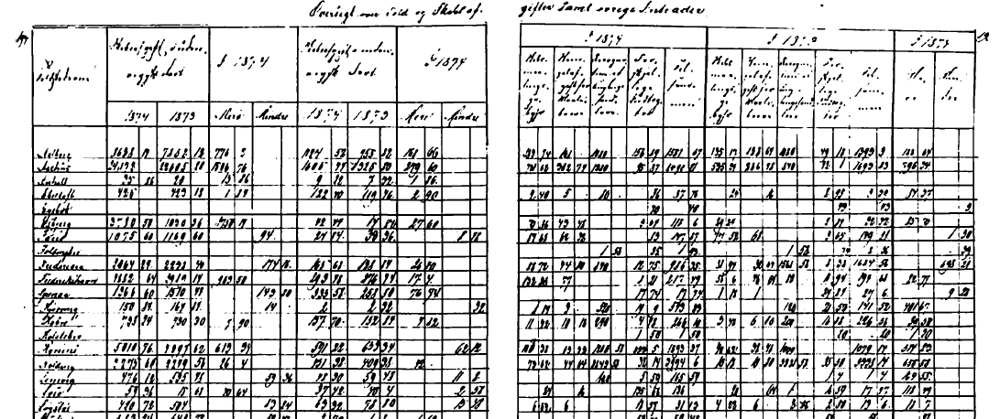

---
output:
  xaringan::moon_reader:
    includes:
    self_contained: false
    lib_dir: libs
    nature:
      highlightStyle: github
      highlightLines: true
      countIncrementalSlides: false
      ratio: '16:9'
editor_options: 
  chunk_output_type: console
---
class: center, middle, inverse
background-image: url("Figures/Background_intro.png")
background-size: cover
background-color: #2c5c34

```{r xaringan-tile-view, echo=FALSE}
xaringanExtra::use_tile_view()
```

```{r xaringanExtra, echo = FALSE}
xaringanExtra::use_progress_bar(color = "#808080", location = "top")
```

```{css echo=FALSE}
.pull-left {
  float: left;
  width: 44%;
}
.pull-right {
  float: right;
  width: 44%;
}
.pull-right ~ p {
  clear: both;
}


.pull-left-wide {
  float: left;
  width: 66%;
}
.pull-right-wide {
  float: right;
  width: 66%;
}
.pull-right-wide ~ p {
  clear: both;
}

.pull-left-narrow {
  float: left;
  width: 33%;
}
.pull-right-narrow {
  float: right;
  width: 33%;
}
.pull-right-narrow ~ p {
  clear: both;
}

.small123 {
  font-size: 0.80em;
}

.large123 {
  font-size: 2em;
}
```

# Aggerkanalens betydning for Limfjordens økonomiske udvikling

## Hvad er effekten af transportforbedringer?

### Christian Vedel,<br> Syddansk Universitet, <br> Økonomisk Institut, HEDG

### Gæsteforelæsning, 2025-09-29

???
..large123[**---> 1 <----**]


---
class: middle
```{r echo=FALSE, out.width="70%", fig.align='center'}
knitr::include_graphics("Figures/Map.png")
```

???
.large123[**---> 7 <----** ]


---
class: middle
# Introduktion
.pull-left[
- Nordjylland er en ø - men har ikke altid været det
- Hvad er effekten af transportforbedringer?
- 24% <-- Hvad betyder det? Og hvorfor er det vigtigt?


#### Disposition
  - Hvem er jeg?
  - Hvad er økonomisk historie 
  - Hvad er transport-økonomi (for sådan en)?
  - Hvad skete der ved Limfjorden i 1825?
]

.pull-right[

```{r echo=FALSE, out.width="100%", fig.align='center'}
knitr::include_graphics("Figures/Petersen 1877.png")
```
*Petersen (1877)*

]


???
.large123[**---> 6 <----** ]
- Understanding what causes wealth (wellbeing, etc.) is at the heart of Economics 
- Understanding the interplay between geography (environment) and Economics is vital in the 21st century

---
class: middle
.pull-left[
# Christian Vedel
- ***Økonom***isk historiker v. SDU


- PhD, 2023: "Natural Experiments in Geography and Institutions", Syddansk Universitet, Økonomisk Institut

- Forskning:
  + Emner: Geografi (transport) og historie
  + Metoder: Maskinlæring og kausal inference


]

.pull-right[

]

---
class: middle
# Økonomisk historie 

.pull-left[
> *"Den videnskabelige del af økonomi (og historie)"* - Deidre McCloskey 


- Et forsøg på at afdække de største, bredeste, *positive* (modsat normative) sammenhænge 
- Tester ting økonomer og historikere påstår
- Årsager og effekter og størrelsen deraf:
  + Hvorfor er der højere velstand i nogle samfund?
  + Hvorfor er der mere ulighed i nogle samfund? 
  + Oprindelsen af den industrielle revolution
  + Kvinders arbejdsmarkedsdeltagelse
  + Hvordan blev Danmark et rigt og lykkeligt land? 
  + **Hvad er effekten af geografi på økonomisk udvikling?** 
  
]

.pull-right[


.small123[
Navne: Bernanke, Eichengreen, Fogel, Friedman, Goldin, Kuznets, Maddison, Marx, Morkyr, North, Piketty, Romer, Schumpeter

##### Note:
- Nogle gange er svaret: "Det ved vi ikke"
- Ofte er svaret: "i gennemsnit sker der X"'
- Cost-Benefit-analysernes grundstof
]

]


---
class: middle
.pull-left-wide[
# Verdens mindste teori-sektion:
- Malthus 101:
  + Det er trist at være fattig 
  + Endnu mere i fattige samfund 
- Dynamik:
    + Velstandsforbedring $\rightarrow$ flere børn overlever 
    + Velstrandsforringelse $\rightarrow$ flere børn dør 
    
    
- **Resultat:** Befolkningstilvækst (i fattige samfund) er et udtryk for velstand

<br><br><br>
**Bemærk:** Vi antager ingen perfekt rationelle agenter, perfekte markeder eller hvad man ellers beskylder økonomer for. Dette er en empirisk øvelse, som er motiveret af teori.
]

.pull-right-narrow[


.small123[
Thomas Malthus (1766-1834)
*Source: [Wikimedia commons](https://commons.wikimedia.org/wiki/File:Thomas_Robert_Malthus_Wellcome_L0069037_-crop.jpg)*
]
]

---
class: middle
# Difference in difference
- Eksempel på tavlen: Hvad sker der med arbejdsløshed, når man indfører mindsteløn?
- Eksempel tilapsset fra Card & Krueger (1994)


---
class: middle
# Transportøkonomi
.pull-left[
- To forklaringer:
  + Institutioner 
  + Geografi 
  
- Geografi:
  + 1.-ordens: Naturskabt 
  + 2.-ordens: Menneskeskabt
  + Ressourcer 
  + Morfologi og markedsadgang*
  
.footnote[
* *Økonom-ord for afstanden mellem mennesker og hvad de laver*
]
  
]

.pull-right[

]

---
# Transportøkonomi - resultater 
.pull-left[
- Vi *tror* at markedsadgang leder til højere velstand 
- Lukningen af Suez-kanalen (1967-1975) førte til tab af velstand (Feyrer, 2021)
- Panama-kanalen førte til forøget velstand (Maurer & Rauch, 2023)
- Steder tæt på naturlig adgang til markeder klare sig bedre (Henderson, Storeygard, Weil, 2018)
- Jernbaner var årsag til velstandsforbedringer (ikke omvendt) (Berger & Enflo, 2017; Donaldson & Hornbeck, 2016)


**Problemer** 
- Årsager til begge: Udvikling eller målet om samme 
- Brug for naturlige ekseperimenter
]


.pull-right[

]

---
class: center, middle, inverse
background-image: url("Figures/Background_ch1.png")
background-size: cover
background-color: #273a8f

# Aggerkanalens betydning for Limfjordens økonomiske udvikling

???
.large123[**---> 4 <----**]


---
class: middle
# Aggertangen
.pull-left[
- D. 4. februar 1825 brød den smalle Agger-kanal og blev kort efter sejlbar
- Limfjorden havde været lukket i 700 år.

#### Det vi kan måle
  - Kanalen medførte handel
  - Kanalen gav befolkningsvækst 
  - Kanalen gav manufakturarbejde
  - Det modsatte skete efter 1100-tallet

]

.pull-right[

```{r echo=FALSE, out.width="100%", fig.align='center'}
knitr::include_graphics("Figures/Deichbruch_an_der_Elbe_1825.jpg")
```

.small123[
Diebrud ved Elben, 1825 [Wikimedia commons](https://commons.wikimedia.org/wiki/File:Deichbruch_an_der_Elbe_1825.jpg)
]


]


???
.large123[**---> 6 <----** ]
- Understanding what causes wealth (wellbeing, etc.) is at the heart of Economics 
- Understanding the interplay between geography (environment) and Economics is vital in the 21st century


---
# Kort
.center[
<iframe src="https://www.google.com/maps/embed?pb=!1m14!1m12!1m3!1d704129.7470425251!2d8.826970647896832!3d56.880787313536544!2m3!1f0!2f0!3f0!3m2!1i1024!2i768!4f13.1!5e1!3m2!1sda!2sdk!4v1634159326111!5m2!1sda!2sdk" width="1000" height="450" style="border:0;" allowfullscreen="" loading="lazy"></iframe>
]

---
# 'Thye'-landet
.pull-left[
#### Aagard, 1802
- "En anden plan ... Den består i at forene Liimfiorden med Vesterhavet, ved at gennemskiære den smalle landstrimmel"
- "For nærværende Tid bestaar Sejladsen paa Liimfiorden allene i at bringe Landets Korn ned til Aalborg, og igen derfra at hente de fornødne Kjøbmandsvare." 
- "I Særdelshed blive Aggerbeboerne anseete som de mindst kultiverede ..."
- "En ublidere Iordplet end den hvorpaa Agger Sogn ligger, findes maaske neppe beboet"
- Øllet smager også dårligt for de har ikke brænde til at koge urten længe nok
]

.pull-right[

.center[
.small123[
*Aagard (1802)*
]
]
]


.footnote[
.small123[Samme historie males af Christensen (1785), Schade (1811), Thaarup (1825), osv.]
]

---
name: timeline
# Tidslinje

--

#### Før 1825: 
- 1085-1208: En vestlig kanal lukker til
- 1672: Aalborg er landets 2.-største købstad
- Vestlige limfjordskøbstæder er blandt de mindste

--

#### Efter 1825:
- 1825: Bruddet på Aggertangen
- 1834: Skibe begynder at benytte den nye kanal
- 1841: Limfjordskøbstæder får frie handelsrettigheder
- 1850-1900: Stor økonomisk fremgang


???
.large123[**---> 8 <----** ]

---
class: middle
```{r echo=FALSE, out.width="70%", fig.align='center'}
knitr::include_graphics("Figures/Map.png")
```

---
# Markedsadgang
.pull-left[
Kost-afstand fra sogne til havne: 
$${MA}_p = \sum_{h \in H} [CostDist(p, h) + 1]^\theta \times W_{p}$$
- CostDist - Dijkstra's agoritme - 10 gange højere pris for landtransport
- $\theta = -1$  
- Nye havne i limfjorden: $H\rightarrow H^*$

$$MA_{before} = MA_p|H \\
MA_{after} = MA_p|H^*$$
Effekten af bruddet: 
$$\Delta log(MA) = log(MA_{after})-log(MA_{before})$$
]

.pull-right[

]

---
class: middle
# Data

**To primære kilder:**
  1. Folketællinger 1787-1901 (meget stort excelark m. 13.5 mio. observationer)
  2. Øresundstoldens regnskaber (1.8 mio rejser)  
  (3. Arkæologiske fund)


---
# Handel kom til Limfjorden
```{r echo=FALSE, out.width="70%", fig.align='center'}
knitr::include_graphics("Figures/Ship_trafic.png")
```
???
.large123[**---> 13 <----** ]

---
# Skibe gennem Aggerkanalen


*Svalgaard (1977) toldarkiver*

---
# Tilpasning

.pull-left-narrow[
- Fisk blev tabt
- Nye muligheder kom til 
- Havnene kunne ikke følge med
- Magre men gyldne tider

### Projekter
- Frederik VII kanal
- Høfdebygning
- Jernbane
- Landeveje 
- Nye havne i alle købstæderne
- Fiskeri på åbent hav (og senere IM)
]

.pull-right-wide[

]

---
name: pop
# Befolkningstilvækst

.pull-left[
### Effekt af markedsadgang
```{r echo=FALSE, out.width="100%", fig.align='center'}
knitr::include_graphics("Figures/pop_ma.png")
```
]

.pull-right[
### Gennemsnitligt for vestl. Limfj. 
```{r echo=FALSE, out.width="100%", fig.align='center'}
knitr::include_graphics("Figures/pop_dummy.png")
```

]

???
.large123[**---> 14 <----**]
- Rauch & Maurer (2022): 2.3 for panama canal

---
# Beskæftigelser (1/2)

.pull-left-wide[
```{r echo=FALSE, out.width="80%", fig.align='center'}
knitr::include_graphics("Figures/All_occupations.png")
```

]
.pull-right-narrow[
- Tilvækst i manufakturhandel 
- Tilvækst i landbrug (det man 'falder tilbage på')

- Data kommer fra folketællinger og en [*sprogmodel for historiske beskæftigelser*](https://raw.githack.com/christianvedels/OccCANINE/refs/heads/update_paper/Project_dissemination/HISCO%20Slides/Slides.html?panelset_001=canine&panelset_002=example-1#1), som vi har udviklet
]

???
.large123[**---> 14 <----** ]

---
# Beskæftigelser (2/2)
.pull-left-wide[
```{r echo=FALSE, out.width="90%", fig.align='center'}
knitr::include_graphics("Figures/Occ_decom_dummy_asi2.png")
```
]

.pull-right-narrow[
- Spinderi, fabriksarbejde, husflid og fiskeri

- *Baseret på ny algoritme, der kan kategorisere beskrivelser*
]


???
.large123[**---> 15 <----** ]

---
# Tilflytning eller fødsler?
.pull-left[
### Migration
*Født i andet amt:*
```{r echo=FALSE, out.width="100%", fig.align='center'}
knitr::include_graphics("Figures/born_different.png")
```
]

.pull-right[
### Fødsler
*Børn pr. kvinde:*
```{r echo=FALSE, out.width="100%", fig.align='center'}
knitr::include_graphics("Figures/fertility.png")
```

]

???
.large123[**---> 15 <----**]

---
class: middle
.pull-left[ 
# Det modsatte naturlige eksperiment 
- Ekstern validitet?
- Det viser sig, at være smart at samle sin 'handelsflåde' i Limfjorden i vikingetiden (Matthiessen 1941; Rasmussen, 1966) 
- Limfjorden er den samme, men landet er **meget** anderledes i 1200-tallet
- Mellem 1086 og 1208 lukker Limfjordens vestlige indsejling til (Saxo, 1208 + Geologiske kilder).

**Data?** 
- Registerdata


]

.pull-right-narrow[

*'Overseas Guests', Roerich (1901)*

*maps.stamen.com*
]

???
.large123[**---> 17 <----**] 

---
class: center
name: arch1
**Møntfund**
```{r echo=FALSE, out.width="80%", fig.align='center'}
knitr::include_graphics("Figures/arch_dummy_coins.png")
```

[More details](#appendixarch); [Matched sample alternative](#matching_coins)

???
.large123[**---> 17 <----**] 

---
class: center
name: arch2
**Bygninger**
```{r echo=FALSE, out.width="80%", fig.align='center'}
knitr::include_graphics("Figures/arch_dummy_buildings.png")
```
[More details](#appendixarch); [Matched sample alternative](#matching_buildings)

???
.large123[**---> 18 <----**]

---
name: other-results
# Konklusion
.pull-left[
- **RQ:** Hvad betyder transport for økonomisk udvikling? 

- 24 procent

- Handel, manufaktur, fiskeri

- Unik stærkt naturligt laboratorie. 
- Ingen havde valgt, at det skulle være der, eller på det tidspunkt. 

- Læs mere her: [A Perfect Storm: First-Nature Geography and Economic Development](https://arxiv.org/abs/2408.00885)
- Link: https://arxiv.org/abs/2408.00885
]

.pull-right[
```{r echo=FALSE, out.width="60%", fig.align='center'}
knitr::include_graphics("Figures/Morsoe.jpg")
```
*Morsøovn i mit barndomshjem. Svensk/Norsk jern og Engelsk kul. Grundlagt i 1853.*
]

???
.large123[**---> 19 <----**] 


---
# Referencer
.small123[
Card, David & Krueger, Alan B, 1994. "Minimum Wages and Employment: A Case Study of the Fast-Food Industry in New Jersey and Pennsylvania," American Economic Review, American Economic Association, vol. 84(4), pages 772-793, September.

Berger, Thor and Enflo, Kerstin, (2017), Locomotives of local growth: The short- and long-term impact of railroads in Sweden, Journal of Urban Economics, 98, issue C, p. 124-138, https://EconPapers.repec.org/RePEc:eee:juecon:v:98:y:2017:i:c:p:124-138.

Donaldson, D., Hornbeck, R., Railroads and American Economic Growth: A “Market Access” Approach , The Quarterly Journal of Economics, Volume 131, Issue 2, May 2016, Pages 799–858, https://doi.org/10.1093/qje/qjw002

Feyrer, James. 2019. "Trade and Income—Exploiting Time Series in Geography." American Economic Journal: Applied Economics, 11 (4): 1-35. DOI: 10.1257/app.20170616
Feyrer, J. (2021). Distance, trade, and income — The 1967 to 1975 closing of the Suez canal as a natural experiment. Journal of Development Economics, 153, 102708. doi:10.1016/j.jdeveco.2021.102708
J Vernon Henderson, Tim Squires, Adam Storeygard, David Weil, The Global Distribution of Economic Activity: Nature, History, and the Role of Trade, The Quarterly Journal of Economics, Volume 133, Issue 1, February 2018, Pages 357–406, https://doi.org/10.1093/qje/qjx030

Stephan Maurer, Ferdinand Rauch, Economic geography aspects of the Panama Canal, Oxford Economic Papers, Volume 75, Issue 1, January 2023, Pages 142–162, https://doi.org/10.1093/oep/gpac009
]

---
name: appendix1
count: false
class: center, middle, inverse
background-color: #273a8f
# Appendix

.footnote[
[Back](#apendicies)
]

---
name: new-ports
# New ports
[Back](#instmech)


---
name: railways1
# Railways (1/2)
[Back](#instmech)

.pull-left[

]

.pull-right[


]

Source: Fertner (2013)

---
name: railways2
# Railways (2/2)
[Back](#instmech)
.pull-left[

]

.pull-right[

]

Source: Fertner (2013)

---
name: MAmath
# Market Access
.pull-left[
Based on cost distance from parishes to harbours: 
$${MA}_p = \sum_{h \in H} [CostDist(p, h) + 1]^\theta \times W_{p}$$
- CostDist - Dijkstra's agorithm and 1/10 land/sea ratio 
- $\theta = -1$  
- Breach caused new harbours in West Limfjord: $H\rightarrow H^*$

$$MA_{before} = MA_p|H \\
MA_{after} = MA_p|H^*$$
Main measure:
$$\Delta log(MA) = log(MA_{after})-log(MA_{before})$$
]

.pull-right[

]

.footnote[[Back](#empstrat1)]

---
name: elsinor
# Elsinor


.center[
<iframe src="https://www.google.com/maps/embed?pb=!1m14!1m12!1m3!1d3743.038856836935!2d12.616720634729397!3d56.03904113734528!2m3!1f0!2f0!3f0!3m2!1i1024!2i768!4f13.1!5e1!3m2!1sda!2sdk!4v1655049802848!5m2!1sda!2sdk" width="600" height="450" style="border:0;" allowfullscreen="" loading="lazy" referrerpolicy="no-referrer-when-downgrade"></iframe>
]

[Back to STR](#str-presentation), [Back to results](#str-results)


---
name: Rob_comp
## Robustness: Comparison groups

.pull-left[
#### MA approach

]

.pull-right[
#### Dummy approach

]

[Back](#pop)

.footnote[
**Definitions:** A: <5km to coast; B: Copenhagen excl.; C: Control >100 km from Limfj.; D: <5km to Market town
]


---
name: all-paramMA
## Robustness: Parameter choices

```{r echo=FALSE, out.width="60%", fig.align='center'}
knitr::include_graphics("Figures/Multiverse_MA_param.png")
```

[Back](#pop)

---
name: pre_treat_adj
## Robustness: Pre-treat characteristics

.pull-left[
- Using the doubly robust estimator from Callaway & Sant’Anna (2021).
- Combines outcome regression with propensity score method. If either is valid, then the estimator is consistent.
- Only corrects for pre-treatment characteristics

**Columns:** (1): No adj.; (2): Adj. for age, occupation, fertility; (3): Adds log(Pop) as adj.
]

.pull-right[

]

[Back](#pop)


---
name: fish
# Environmental impact
[Back](#mechanism1)


---
name: newspapers
# Newspapers

.pull-left[
- Based on all newspapers in published in the period
]

.pull-right[

]

---
name: instmech
# Mechanism: Adaptation

.pull-left[
[Back](#mechanism1)  
*Theoretical mystery desribed by Redding and Turner (2015)*

#### Historiography:
- 1840s: [New ports were constructed in all west Limfjord market towns](#new-ports)
- 1841: Independent rights for international trade
- 1852: First ever Danish steam route to England 
- 1856-1861: Construction of the Frederik VII canal at Løgstør 
- 1860-1900: [Railways](#railways1) and highways 
- 1875-1933: Groins to stabilise the channel (and coast) 
]


.pull-right[

*Milton (1884) Frederik VII canal*


*'Placat' announcing trade rights of Limfjord market towns*
]


---
name: hisco
# New occupational data
[Back](#censusdata)

.pull-left[
- Data censuses 1787-1901 contain occupational for some years (3.7 mio. observations) 
- Training data to train an automatic HISCO-label AI for all 12.4 mio. records. 
- Precision: 97.21%; Recall: 97.07% 
- Separate paper - please let me know if you have data
]

.pull-right[
#### How it is applied here
- Top 100 occupations are manually labelled as 'Fishing' or 'Manufacturing'
- Used in a mediation analysis: Can either explain away the effect of the channel?  
- Manufacturing can! 
]


---
class: center, middle
name: appendixarch
# Archaeological evidence details

.footnote[
[Back](#arch)
]

---

.pull-left[
## About the data
- Administrative database of all archaelogical sites and finds 
- Managed by ministry of culture 
- 321 generic types of findings. E.g. coins
- 1940 dated sites with coins between 750 and 1500

- Panel construction:
  + **Innovation:** Monte Carlo to estimate $P_i(Coin|t)$   
  + Probability that a coin finding was generated at a specific time

]

.pull-right[
## Data example


*Coins, wikimedia commons*
]

.footnote[
[Back](#arch)
]

---
# Estimator of coin probability
.pull-left[
- **Objective:** We want to know *how likely it is that coin was left at a particular time $t$*
- **What we have:** Observations of individual coin findings and a distribution of times $t$, which are likely for a specific coin finding in a place $i$ 

**In equation form:**
- What we have: $P_i(t|c)$: Probability of $t$ given one coin 
- What we want: $P_i(\{c\}|t)$: Probability of *any* coins in time $t$
]
--
.pull-right[
### The solution
Bayes formula and Monte Carlo
- Simple to sample from this distribution
- Sample $t$ from each coin 
- Count frequency of coin findings
$$P(\{c\}|t)=\left[1-\prod_{c=1}^{K_i} \left( 1 - P(t|c) \right)\right] P(\{c\})$$
where it is assumed that
$P(t|c)\sim \mathscr{U}(Year_{min}^c; Year_{max}^c)$ or
$P(t|c)\sim \mathscr{N}(\mu_c, \sigma_c),$
$\sigma_c=\frac{(Year_{max}^c - Year_{min}^c)}{1.96}$
]


---
### All indicators 


.footnote[
[Back](#arch)
]
---
name: matching
### Soil type matching
.pull-left[
- Soil types linked to medieval developmental trajectory (Andersen et al, 2016)
- Using common soil types to estimate treatment propensity score with XGBoost 
- Soil from GEUS
- West Limfjord matched to other parishes using greedy matching. 
]

.pull-right[
*Before*
```{r echo=FALSE, out.width="80%", fig.align='center'}
knitr::include_graphics("Figures/Propensity_before.png")
```

*After*
```{r echo=FALSE, out.width="80%", fig.align='center'}
knitr::include_graphics("Figures/Propensity_after.png")
```

]

---
name: matching_coins
#### Coin findings (matched sample)
```{r echo=FALSE, out.width="80%", fig.align='center'}
knitr::include_graphics("Figures/arch_dummy_coins_matched.png")
```
[Back](#arch1)
---
name: matching_buildings
#### Building findings (matched sample)
```{r echo=FALSE, out.width="80%", fig.align='center'}
knitr::include_graphics("Figures/arch_dummy_buildings.png")
```
[Back](#arch2)
---
### Safer, more convenient harbours

*Dangerous loading on the west coast*

---
# International trading rights (1/2)
.pull-left[
**Two interpretations:**
- Trading rights $\rightarrow$ Growth
- Channel $\rightarrow$ Trading rights $\rightarrow$ Growth

*Trading rights can determine population growth* (Cermeño, Enflo 2019)

- Two types of rights: 
  + Market town rights (all comercial activity had to happen in these locations) 
  + Customs rights (*toldsted*): Places where goods could be declared and taxed before it was traded on foreign markets 

]

.pull-right[

]


---
# International trading rights
.pull-left[
**Timeline**

**1657-1720:** General consumption tax in market towns and Dano-Swedish wars boosts timber/grain legal grey zone trade (*skudehandel*) between Thy and Norway.  
**1814:** Norway becomes Swedish. Illegal trade continues  
**1834-35:** Overwelming trade with even larger ships. Coastal watch established. Thisted becomes de facto customs town.  
**1837, 1840:** Petitions to the King for formal international trading rights for all market towns  

]

.pull-right[
**1841**: Full customs rights introduced to only Limfjord Market towns 


]

.footnote[
Holm (1989); Fode (1989); Svalgaard (1977); Svalgaard (1974)
]


---
# On the origin of the channel 

.pull-left[
- Gradual erosion is documented in Petersen (1877) as early as 1688.
- Agger Church lost in 1832.  
- In the 16th century in the same period Christian II made it illegal to drive cattle across the Isthmus  
- Groins constructed from 1875 (Esbjerg).

.small123[*Mårup church demolition 2008*]
]


.pull-right[


.center[
*Groins*
<iframe src="https://www.google.com/maps/embed?pb=!1m14!1m12!1m3!1d15541.513031989105!2d8.187605907284134!3d56.6904893489832!2m3!1f0!2f0!3f0!3m2!1i1024!2i768!4f13.1!5e1!3m2!1sen!2sdk!4v1695323661648!5m2!1sen!2sdk" width="600" height="450" style="border:0;" allowfullscreen="" loading="lazy" referrerpolicy="no-referrer-when-downgrade"></iframe>
]
]

---
# Descriptive evidence - coins


---
# Alternative shipping statistics


*Descriptive statistics from Svalgaard (1977) sourced from customs archives*


