---
output:
  xaringan::moon_reader:
    seal: false
    includes:
      after_body: insert-logo.html
    self_contained: false
    lib_dir: libs
    nature:
      highlightStyle: github
      highlightLines: true
      countIncrementalSlides: false
      ratio: '16:9'
editor_options: 
  chunk_output_type: console
---
class: center, inverse, middle

```{r xaringan-panelset, echo=FALSE}
xaringanExtra::use_panelset()
```

```{r xaringan-tile-view, echo=FALSE}
xaringanExtra::use_tile_view()
```

```{r xaringanExtra, echo = FALSE}
xaringanExtra::use_progress_bar(color = "#808080", location = "top")
```

```{css echo=FALSE}
.pull-left {
  float: left;
  width: 44%;
}
.pull-right {
  float: right;
  width: 44%;
}
.pull-right ~ p {
  clear: both;
}


.pull-left-wide {
  float: left;
  width: 66%;
}
.pull-right-wide {
  float: right;
  width: 66%;
}
.pull-right-wide ~ p {
  clear: both;
}

.pull-left-narrow {
  float: left;
  width: 30%;
}
.pull-right-narrow {
  float: right;
  width: 30%;
}

.pull-right-extra-narrow {
  float: right;
  width: 20%;
}

.pull-center {
  margin-left: 28%;
  width: 44%;
}

.pull-center-wide {
  margin-left: 17%;
  width: 66%;
}

.pull-center-medium {
  margin-left: 20%;
  width: 60%;
}

.tiny123 {
  font-size: 0.40em;
}

.small123 {
  font-size: 0.80em;
}

.large123 {
  font-size: 2em;
}

.red {
  color: red
}

.chaosred {
  color: #b33d3d
}

.orange {
  color: orange
}

.green {
  color: green
}

.blue {
  color: blue
}
```


# CHAOS
## Converting Historical Accounts to Occupational Scores


### Matt Curtis, Torben Johansen, Julius Koschnick, **Christian Vedel**,
### University of Soutern Denmark

### Email: [christian-vs@sam.sdu.dk](christian-vs@sam.sdu.dk)  

### Updated `r Sys.Date()`

---

.pull-left[
# The problem

- Archives are **rich in occupations**, but **sparse in direct incomes** (wages, earnings, status).
- Standard workaround: impute income with **occupational scores** (e.g., IPUMS **OCCSCORE**).
- But fixed benchmarks (e.g., 1950 US wages) can **misstate levels and trends** across **time, place, and titles**.

]

--

.pull-right[
### Use of OCCSCORE (examples)
.small123[
- Abramitzky, Boustan & Eriksson (2014): Assimilation of immigrants 1900–1920 using what a median US worker earned in 1950 (OCCSCORE adjusted back).  
- Ager, Boustan & Eriksson (2021): Recovery of Southern slaveholder families after the Civil War, comparing wealth shocks, with adjustments based on occupation-based earnings proxies from later censuses.
Abramitzky, Ager, Boustan, Cohen & Hansen, C. W. (2023): Migration does not offset local wages (as proxied by their occupation and a few other characteristics)
- Collins & Wanamaker (2014): Uses occupational scores to measure the effects, on income, from the great internal migration among africian americans in the period 1910-1930s

*Amazing paper in the age before high-powered machine learning*
- But now we can do better
]

]

---
class: middle

# Three problems:

1. **Source-Target drift:** Problematic to estimate effects in e.g. 1900 based on 1950s wages
2. **Within Occupation variation:** All bakers do not earn the same
3. **Hard to construct:** Constructing new measures is time consuming.

.footnote[
.chaosred[*1. and 2. causes systematic bias*]
]


---

.pull-left[
# CHAOS
- This paper introduces a method for:  
  + **C**onverting (using maths)
  + **H**historical **A**ccounts (e.g. wage tables)
  + **O**ccupational **S**scores (something like IPUMS occscore [but better])


### Some points:
- .chaosred[**Still preliminary**]
- Different than Saavedra & Twinam (2020): Not a classical supervised ML approach
- Different than Paker, Stephenson, Wallis (2025): Produces estimates across occupations
- Fully automatic and highly interpretable + comes with built in debiasing (even more preliminary)

]

--

.pull-right[
### Four introductions
.panelset[
.panel[.panel-name[1 Straight forward]
- If I give you this:
.pull-right-wide[
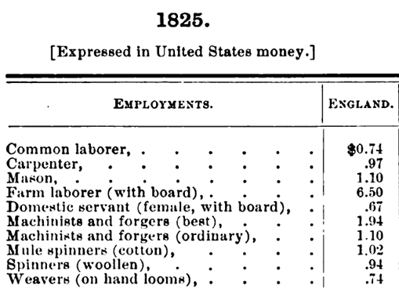
]

.pull-left-wide[
- Could you then tell me the approximate income of:
  + Joiner,
  + Cowherd,
  + Bricklayer?
  
- **CHAOS** tells you the appropriate weighted mean

]

]

.panel[.panel-name[2 Technical]
Given classifier (of $h_j$):
$$
d_i \mapsto Pr(h_j\mid d_i)
$$
And a source 
$$
d_i \mapsto y_i \qquad\text{e.g. income}
$$

Can we combine them into a function, $f$, to estimate new outcomes:

$$
f:\qquad d_k\mapsto\mathbb{E}(y_k \mid d_k)
$$

]

.panel[.panel-name[3 Casual]
> "Yo! I've got this table of people's income from 1825. Do you think we could somehow sort of apply it to incomes for occupations across this census data?" 


]

.panel[.panel-name[4 Collegial]
*We are trying to replace IPUMS occscore*
]


]

]

---
<br>
<br>
<br>
<br>
<br>
# A disclaimer


--
.pull-right[
.pull-left-narrow[]

.pull-right-wide[
This is not:
 - A magic bullet
 - An excuse to not care about source criticism
 - (In fact a key econometric result is the *'relevance assumption'*)
]

]

---
# Sneakpeak: Where we are getting to
*Given a source:*
.pull-center-medium[
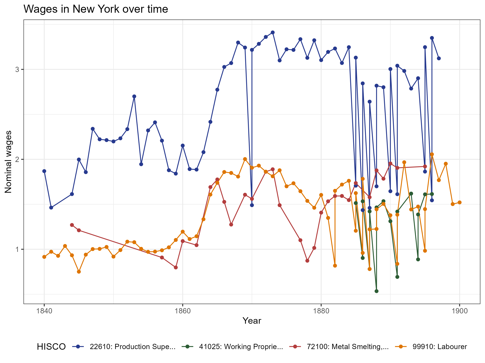

]


---

.pull-left-narrow[
## Step by step
1. You find a **source** of occupational outcomes (e.g. wages)
2. You classify them into a **standardized system** (e.g. HISCO)
3. You calculate **average** (e.g. how they taught you in school)
4. You assign these averages to new **target observations**
  a. Classify occupations in target (e.g. into HISCO)
  b. Apply estimates from step 3
]

--

.pull-right-wide[
.panelset[
.panel[.panel-name[Steps 1-3]
.pull-right-wide[
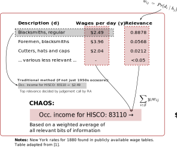
]
]
.panel[.panel-name[Step 4]
.pull-right-wide[
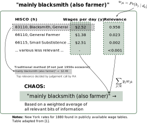
]
]
]

]


---
class: middle

# Mostly harmless maths

.pull-left[
.small123[
#### Target / Source

We are interested in
$$\mathbb{E}(y_k \mid d_k).$$
(The expected income of observation, $k$, given occupational description $d_k$)

What we have is observations containing

$$\mathbb{E}(y_i \mid d_i).$$
(The expected income of observation, $i$, given occupational description $d_i$)

#### Assumption:
1. **Source-Target relevance:** Good historian's assumption: Your Source must be relevant for your target: $i$ and $k$ are both iid draws from the same distribution
2. **Broadband** You have a *broadband* way of classifying occupational descriptions which captures the mean: $\mathbb{E}(y_i \mid h_j, d_i) = \mathbb{E}(y_i \mid h_j)$ 
]
]

--

.pull-right[
.small123[


]


#### What you then get:
$$\mathbb{E}(y_i\mid d_i) = \mathbb{E}(y_k\mid d_k)$$
So the task is just to get a function which can estimate $$\mathbb{E}(y_i\mid d_i)$$

Our approach:
1. Calculate HISCO-level averages: $$\mathbb{E}(y_i \mid h_j)$$
2. Estimate how well target descriptions fit HISCO codes 

Secret sauce: We can estimate $$\Pr(h_j\mid d_i)$$

]


---
class: middle
# OccCANINE

.pull-left[
.small123[
w. Christian Møller Dahl & Torben Johansen   
https://arxiv.org/abs/2408.00885
]

- We train a language model on ~18.5 million observations spanning 13 different language from 29 different sources
- Open source, user friendly, fast and highly accurate

- **Importantly:** Gives us a probability of each HISCO code given a textual description.

$$
\text{OccCANINE}: \qquad d_i \mapsto Pr(h_j\mid d_i)
$$

- Using basic tricks of probability we can tease out an estimator from this!

]

.pull-right[
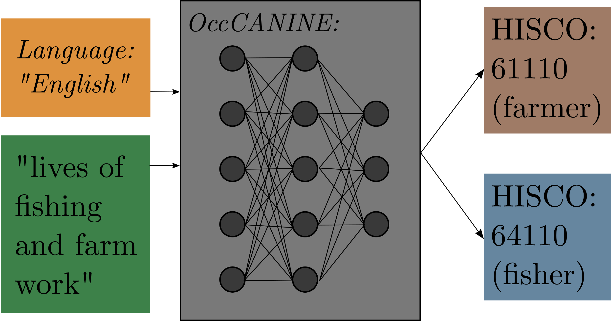 
*Figure 1: Conceptual architecture*

.small123[
#### Some numbers:
- 10k occupational descriptions: 27 seconds
- 100k occupational descriptions: 5 min.
- 1 million occupational descriptions: 45 min.
]


]


---
## More mostly harmless maths

.pull-left[


### .chaosred[Source to HISCO]

$$\mathbb{E}(y_i\mid h_j)\;=\; \sum_{i\in \mathcal{S}} y_iw_{ij} \;=\; \sum_{i \in \mathcal{S}} y_i \;\frac{\overset{OccCANINE}{\overbrace{Pr(h_j\mid d_i)}}\;\overset{Prior}{\overbrace{Pr(d_i)}}}{\underset{Evidence}{\underbrace{Pr(h_j)}}}$$

#### Example
We estimate that HISCO 83110 "Blacksmith" earns $2.52 a day since this is the sum:
$$2.49\times 0.8878 + 3.96\times 0.0568 + ...$$

]

--

.pull-right[
### .chaosred[HISCO to Target]
$$\mathbb{E}(y_k\mid d_k) \;=\;  \sum_{j\in \mathcal{H}} \hat{y}_j w_{jk} \;=\; \sum_{j \in \mathcal{H}} {\underset{\text{from above}}{\underbrace{\mathbb{E}(y_i\mid h_j)}}}  \overset{OccCANINE}{\overbrace{Pr(h_j\mid  d_k)}}$$

#### Example:
`"mainly blacksmith (also farmer)"` gets a wage $\hat{y}_k$ assigned from both the HISCO codes for blacksmith (0.95) but also farmer (0.02) etc.

]

.footnote[
.small123[
$i$: Index of source; $j$: Index in HISCO table; $k$: Index of target table
]
]


---
# Demonstration
[Notebook]

---
# Not so harmless maths


.pull-left[
.small123[
### More than one source?
$$
\mathbb{E}(y_i\mid h_j)=\sum_i \left[ y_i \sum_s \left( 
    \frac{\overset{OccCANINE}{\overbrace{Pr(h_j\mid y_i, S_s)}}\overset{Prior}{\overbrace{Pr(y_i\mid S_s)}} \overset{\textit{Source weight}}{\overbrace{Pr(S_s)}}}{\underset{Normalization}{\underbrace{Pr(h_j)}}} \right) \right]
$$


### What if we input gibberish?
Then we get:
$$
\begin{split}
Classifier:\qquad &Pr(h_j\mid d_k) \;=\; Pr(h_j), \qquad \text{(bd cond. prob.)} \\
CHAOS:\qquad &\mathbb{E}(y_k|d_k) \;= \mathbb{E}(y_i)
\end{split}
$$
I.e. we just get the mean from the source
]
]


--

.pull-right[

#### Debiasing & scaling
.small123[
- Bias and scaling problems $\mathbb{E}(\hat{y}_k)\neq\mathbb{E}(y_k)$ and $\mathbb{V}(\hat{y}_k)\neq\mathbb{V}(y_k)$  
- But we can observe this problem if we are willing to assume:
$$
\begin{split}
\mathbb{E}( y_k-\hat{y}_k) = \mathbb{E}(y_i-\hat{y}_i) \\
\mathbb{V}( y_k-\hat{y}_k) = \mathbb{V}(y_i-\hat{y}_i)
\end{split}
$$
True under *relevance assumption*
]

.chaosred[**Implication**]: Classification does not need to be perfect - we can correct for bias

*Note: This is a vast improvement over previous methods*

]

---
<br>
<br>
<br>

# Bias correction via self-validation

.pull-left-wide[
- If you trust you own source, you can use LOO-CV self-validation to debias
  1. Leave out $i^*$ in source
  2. Estimate prediction from $i^*$ for each source observation
  3. Use CHAOS on the predicted errors to obtain $\widehat{B}(d)$
  4. Repeat for all observations to recover error estimate for all source observations
  
- Under Source-Target relevance, we can now estimate bias for new observations $B(d_k)$ using CHAOS.
  
*LOO can be implemented very quickly (and exactly) via weights updating*

.chaosred[**Code still needs to be implemented**]
]

--

.pull-right-narrow[
> Whenever you run a regression you can correct for the bias via $$\hat\beta \;=\; \hat\beta_{\text{naive}} + (X'X)^{-1}X'\widehat{B}(d)$$


> $\rightarrow$ Unbiased results 

> *All of this build on PPI and DSL* $^1$

.footnote[
$^1$: PPI: Angelopoulos et al. (2023), DSL: Egami et al. (2024) 
]

]


---
# Application: Setup


.pull-left-wide[
#### 1. We apply this to a table of wages for 84000 occupations (US Commissioner of Labor)
  + Across 140 places (states and countries) 
  + In the period 1725-1900
  
#### 2. We combine this with measure for skills (routine, mechanical, cognitive) obtained from the *London's Trademan* (1747)
  + Using embedding distance
  + Please ask about details
  
#### 3. We turn everything into a HISCO-level panel using .chaosred[**CHAOS**]
  + **Result:** Occupation level panel of incomes and skills

]

.pull-right-narrow[
.panelset[
.panel[.panel-name[Wages 1]
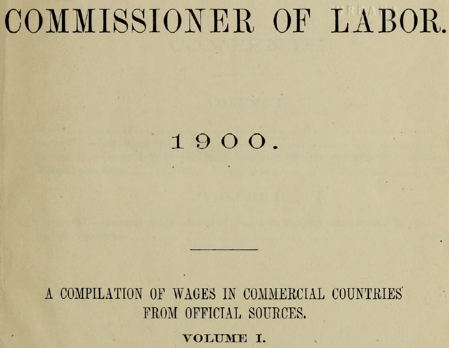

]
.panel[.panel-name[Wages 2]
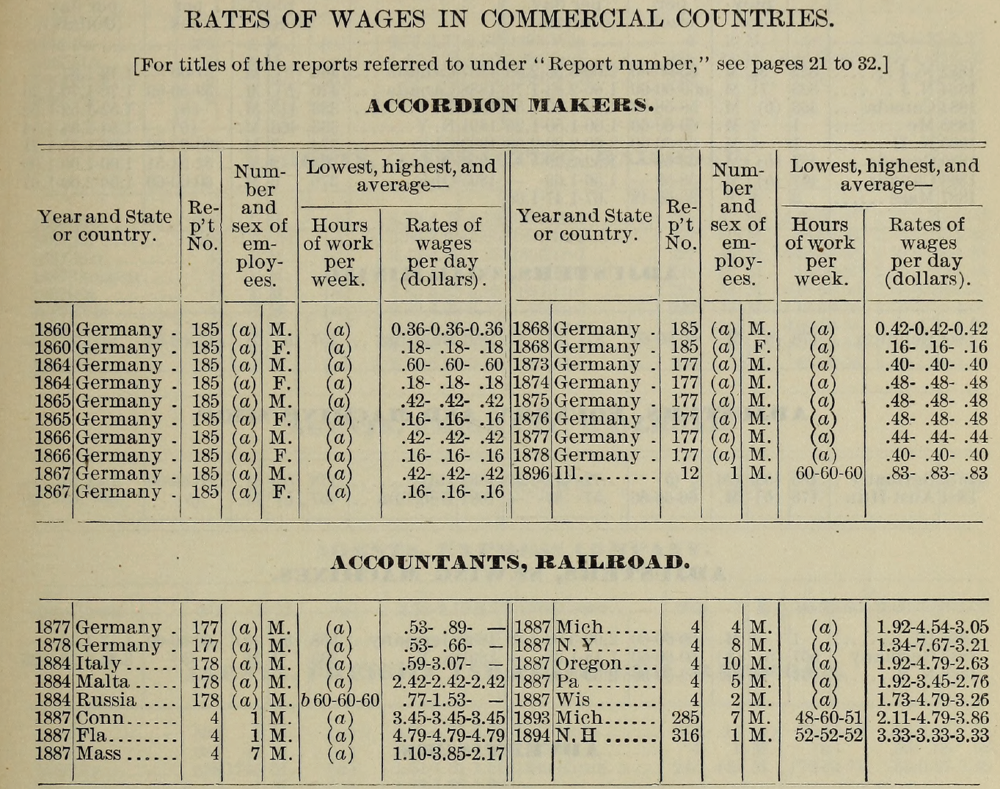

]

.panel[.panel-name[Skills]
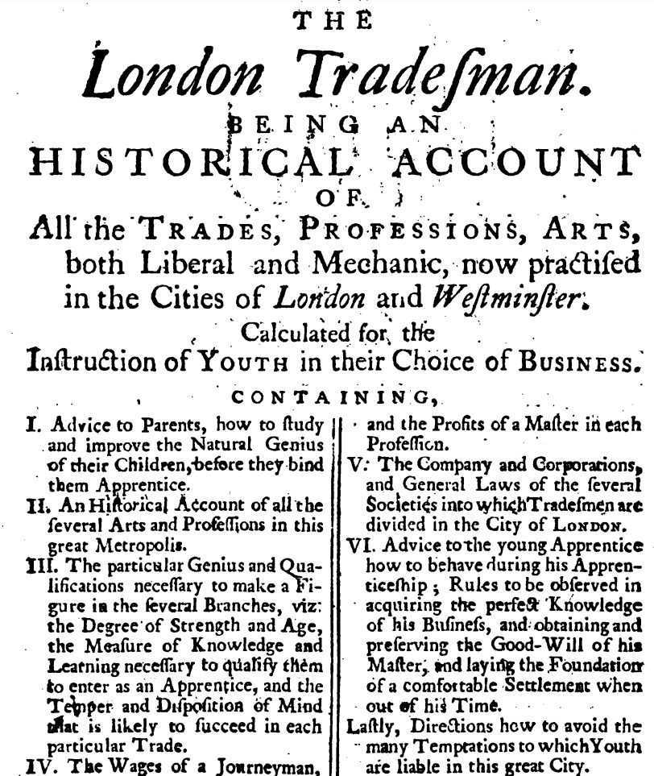

]

.panel[.panel-name[Skills]
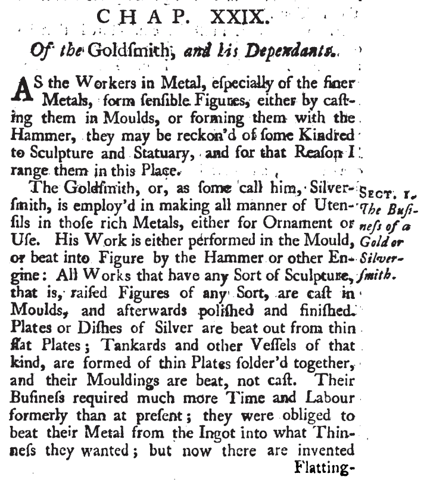

]

]

]

---
# Application: Result

.pull-left-narrow[
### What is good advice in 1800?
- Which 18th skills would benefit in the 19th century?

- VERY preliminary
]

.pull-right-wide[
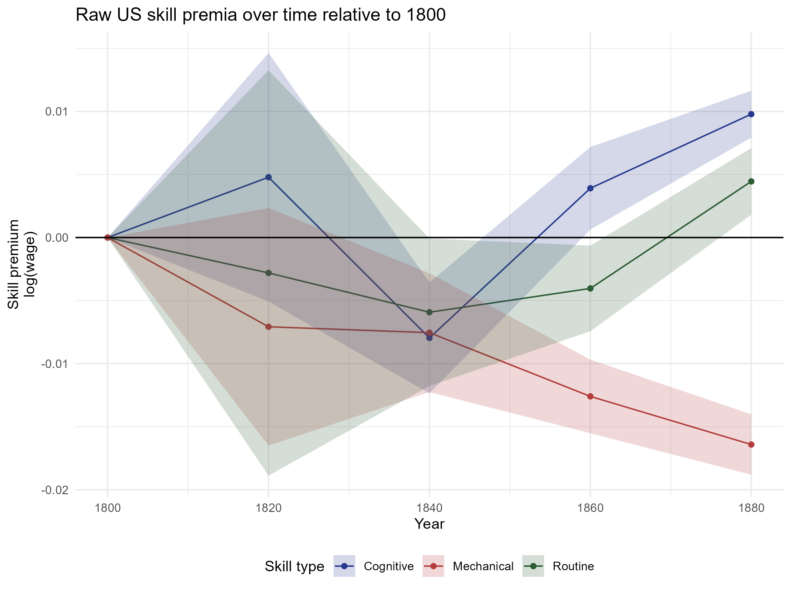
]

---
# Conclusion

.pull-left[
- Here's a new tool (on its way)
- We hope its useful

- More work to be done on:
  + Automatic debiasing
  + Application
  
  
#### Feel free to contact me
**Email:** <christian-vs@sam.sdu.dk>;  
**Twitter/X:** [@ChristianVedel](https://twitter.com/ChristianVedel);  
**BlueSky:** [@christianvedel.bsky.social](https://bsky.app/profile/christianvedel.bsky.social);
]

--

.pull-right[
.pull-left-wide[
### The entire pipeline of CHAOS
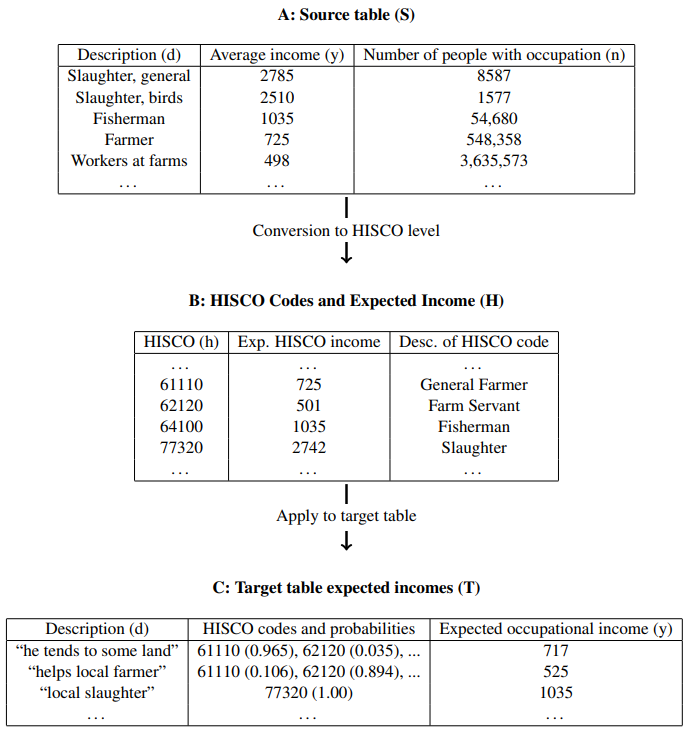 
]
]


---
class: middle, center

# Appendix

---
class: middle

# Skills from LTM

.pull-left-wide[
### Extracting skills
- We ask `gpt-4o` to return a JSON of each occupations skills

### Measuring skills
- First, we map the list skills in an occupation, $S = \{s_1, \dots, s_N\}$, into a 384-dimensional vector space  using a a pre-trained Sentence-BERT model (all-MiniLM-L6-v2). This yields embedding vectors $\mathbf{e}_{s_i} \in \mathbb{R}^d$.

- We then construct a index of skill based on cosine similarity

$$\text{routine proportion}_i = \frac{\bar{\sigma}_{i,\text{routine}}}{\bar{\sigma}_{i,\text{routine}} + \bar{\sigma}_{i,\text{non routine}}}$$

Where $\bar{\sigma}_{i,routine}$ is the cosine similarity between skills$_i$ and the description of $\text{routine}$.

]

.pull-right-narrow[
.panelset[
.panel[.panel-name[Goldsmith skills]
.tiny123[
`"making all manner of utensils in gold or silver for ornament or use"`,  
`"performing work in the mould or beating into figure by hammer or other engine"`,  
`"casting works with raised figures in moulds"`,  
`"polishing and finishing cast works"`,  
`"beating plates or dishes of silver from thin flat plates"`,  
`"forming tankards and other vessels from thin plates soldered together"`,  
`"beating mouldings for vessels"`,  
`"using flatting-mills to reduce metal to required thinness"`,  
`"making all moulds for their work"`  
]
]

.panel[.panel-name[Routine]
.small123[
#### Routine
repetitive task, following explicit rules, highly structured sequence

#### Non-routine
problem solving, creative thinking, requires judgment
]
]

.panel[.panel-name[Cognitive]
.small123[
#### Cognitive
abstract reasoning, analytical thinking, information processing

#### Non-cognitive
physical effort, manual labor, emotional labor
]
]

.panel[.panel-name[Cognitive]
.small123[
#### Mechanical
operate machinery, assemble parts, machine operation

#### Non-mechanical
software use, writing, communication
]
]


]


]

---
class: middle
# Appendix Example: New York, 1880

### "He is a blacksmith"

We want to estimate an income for a census record  
with only an occupational title.  

We start from a **source table** of daily wages in New York, 1880:

.small123[
| Source title $d_i$  | Outcome $y_i$ (daily wage) |
|---------------------|----------------------------|
| Blacksmith          | $2.80 |
| Hammersmith         | $2.55 |
| Tinsmith            | $2.30 |
| Goldsmith           | $3.10 |
| Shoemaker           | $2.40 |
| (other)             | ...   |
]
---

# Step A1: Classifier probabilities

OccCANINE assigns each source title $d_i$ a distribution over HISCO codes:

.small123[
| $d_i$       | Pr(83110 Blacksmith) | Pr(83120 Hammersmith) | Pr(87340 Tinsmith) | Pr(88050 Goldsmith) | Pr(80110 Shoemaker) |
|-------------|----------------------|-----------------------|--------------------|---------------------|---------------------|
| Blacksmith  | 0.955 | 0.011 | 0.018 | 0.013 | 0.003 |
| Hammersmith | 0.112 | 0.851 | 0.031 | 0.000 | 0.006 |
| Tinsmith    | 0.069 | 0.000 | 0.911 | 0.018 | 0.002 |
| Goldsmith   | 0.074 | 0.011 | 0.012 | 0.901 | 0.002 |
| Shoemaker   | 0.011 | 0.000 | 0.012 | 0.000 | 0.977 |
]

---

# Step A2: Posterior probabilities

Via Bayes rule, we invert to $\Pr(d_i \mid h_j)$:

.small123[
| $d_i$       | Blacksmith | Hammersmith | Tinsmith | Goldsmith | Shoemaker |
|-------------|------------|-------------|----------|-----------|-----------|
| Blacksmith  | 0.782 | 0.013 | 0.018 | 0.014 | 0.003 |
| Hammersmith | 0.092 | 0.975 | 0.032 | 0.000 | 0.006 |
| Tinsmith    | 0.057 | 0.000 | 0.926 | 0.019 | 0.002 |
| Goldsmith   | 0.061 | 0.013 | 0.012 | 0.967 | 0.002 |
| Shoemaker   | 0.009 | 0.000 | 0.012 | 0.000 | 0.987 |
]

---

# Step A3: HISCO-level means

Aggregate outcomes into HISCO-level expected values:  

$\; y_j = \sum_i y_i \Pr(d_i \mid h_j)$

.small123[
| HISCO code | Occupation          | $\mathbb{E}(y_i\mid h_j)$ |
|------------|--------------------|---------------------------|
| 83110      | Blacksmith         | 2.76 |
| 83120      | Hammersmith        | 2.56 |
| 87340      | Tinsmith           | 2.33 |
| 88050      | Goldsmith          | 3.08 |
| 80110      | Shoemaker          | 2.40 |
]

---

# Step B1: Target classification

Target record: *“He is a blacksmith”*  

OccCANINE distribution over HISCO:

.small123[
| Target $d_k$ | Blacksmith | Hammersmith | Tinsmith | Goldsmith | Shoemaker |
|--------------|------------|-------------|----------|-----------|-----------|
| "He is a blacksmith" | 0.918 | 0.019 | 0.032 | 0.016 | 0.015 |
]

---

# Step B2: Target prediction

Estimate $\hat y_k = \sum_j y_j \Pr(h_j\mid d_k)$

$$\hat y_k = 2.76\cdot0.918 + 2.56\cdot0.019 + 2.33\cdot0.032 + 3.08\cdot0.016 + 2.40\cdot0.015$$

$$\hat y_k \;\approx\; \$2.75$$

**Prediction:** A census record with “blacksmith” in 1880 New York  
gets an estimated daily wage of $2.745.

---

# Step C: Collapsed weights

We can collapse HISCO and express weights $w_{ik}$ directly:

.small123[
| Source $d_i$ | Weight $w_{ik}$ |
|--------------|-----------------|
| Blacksmith   | 0.719 |
| Hammersmith  | 0.104 |
| Tinsmith     | 0.082 |
| Goldsmith    | 0.072 |
| Shoemaker    | 0.023 |
]

So prediction = weighted average:

$$\hat y_k = 0.719\cdot2.80 + 0.104\cdot2.55 + 0.082\cdot2.30 + 0.072\cdot3.10 + 0.023\cdot2.40$$

= **$2.745**

---

class: middle
# Interpretation

- Majority weight: **Blacksmith** row (0.719)  
- Related trades contribute: Hammersmith, Tinsmith, Goldsmith  
- Even Shoemaker leaves a small trace  
- **Not a black box:** full transparency on how the estimate is built  


---
class: middle
# Example 1

.pull-left-wide[
- Suppose the source reports an income of $3.10 for "smiths." 
- In HISCO, there are several possibilities: blacksmith, tinsmith, and goldsmith. Instead of forcing a hard choice, CHAOS distributes the weight across codes. 
- If historical usage suggests "smith" usually means blacksmith, we might assign $w_{ij}=0.7$ to blacksmith, $w_{ij}=0.2$ to tinsmith, and $w_{ij}=0.1$ to goldsmith. 
- The CHAOS equations thereby preserve the ambiguity and propagate it through to the estimates. 
]

---
class: middle
# Example 2

.pull-left-wide[
- Sometimes a historical record lists multiple occupations for the same person
- For instance, "farmer and butcher'" with an average income of $2.50. In HISCO, these map to two codes.
- Instead of forcing a choice, CHAOS splits the weights, say $w_{ij}=0.7$ for farmer and $w_{ij}=0.3$ for butcher.  
]


