---
output:
  xaringan::moon_reader:
    seal: false
    includes:
      after_body: insert-logo.html
    self_contained: false
    lib_dir: libs
    nature:
      highlightStyle: github
      highlightLines: true
      countIncrementalSlides: false
      ratio: '16:9'
editor_options:
  chunk_output_type: console
---
class: center, inverse, middle

```{r xaringan-panelset, echo=FALSE}
xaringanExtra::use_panelset()
```

```{r xaringan-tile-view, echo=FALSE}
xaringanExtra::use_tile_view()
```

```{r xaringanExtra, echo = FALSE}
xaringanExtra::use_progress_bar(color = "#808080", location = "top")
```

```{css echo=FALSE}
.pull-left {
  float: left;
  width: 44%;
}
.pull-right {
  float: right;
  width: 44%;
}
.pull-right ~ p {
  clear: both;
}

.pull-left-wide {
  float: left;
  width: 66%;
}
.pull-right-wide {
  float: right;
  width: 66%;
}
.pull-right-wide ~ p {
  clear: both;
}

.pull-left-narrow {
  float: left;
  width: 30%;
}
.pull-right-narrow {
  float: right;
  width: 30%;
}

.pull-right-extra-narrow {
  float: right;
  width: 20%;
}

.pull-center {
  margin-left: 28%;
  width: 44%;
}

.pull-center-wide {
  margin-left: 17%;
  width: 66%;
}

.pull-center-medium {
  margin-left: 20%;
  width: 60%;
}

.pull-center-narrow {
  margin-left: 35%;
  width: 25%;
}

.tiny123 {
  font-size: 0.40em;
}

.small123 {
  font-size: 0.80em;
}

.large123 {
  font-size: 2em;
}

.red {
  color: red
}

.chaosred {
  color: #b33d3d
}

.orange {
  color: orange
}

.green {
  color: green
}

.blue {
  color: blue
}
```


# CHAOS
## Converting Historical Accounts to Occupational Scores

### Matt Curtis, Torben Johansen, Julius Koschnick, **Christian Vedel**,
### University of Southern Denmark

### Email: [christian-vs@sam.sdu.dk](mailto:christian-vs@sam.sdu.dk)

### Updated `r Sys.Date()`

---
name: ovid
class: center, inverse

<br>
<br>
<br>
<br>
<br>

### *Working with Historical Data:*

--

> ## *"Chaos; a rude and undigested mass, and nothing more than an inert weight… heaped together in the same spot."*
> — Ovid, *The Metamorphoses*

---


---


---
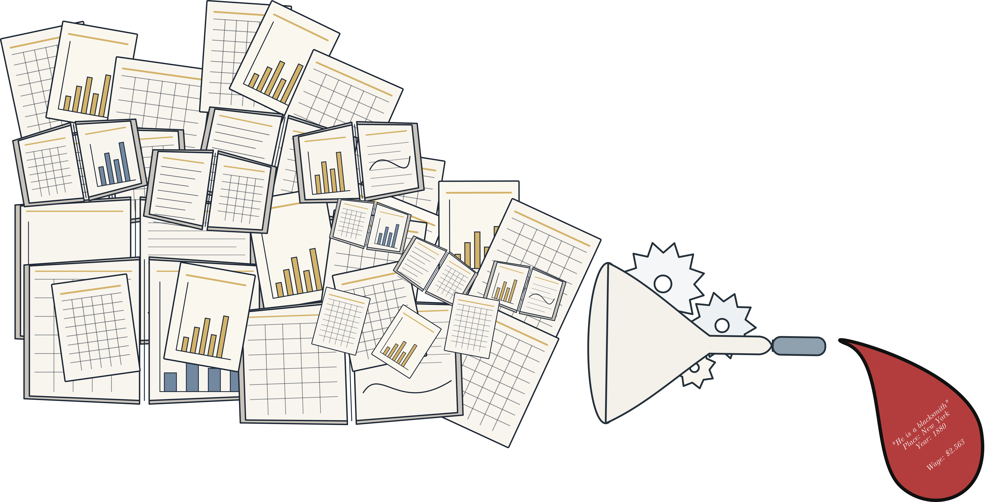

---
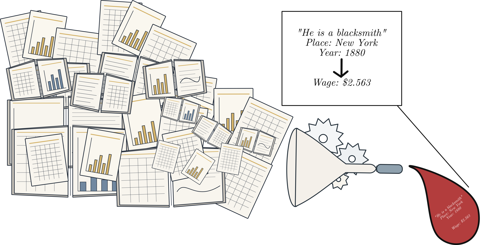

---
# The tool we present: *CHAOS*

--

1. If you have a *Source* containing: Occupations + some outcome (skills, income, etc.)

--

2. A *Target* containing: Occupations only (e.g. census data)

--

3. We provide a method for map any target occupation to a predicted outcome

--

**Aproach:** We do probabilistic mapping to a standardized scheme. E.g. HISCO as an intermediate step


--

.pull-left-narrow[
### What you provide:
- Source: $\{d_i, y_i\}$

| Occupation | Income |
|---|---|
| blacksmith | $2.30 |
| tailor | $1.98 |
| farmer | $1.42 |
]

--

.pull-right-narrow[
### What you get:
- Target: $\{d_k, \hat{y}_k\}$

| Occupation | Income |
|---|---|
| smith | [Estimate] |
| tailor | [Estimate] |
| agricultural worker | [Estimate] |
]

---
name: motivation

# CHAOS: Converting Historical Accounts to Occupational Scores

.pull-left-wide[
- When we don't have wages but occupations, we can proxy wages with people's occupations.
- Typically OCC1950-SCORE (i.e. wages in the US in 1950s)

]

--

.pull-left-wide[
### This presentation:
- We provide econometric formalization of the use of occscores
- Introduce CHAOS, a new method for constructing occscores that is efficient, interpretable, and well-validated
- Apply it to estimate skill premiums across the industrializing world, 1800–1900
]


--

.pull-right-narrow[
.center[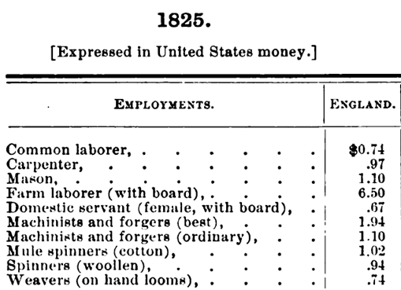]

Could you tell me the income of a *Joiner*, *Cowherd*, *Bricklayer*?

.center[]
]

---
name: literature

# Literature

.small123[
- IPUMS occscore introduced by Sobek (1995), but similar measures used throughout the literature (e.g. Preston & Haines 1991)

- This and similar measures have become prevalent in the literature.

- However, they entail a number of problems, mainly stemming from source-target-shift (Inwood et al. 2019, Saavedra & Twinam, 2020).

- A few fixes and alternative methods proposed (Saavedra & Twinam, 2020, Paker, Stephenson & Wallis, 2025, Vafa et al 2024, Mühlbach, 2021)

]

--

> .chaosred[**We propose a new method that is efficient and ML-powered but interpretable.**]

---
class: inverse, middle, center

# Econometric framework

---
name: bias

# Problem: Bias from occ. scores

$$y_i = \alpha + \beta x_i + \varepsilon_i$$

.small123[
where $y_i$ is the true outcome (e.g. wage) to be replaced with $\mu_S(d_i)$ s.t.
]

--

$$\mu_S(d_i) = \alpha + \beta x_i + \varepsilon_i$$


--

.pull-left-wide[
.small123[
Let $\mu_S(d_i)$ be the source-assigned score, $\mu_T(d_i)$ the target-population mean, $y_i$ the true outcome. The total proxy error decomposes as:

$$m_i \;=\; \underbrace{\mu_S(d_i) - \mu_T(d_i)}_{\delta(d_i)\ \text{source-target drift}} \;+\; \underbrace{\mu_T(d_i) - y_i}_{r_i\ \text{within-occupation residual}}$$

Then:

$$\hat{\beta} = \beta + \frac{\text{Cov}(x_i,\, m_i)}{\text{Var}(x_i)}$$

]
]

.pull-right-narrow[
### The two big problems of occupational scores:
.small123[
$\delta(d_i)$ — **source-target drift**
1950 US wages $\neq$ 1850 England.

$r_i$ — **within-occupation residual**
Apprentice $\neq$ master;
]
]

--

.pull-left-wide[
$$\require{cancel}$$
$m_i \;=\; \cancel{\underbrace{\mu_S(d_i) - \mu_T(d_i)}_{\delta(d_i)\ \text{source-target drift}}} \;+\; \underbrace{\mu_T(d_i) - y_i}_{r_i\ \text{within-occupation residual}}$
]

.pull-right-narrow[
.chaosred[**CHAOS addresses the first and formalizes the second.**]
]

???

IPUMS occscore uses 1950 US wages → Canadian migrants. Blacksmith rank shifts. Inwood et al. (2019).

r_i: "Smith" = goldsmith or blacksmith. "Tailor" = master or journeyman.

---
# The goal
To input:
- One or multiple source of info on occupations
- To obtain an estimator: $\mathbb{E}(y_k \mid d_k)$

--

$$\text{text}_k\Rightarrow y_k$$

--

$$\text{"he is a blacksmith"}\Rightarrow \$2.563$$

--

.pull-left[
### What we have:
- Sources: $\{d_i, y_i\}$

| Occupation | Income |
|---|---|
| blacksmith | $2.30 |
| tailor | $1.98 |
| farmer | $1.42 |
]

--

.pull-right[
### What we want:
- Target: $\{d_k\}$

| Occupation | Income |
|---|---|
| smith | ? |
| tailor | ? |
| agricultural worker | ? |
]

---
name: occcanine

# OccCANINE: the classifier

.pull-left[
.small123[w. Christian Møller Dahl & Torben Johansen — [arxiv 2408.00885](https://arxiv.org/abs/2408.00885)]

- Language model trained on **~18.5 million** observations
- 13 languages, 29 sources
- Open source, fast, highly accurate

**Key output:**

$$\text{OccCANINE}: \quad d_i \;\mapsto\; \Pr(h_j \mid d_i)$$

A full probability distribution over HISCO codes for any occupation string.

- Handles ambiguous, multi-occupation, and historical spelling

]

.pull-right[
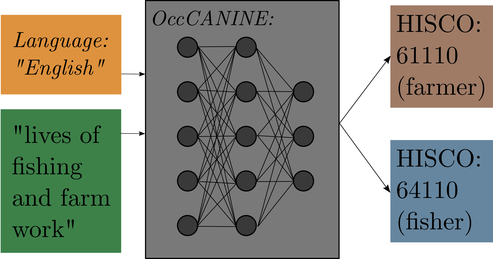
.small123[*Conceptual architecture of OccCANINE*]
]


---
name: chaos-math

# Bringing Maths to CHAOS

Now, let's introduce a unversal encoding $h_j$. *Let's say we know* $\color{#2c5c34}{Pr(h_j \mid d)}$

--

.pull-left[
.small123[
### Step 1 — by definition
$$\color{#b33d3d}{\mathbb{E}(y_i \mid h_j)} = \sum_i y_i\Pr(y_i\mid h_j)$$

### Step 2 — Bayes rule
$$\color{#b33d3d}{\mathbb{E}(y_i \mid h_j)} = \sum_i y_i\frac{\Pr(h_j \mid y_i) \Pr(y_i)}{\Pr(h_j)}$$

### Step 3 — swap $y$ for $d$
$$\color{#b33d3d}{\mathbb{E}(y_i \mid h_j)} = \sum_i y_i\frac{\color{#2c5c34}{\Pr(h_j \mid d_i)} \Pr(d_i)}{\Pr(h_j)}$$

]
]

--

.pull-right[
.small123[
### Step 4 — apply to target
$$\mathbb{E}(y_k \mid d_k) = \sum_j \color{#b33d3d}{\mathbb{E}(y_i \mid h_j)}\, \color{#2c5c34}{\Pr(h_j \mid d_k)}$$

### Key assumptions
1. **Source–target relevance:** source and target are iid draws from the same distribution
2. **Broadband classifier:** $\mathbb{E}(y_i \mid h_j, d_i) = \mathbb{E}(y_i \mid h_j)$

]
]

---
name: method-check

# Checking results — evidence for each prediction

--

.pull-left[
### Evidence — a free byproduct of Bayes' rule

$$\text{Evidence}(d_k) = \sum_j \Pr(h_j) \cdot \Pr(h_j \mid d_k)$$

> Empirical backing for $d_k$ — falls out of the derivation for free.
]

--

.pull-right[
### Effective observations

$$N_\text{eff}(d_k) = N_\text{source} \times \text{Evidence}(d_k)$$

> *How many source observations back this prediction?*

- High $\Rightarrow$ reliable
- Low $\Rightarrow$ reverts to source mean
]

---
class: inverse, middle, center

# Data and validation CHAOS predictions

---
name: application-data

# Source A — Wages (US Commissioner of Labor)

.pull-left-wide[
- **84,000 occupation–place–year** wage observations
- 140 places (US states + countries), 1725–1900
- Analysis sample (1800–1900): **135,182 obs**, 67 places, 4,492 occupations
- $\Rightarrow$ Provides $y_i$ (daily wages)

| Region | Obs | Places | Occupations |
|---|---|---|---|
| United States | 92,647 | 49 | 4,002 |
| United Kingdom | 18,793 | 5 | 1,617 |
| Western Europe | 23,742 | 13 | 2,002 |


- All of it digitized with Gemini and cleaned by hand
- **We supplement this with skills for 229 occupations from the London Tradesman (1747).** [See appendix](#appendix-source-b)
]

.pull-right-narrow[
.panelset[
.panel[.panel-name[Cover]
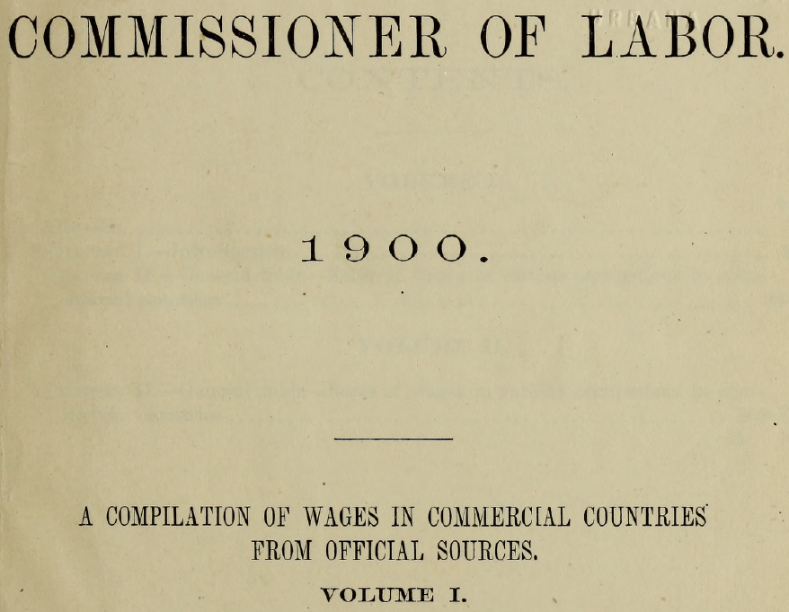
]
.panel[.panel-name[Table]
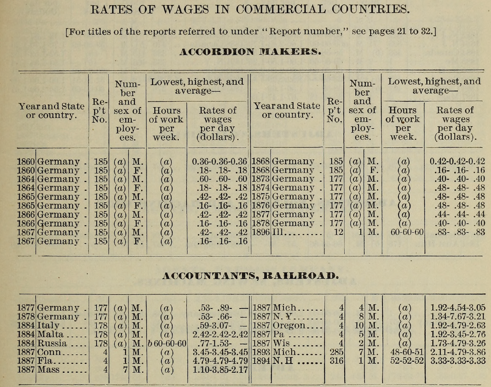
]
]
]
---
name: chaos-flexibility

# CHAOS as a bridge between sources

.pull-right-wide[
.center[]
]

--

.pull-left-wide[
- Works in **any direction**
- In this application: **LTM skills (1747) $\Rightarrow$ HISCO $\Rightarrow$ DoL wages**
- In a nutshell: This gives intuition for the broadband classifier assumption — the HISCO layer is the "pivot" that allows us to connect different sources and time periods.
- *How much do you believe in HISCO? - Could use other classification systems.*
]

---
# Demonstration

.pull-left-narrow[

- This is all wrapped in a nice little python library.

]  

.pull-right-wide[
  <iframe width="560" height="315" src="https://www.youtube.com/embed/WHCYSQp6yCk?si=lcKyQfj_3ZUYiRih" title="YouTube video player" frameborder="0" allow="accelerometer; autoplay; clipboard-write; encrypted-media; gyroscope; picture-in-picture; web-share" referrerpolicy="strict-origin-when-cross-origin" allowfullscreen></iframe>
  <br>
  [Short demonstration on YouTube](https://youtu.be/WHCYSQp6yCk)
]

---
# Validation exercise

*We run CHAOS on 1880 and try to predict 1860–1900 to showcase Source-Target drift.*


--

.pull-left-narrow[
- We have actual wages for 1860–1900
- So we can check how well CHAOS does in each year.
]

--

.pull-right-wide[

.panelset[
.panel[.panel-name[1881]
.center[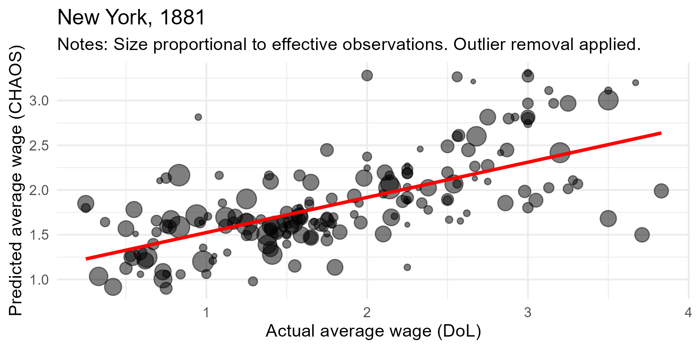]
]
.panel[.panel-name[1882]
.center[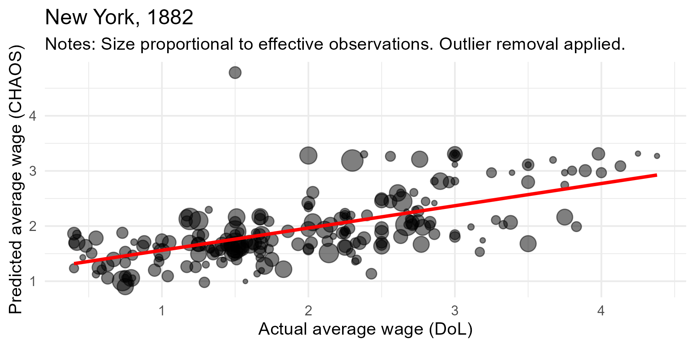]
]
.panel[.panel-name[1883]
.center[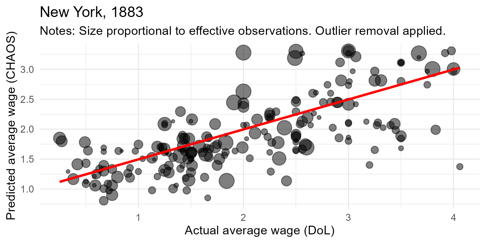]
]
.panel[.panel-name[1894]
.center[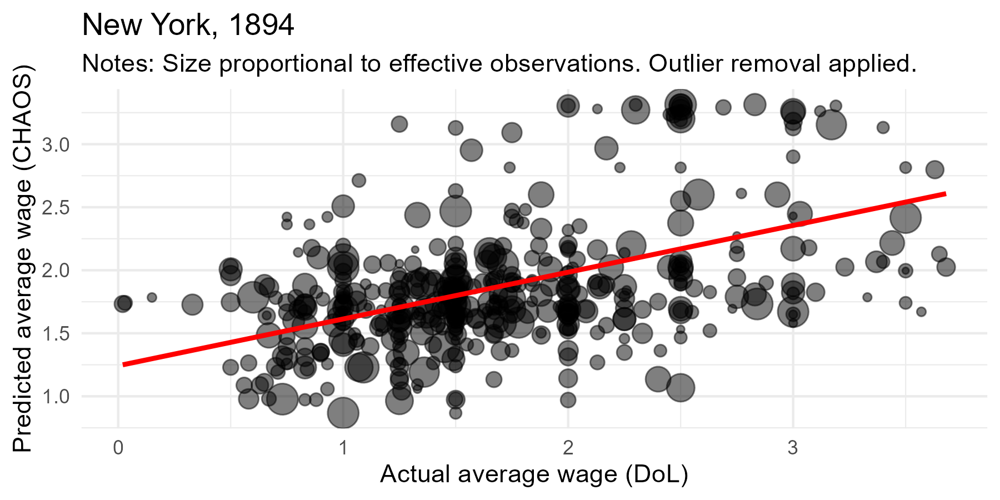]
]
.panel[.panel-name[Bias]
.center[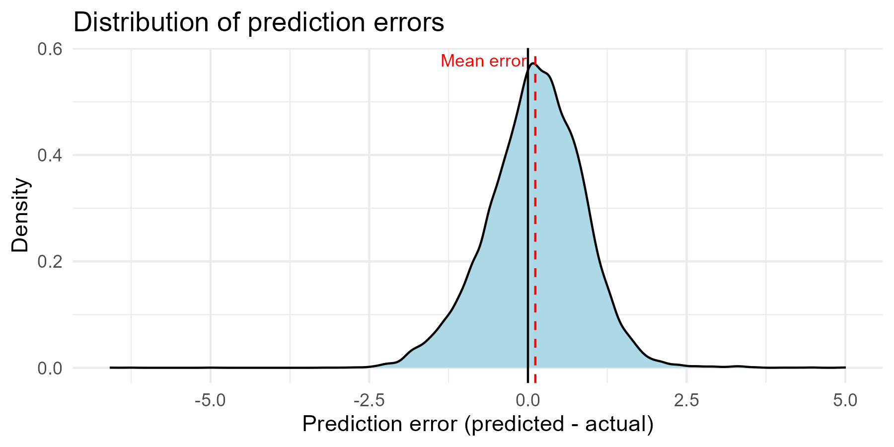]
]
.panel[.panel-name[R^2]
.center[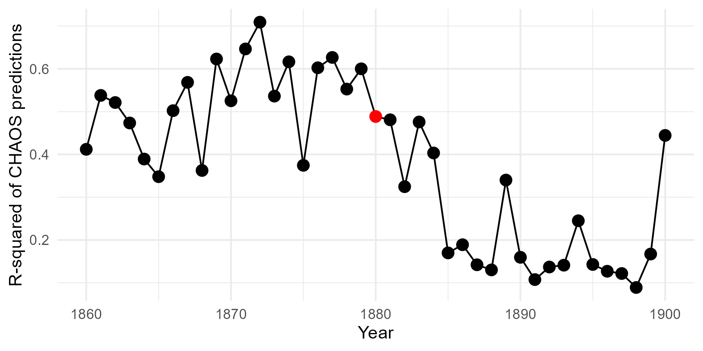]
]
.panel[.panel-name[Wages]
.center[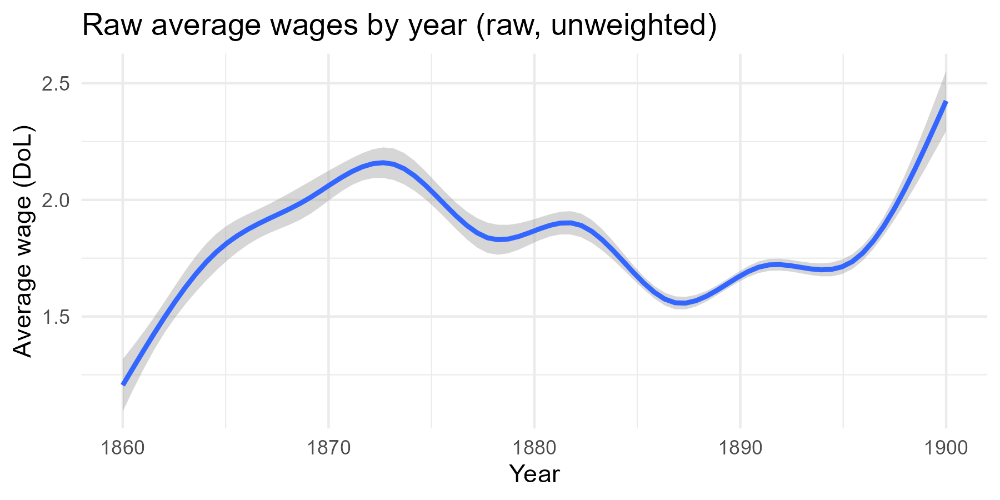]
]
.panel[.panel-name[1895 base]
.center[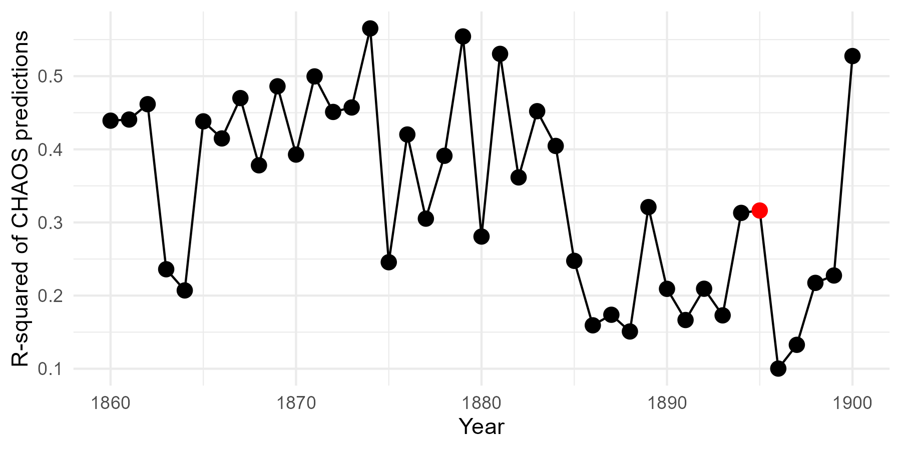]
]
.panel[.panel-name[1894 rebased]
.center[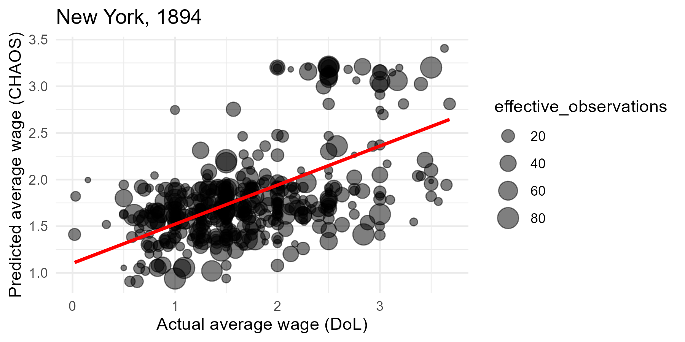]
]
.panel[.panel-name[Bias by year]
.center[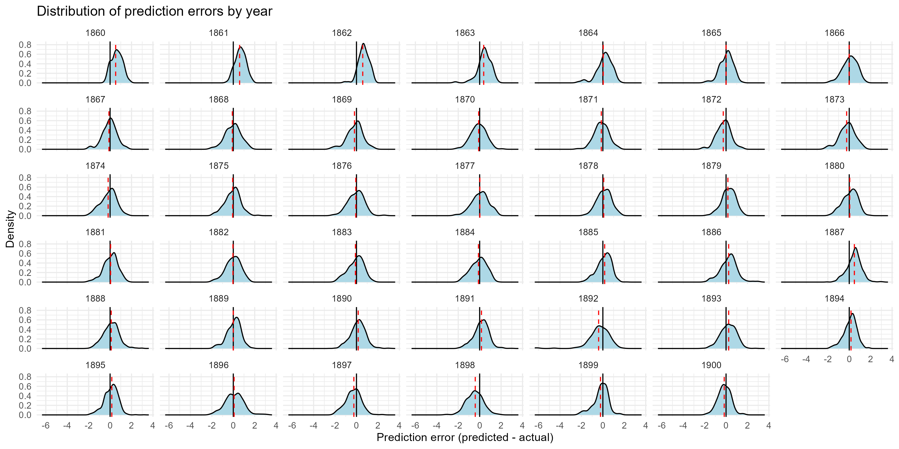]
]
]
]


```{r eval=FALSE, echo=FALSE, warning=FALSE, message=FALSE} 
library(tidyverse)
dol = read_csv("Project_dissemination/CHAOS_slides/predicted_outcomes.csv")

dims = c(3, 6)

# Outlier removal
dol = dol %>%
  group_by(year) %>%
  filter(outcome < mean(outcome) + 2 * sd(outcome))

for(y in unique(dol$year)){
  p = ggplot(dol %>% filter(year == y), aes(x = outcome, y = predicted_outcome)) +
    geom_point(aes(size = effective_observations), alpha = 0.5) +
    geom_smooth(aes(weight = effective_observations), method = "lm", se = FALSE, color = "red") +
    labs(x = "Actual average wage (DoL)", y = "Predicted average wage (CHAOS)",
         title = paste("New York,", y),
         subtitle = "Notes: Size proportional to effective observations. Outlier removal applied.") +
    theme_minimal() + 
    theme(legend.position = "none")
  ggsave(paste0("Project_dissemination/CHAOS_slides/Figures/validation_scatter_by_year/", y, ".png"), plot = p, width = dims[2], height = dims[1])
}

# Regression results:
rsqs = data.frame(year = numeric(), rsq = numeric())
for(y in unique(dol$year)){
  reg = lm(predicted_outcome ~ outcome, data = dol %>% filter(year == y), weights = effective_observations)
  print(paste("Year:", y))
  rsq = summary(reg)$r.squared
  rsqs = rbind(rsqs, data.frame(year = y, rsq = rsq))
}

p1 = ggplot(rsqs, aes(x = year, y = rsq)) +
  geom_line() +
  geom_point(aes(color = year == 1880), size = 3) +
  scale_color_manual(values = c("FALSE" = "black", "TRUE" = "red"), guide = "none") +
  labs(x = "Year", y = "R-squared of CHAOS predictions") +
  theme_minimal()

ggsave("Project_dissemination/CHAOS_slides/Figures/validation_rsq_by_year.png", plot = p1, width = dims[2], height = dims[1])


# Raw average wages
p2 = ggplot(dol, aes(x = year, y = outcome)) +
  geom_smooth() +
  labs(x = "Year", y = "Average wage (DoL)",
       title = "Raw average wages by year (raw, unweighted)") +
  theme_minimal()
ggsave("Project_dissemination/CHAOS_slides/Figures/validation_raw_wages_by_year.png", plot = p2, width = dims[2], height = dims[1])

# Error histogram
mean_error = mean(dol$predicted_outcome - dol$outcome)
mean_error_by_year = dol %>% group_by(year) %>% summarize(mean_error = mean(predicted_outcome - outcome))

p3 = dol %>%
  mutate(error = predicted_outcome - outcome) %>%
  ggplot(aes(x = error)) +
  geom_density(fill = "lightblue", color = "black") +
  geom_vline(xintercept = 0) +
  geom_vline(xintercept = mean_error, color = "red", linetype = "dashed") +
  geom_text(data = data.frame(mean_error = mean_error),
            aes(x = mean_error, y = Inf, label = "Mean error"),
            color = "red", vjust = 1.5, hjust = 1.1, size = 3) +
  labs(x = "Prediction error (predicted - actual)", y = "Density",
       title = "Distribution of prediction errors") +
  theme_minimal()
ggsave("Project_dissemination/CHAOS_slides/Figures/validation_prediction_error_histogram.png", plot = p3, width = dims[2], height = dims[1])

p3_by_year = dol %>%
  mutate(error = predicted_outcome - outcome) %>%
  ggplot(aes(x = error)) +
  geom_density(fill = "lightblue", color = "black") +
  geom_vline(xintercept = 0) +
  geom_vline(data = mean_error_by_year, aes(xintercept = mean_error), color = "red", linetype = "dashed") +
  facet_wrap(~year) +
  labs(x = "Prediction error (predicted - actual)", y = "Density",
       title = "Distribution of prediction errors by year") +
  theme_minimal()
ggsave("Project_dissemination/CHAOS_slides/Figures/validation_prediction_error_histogram_by_year.png", plot = p3_by_year, width = dims[2]*2, height = dims[1]*2)
```

```{r eval=FALSE, echo=FALSE, warning=FALSE, message=FALSE} 
library(tidyverse)
dol = read_csv("Project_dissemination/CHAOS_slides/predicted_outcomes_1895_baseline.csv")

dims = c(3, 6)

# Outlier removal
dol = dol %>%
  group_by(year) %>%
  filter(outcome < mean(outcome) + 2 * sd(outcome))

# for(y in unique(dol$year)){
# Produce y = 1894 plot as an example
y = 1894
  p = ggplot(dol %>% filter(year == y), aes(x = outcome, y = predicted_outcome)) +
    geom_point(aes(size = effective_observations), alpha = 0.5) +
    geom_smooth(aes(weight = effective_observations), method = "lm", se = FALSE, color = "red") +
    labs(x = "Actual average wage (DoL)", y = "Predicted average wage (CHAOS)",
         title = paste("New York,", y)) +
    theme_minimal()
  ggsave(paste0("Project_dissemination/CHAOS_slides/Figures/validation_scatter_by_year_1895_baseline/", y, ".png"), plot = p, width = dims[2], height = dims[1])
# }

# Regression results:
rsqs = data.frame(year = numeric(), rsq = numeric())
for(y in unique(dol$year)){
  reg = lm(predicted_outcome ~ outcome, data = dol %>% filter(year == y), weights = effective_observations)
  print(paste("Year:", y))
  rsq = summary(reg)$r.squared
  rsqs = rbind(rsqs, data.frame(year = y, rsq = rsq))
}

p1 = ggplot(rsqs, aes(x = year, y = rsq)) +
  geom_line() +
  geom_point(aes(color = year == 1895), size = 3) +
  scale_color_manual(values = c("FALSE" = "black", "TRUE" = "red"), guide = "none") +
  labs(x = "Year", y = "R-squared of CHAOS predictions") +
  theme_minimal()

ggsave("Project_dissemination/CHAOS_slides/Figures/validation_rsq_by_year_1895_baseline.png", plot = p1, width = dims[2], height = dims[1])

```

---
name: method-check-traceability

# No black box — full traceability

.pull-left-narrow[
> Every prediction is a readable weighted average over source rows.

- Trace which HISCO codes contribute
- See the exact source occupations and weights
- Nothing hidden

]


.pull-right-wide[
.panelset[
.panel[.panel-name[Baker]
.center[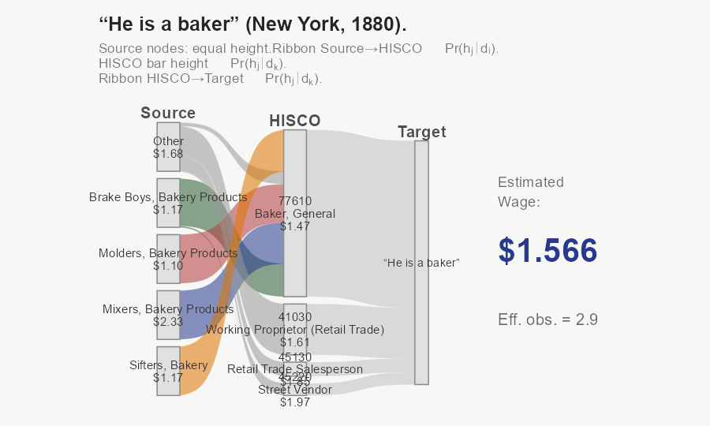]
]
.panel[.panel-name[Blacksmith]
.center[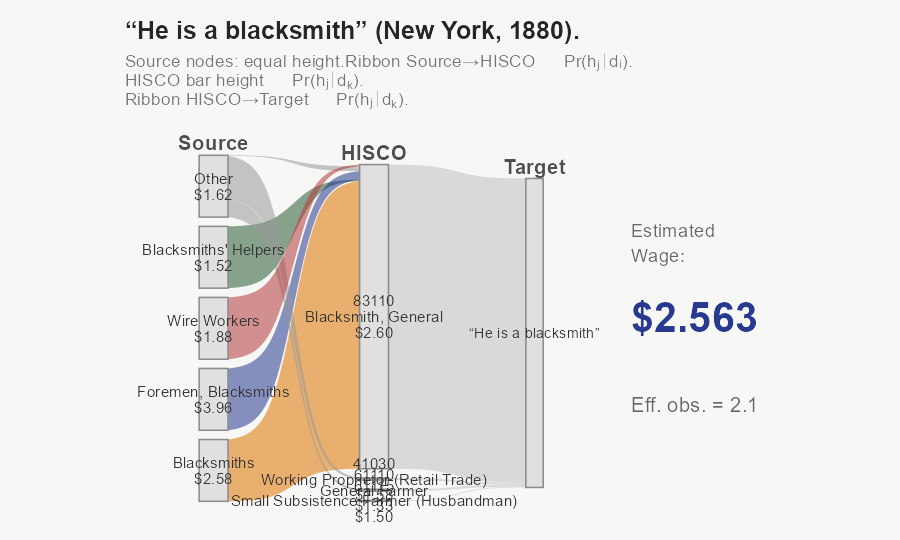]
]
.panel[.panel-name[Tailor]
.center[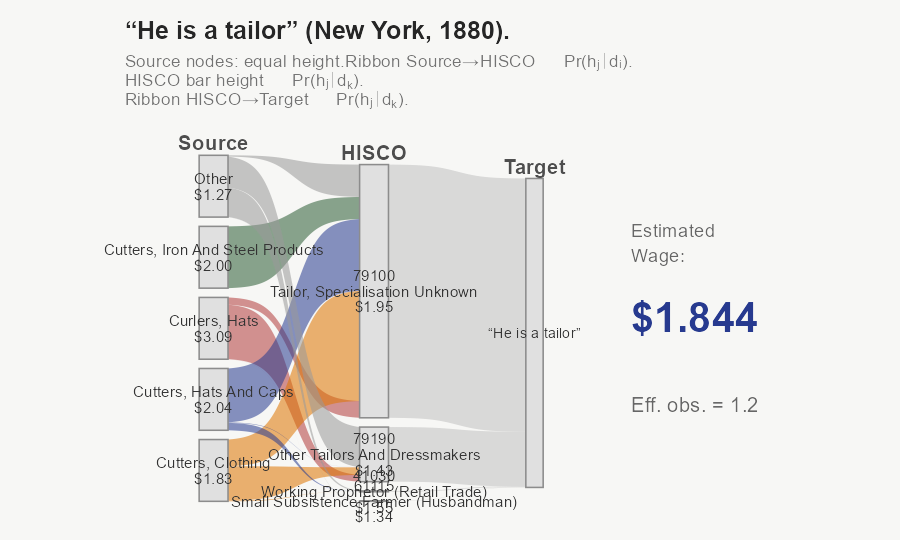]
]
.panel[.panel-name[Merchant]
.center[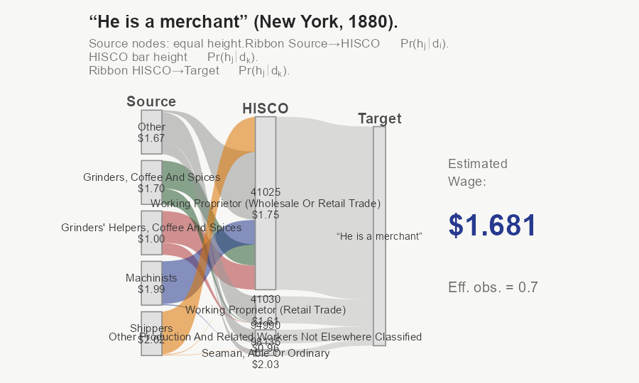]
]
]
]

---
class: inverse, middle, center

# Application

---
name: applied-rq
class: middle 

.pull-left-wide[
# Applied question

> What skills survive when the world turns upside down? The Industrial Revolution is our experiment — **skills locked in 1747**, outcomes traced across **regions, time, and gender**.

.small123[135,182 wage obs &middot; 67 places &middot; 1800–1900]

]

---
name: regression-setup

# Setup

.pull-left-wide[
.chaosred[**Warning:** Everything that follows is proof of concept. Do not believe anything you see.]

OLS throughout; SEs clustered by occupation. Skills from a **2×2 task framework**:

**Two continuous margins:**
- Routine vs. non-routine
- Cognitive vs. manual

**Four binary quadrant indicators** (mutually exclusive):
- Routine cognitive, non-routine cognitive, routine manual, non-routine manual
]

---
name: regression-specs

# Regression specifications

.pull-left-wide[

**Skill premium over time** — estimated separately per skill $s$ and region $r$, reference 1800:
$$\log w_{irt} = \sum_{t \neq 1800} \beta_t \bigl(s_i \cdot \mathbf{1}[\text{decade}=t]\bigr) + \gamma_t + \varepsilon_{irt}$$

]

.pull-right-narrow[
- $\gamma_t$ = decade fixed effects
- Run separately per skill and region
- **Continuous:** routine margin, cognitive margin
- **Binary:** 2×2 quadrant membership
- Weighted by CHAOS target evidence
]


---
name: skill-premiums-time

# Skill premiums over time, by region

.pull-left-narrow[
Coefficient = change in skill premium relative to 1800.

.chaosred[**Still preliminary**]

- No balancing
- No control for selection
- Just descriptive
]

.pull-right-wide[
.panelset[
.panel[.panel-name[Routine margin]
.center[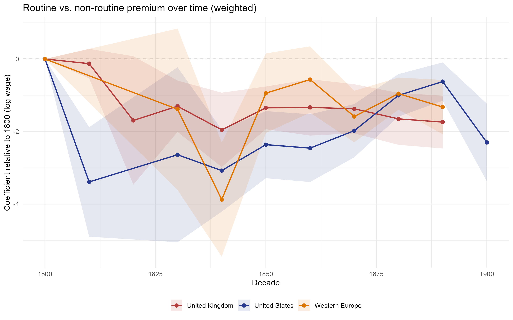]
]
.panel[.panel-name[Cognitive margin]
.center[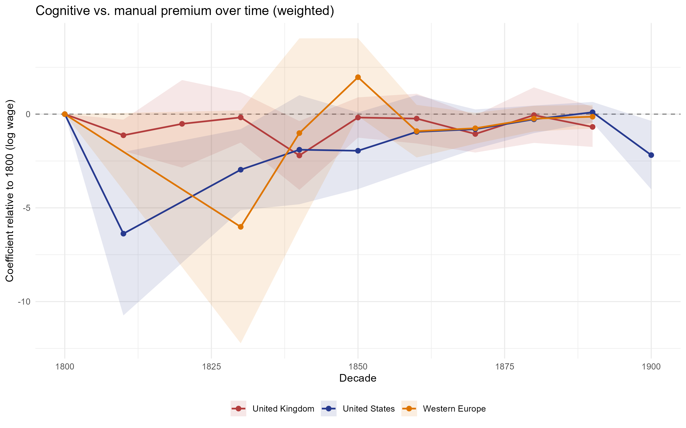]
]
.panel[.panel-name[Routine cognitive]
.center[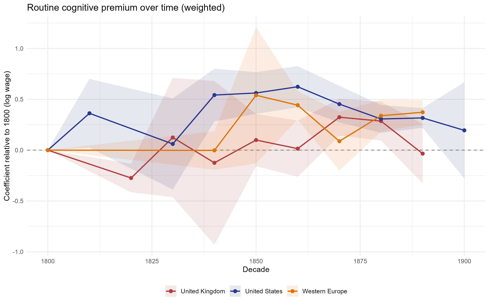]
]
.panel[.panel-name[Non-routine cognitive]
.center[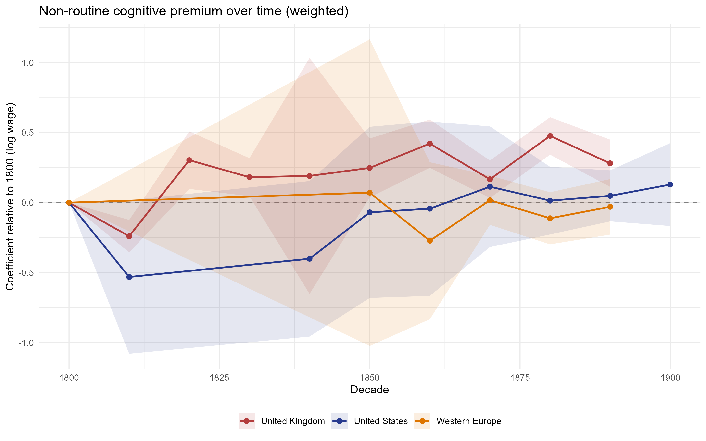]
]
.panel[.panel-name[Routine manual]
.center[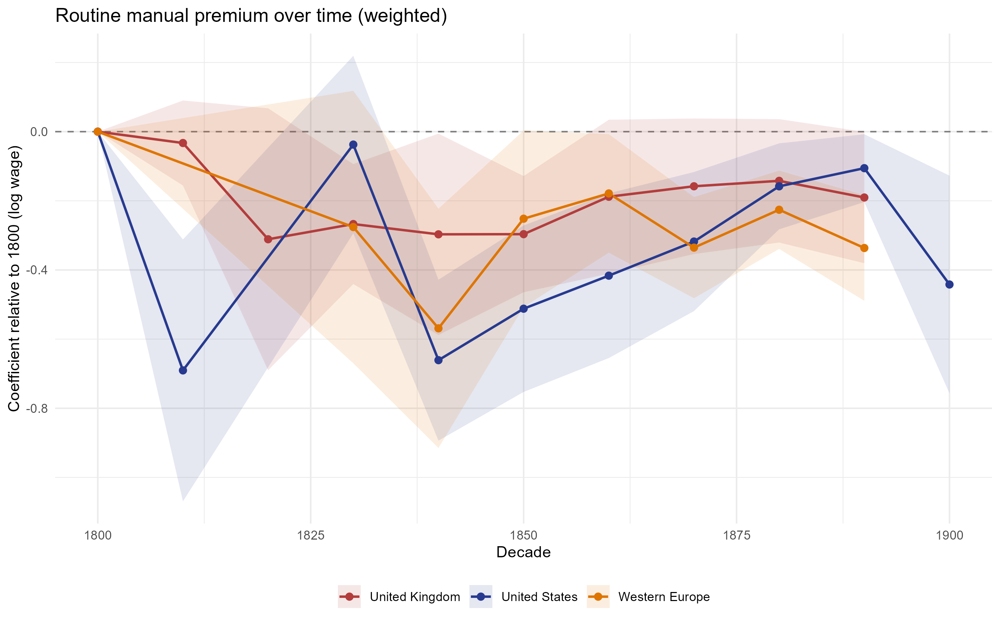]
]
.panel[.panel-name[Non-routine manual]
.center[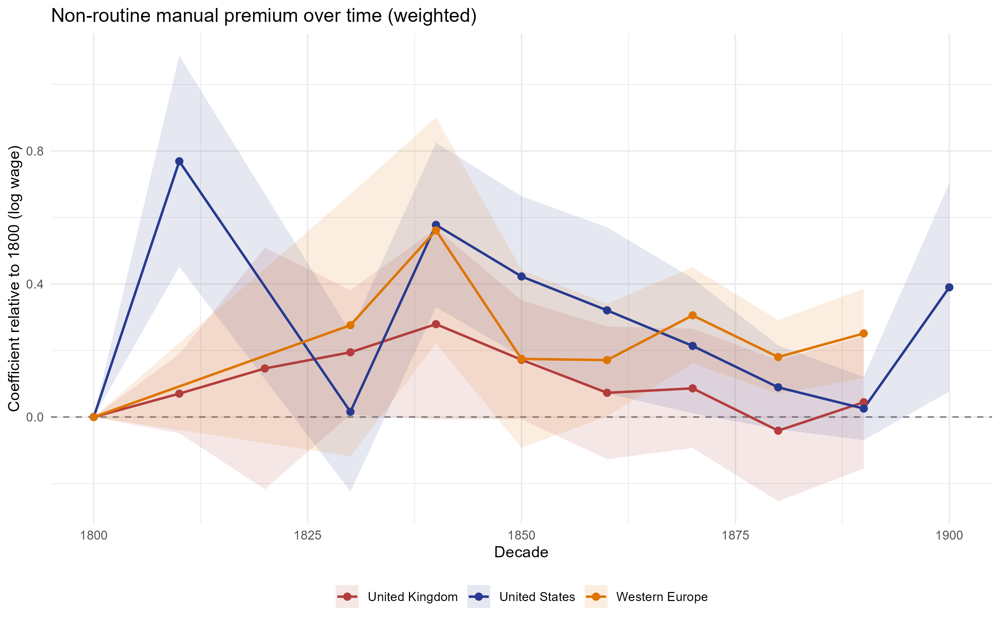]
]
]
]


---
name: conclusion

# Conclusion

.pull-left[
### Contributions

- **CHAOS:** interpretable, automatic occupation-to-skill scoring
- **Empirical:** skill premiums across the industrializing world, 1800–1900 .chaosred[(preliminary)]

### What remains
- Validation, robustness, and extensions

**Email:** [christian-vs@sam.sdu.dk](mailto:christian-vs@sam.sdu.dk)
**BlueSky:** [@christianvedel.bsky.social](https://bsky.app/profile/christianvedel.bsky.social)
]

--

.pull-right[
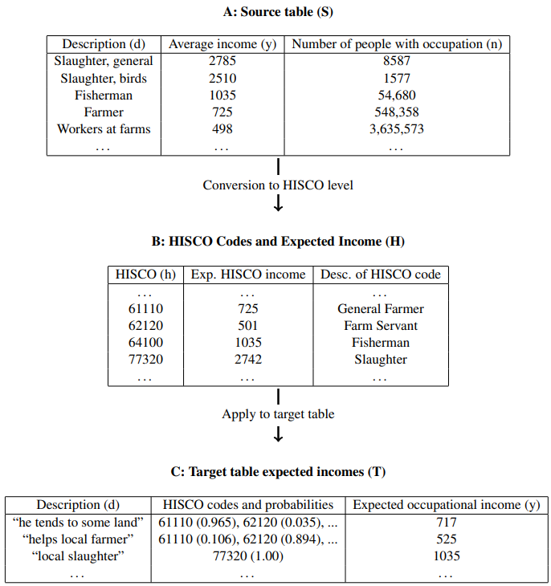
]

---
class: middle, center, inverse

# Appendix

---
name: appendix-math-advanced

# CHAOS: multiple sources + debiasing .chaosred[(if time)]

.pull-left[
.small123[
### Multiple sources $s$
$$\mathbb{E}(y_i\mid h_j)=\sum_i \left[ y_i \sum_s \left(
    \frac{Pr(h_j\mid y_i, S_s)\,Pr(y_i\mid S_s)\,Pr(S_s)}{Pr(h_j)} \right) \right]$$

### Gibberish input
If the classifier is uninformative: $Pr(h_j\mid d_k) = Pr(h_j)$, then:
$$\mathbb{E}(y_k|d_k) = \mathbb{E}(y_i)$$
Prediction reverts gracefully to the source mean.
]
]

.pull-right[
.small123[
### Bias correction (PPI-style)
Bias: $\mathbb{E}(\hat{y}_k)\neq\mathbb{E}(y_k)$

Under relevance assumption:
$$\mathbb{E}(y_k - \hat{y}_k) = \mathbb{E}(y_i - \hat{y}_i)$$

$\Rightarrow$ Observable via LOO-CV on the source.

$$\mu(y)\approx \mu(\hat{y})+\frac{1}{k}\mu(y-\hat{y})$$

Generalizes to regression:
$$\hat\beta = \hat\beta_{\text{naive}} + (X'X)^{-1}X'\widehat{B}(d)$$

.chaosred[**Code still being implemented**]
]
]

[Back to slides](#motivation)

---
name: appendix-skills-ltm

# Skills from the London Tradesman (1747)

.pull-left-wide[
### Extracting skills
- GPT-4o returns a JSON list of skills per occupation from LTM descriptions

### Measuring skills (embedding distance)
- Map skill list $S = \{s_1, \dots, s_N\}$ into 384-dim space via Sentence-BERT (all-MiniLM-L6-v2)
- Construct skill index via cosine similarity to anchor phrases:

$$\text{routine proportion}_i = \frac{\bar{\sigma}_{i,\text{routine}}}{\bar{\sigma}_{i,\text{routine}} + \bar{\sigma}_{i,\text{non-routine}}}$$
]

.pull-right-narrow[
.panelset[
.panel[.panel-name[Goldsmith skills]
.tiny123[
`"making all manner of utensils in gold or silver"`,
`"casting works with raised figures in moulds"`,
`"polishing and finishing cast works"`,
`"using flatting-mills to reduce metal to required thinness"`,
`"making all moulds for their work"`
]
]
.panel[.panel-name[Anchors]
.small123[
**Routine:** repetitive task, following explicit rules, highly structured sequence

**Cognitive:** abstract reasoning, analytical thinking, information processing

**Mechanical:** operate machinery, assemble parts, machine operation
]
]
]
]

[Back to slides](#application-data)

---
name: appendix-ny

# Sankey examples — input text to estimated wage

.panelset[
.panel[.panel-name[Baker]
.center[]
]
.panel[.panel-name[Blacksmith]
.center[]
]
.panel[.panel-name[Tailor]
.center[]
]
.panel[.panel-name[Carpenter]
.center[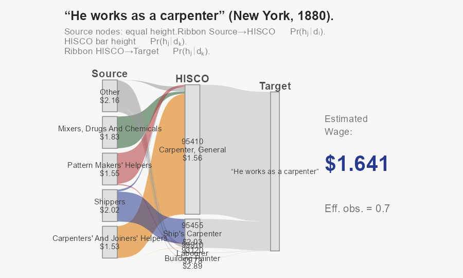]
]
.panel[.panel-name[Merchant]
.center[]
]
.panel[.panel-name[Physician]
.center[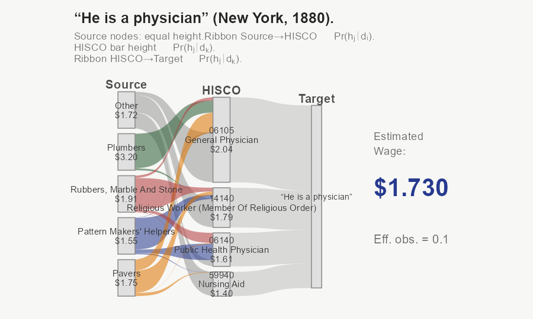]
]
.panel[.panel-name[Miner]
.center[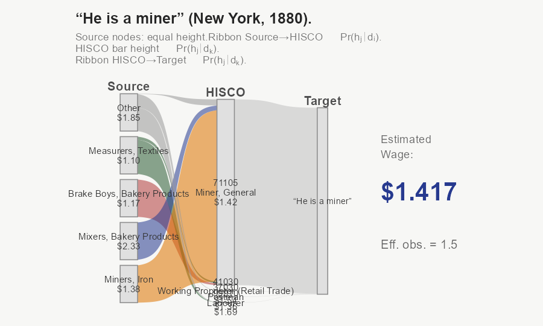]
]
]

[Back to slides](#method-check)


---
name: appendix-bias-rhs

# Bias when the occupational score is on the RHS

.pull-left-wide[
Now suppose $\hat{y}_i$ is the **explanatory variable**:

$$x_i = \alpha + \beta_2 \hat{y}_i + \varepsilon_i, \quad \hat{y}_i = y_i + m_i$$

The OLS estimator gives:

$$\hat{\beta}_2 = \beta_2 \!\left(1 - \frac{\text{Var}(m_i)}{\text{Var}(y_i)}
\right) - \frac{\text{Cov}(y_i,\, m_i)}{\text{Var}(y_i)} + \frac{\text{Cov}(m_i,\, \varepsilon_i)}{\text{Var}(y_i)}$$

Two sources of bias:

1. **Attenuation** -- $\text{Var}(m_i)$ dilutes the signal, shrinking $\hat{\beta}_2$ toward zero
2. **Correlation bias** -- if $m_i$ co-moves with $y_i$ or $\varepsilon_i$, slope shifts unpredictably
]

.pull-right-narrow[
Recall $m_i = \hat{y}_i - y_i$ decomposes as $\delta(d_i) + r_i$ (drift + residual):

- $\delta$ correlated with $x_i$ $\Rightarrow$ correlation bias. CHAOS .green[**reduces**] $\delta$.
- $r_i$ correlated with $x_i$ $\Rightarrow$ .chaosred[**irreducible.**]
- Attenuation always present; CHAOS reduces $\text{Var}(m_i)$ by eliminating $\delta$.
]


---
name: appendix-source-b

# Source B — Skills (London Tradesman, 1747)

.pull-left-wide[
- 229 occupations with natural-language skill descriptions
- **GPT-4o** extracts a JSON list of skills per occupation
- **Sentence-BERT** embeds each skill; cosine similarity to anchor phrases gives a score per dimension

**Four dimensions** — share of skills semantically close to:
- **Cognitive** — *"abstract reasoning, analytical thinking"*
- **Routine cognitive** — *"repetitive task, following explicit rules"*
- **Routine manual** — *"repetitive task, explicit rules"* (physical execution)
- **Manual** — *"operate machinery, assemble parts"*
]

.pull-right-narrow[
.panelset[
.panel[.panel-name[Book]
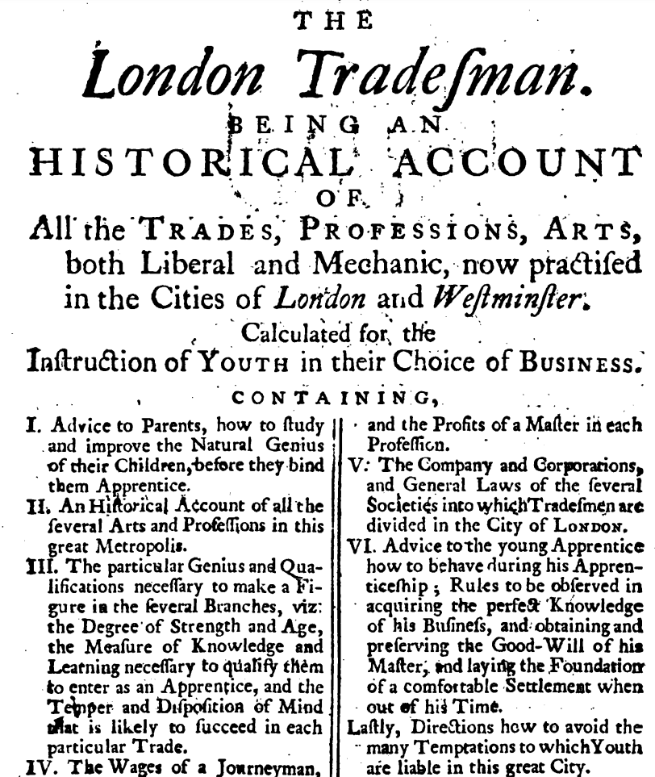
]
.panel[.panel-name[Example]
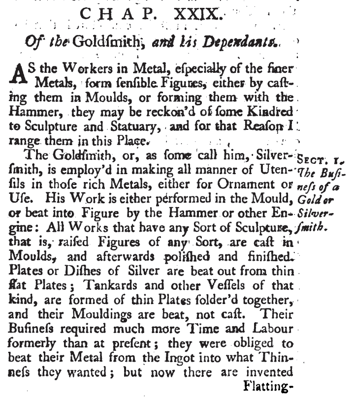
]
.panel[.panel-name[Semantic space]
```{r skills-illustration, eval=FALSE, echo=FALSE, warning=FALSE, message=FALSE}
set.seed(20)
library(ggplot2)
n = 30
anchors = data.frame(
  x     = c(1.8, -1.6),
  y     = c(0.9, -1.1),
  label = c("Mechanical", "Routine\nmanual")
)
pts = data.frame(
  x       = c(rnorm(n, 1.8, 0.45), rnorm(n, -1.6, 0.45)),
  y       = c(rnorm(n, 0.9, 0.45), rnorm(n, -1.1, 0.45)),
  cluster = rep(c("Mechanical", "Routine manual"), each = n)
)
occ = data.frame(x = 0.5, y = 0.1, label = "Goldsmith")
p1 = ggplot() +
  geom_point(data = pts, aes(x, y, color = cluster),
             alpha = 0.45, size = 1.8) +
  geom_point(data = anchors, aes(x, y, color = label),
             size = 6, shape = 18) +
  ggrepel::geom_label_repel(
    data = anchors, aes(x, y, label = label, color = label),
    size = 3, fontface = "bold", label.size = 0,
    fill = "white", show.legend = FALSE, seed = 1
  ) +
  geom_point(data = occ, aes(x, y),
             color = "black", size = 3.5, shape = 4, stroke = 1.8) +
  ggrepel::geom_label_repel(
    data = occ, aes(x, y, label = label),
    size = 2.8, color = "black", label.size = 0.1,
    fill = "white", show.legend = FALSE, seed = 2
  ) +
  scale_color_manual(values = c(
    "Mechanical"     = "#273a8f",
    "Routine manual" = "#b33d3d"
  )) +
  theme_void(base_size = 10) +
  theme(legend.position = "none",
        plot.caption = element_text(size = 7, color = "grey50", hjust = 0.5))

ggsave("Project_dissemination\\CHAOS_slides\\Figures\\skills_illustration.png", plot = p1, width = 3, height = 2)
```

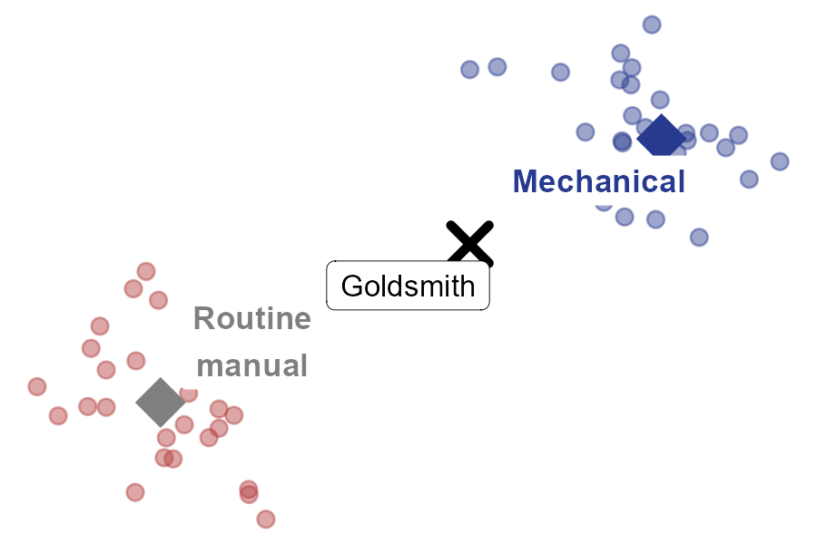
]
]
]

[Skills measurement details](#appendix-skills-ltm)

[Back to slides](#application-data)

---
name: appendix-wages-premia

# Wages and skill premia

.panelset[
.panel[.panel-name[Wages NY over time]
.center[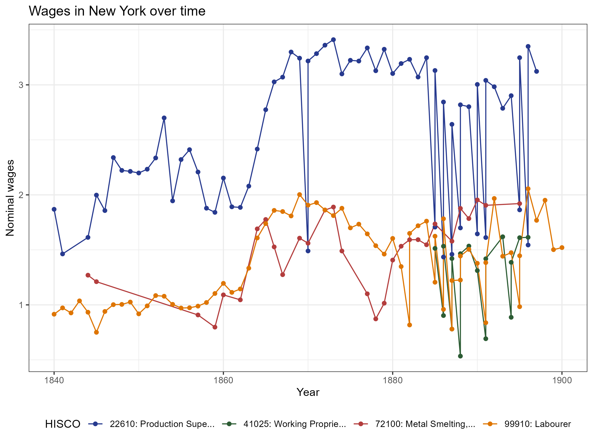]
]
.panel[.panel-name[Skill premia USA]
.center[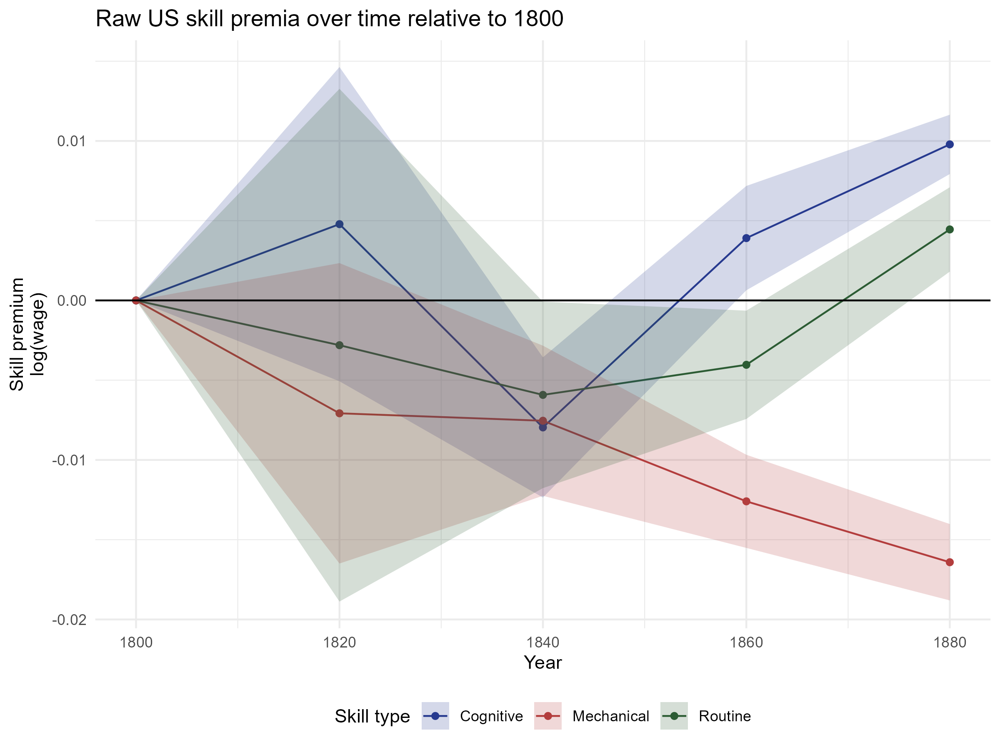]
]
]

---
name: appendix-2d-task-space

# Occupations in 2D task space

.center[]

[Back to slides](#regression-setup)

---
name: appendix-references

# References

.tiny123[
.pull-left[
Sobek, Matthew (1995). "The Comparability of Occupations and the Generation of Income Scores." *Historical Methods* 28(1): 47–51.

Inwood, Kris, Chris Minns, and Fraser Summerfield (2019). "Occupational Income Scores and Immigrant Assimilation: Evidence from the Canadian Census." *Explorations in Economic History* 72: 114–122.

Saavedra, Martin, and Tomas Twinam (2020). "A Machine Learning Approach to Improving Occupational Income Scores." *Explorations in Economic History* 75: 101304.

Dahl, Christian Møller, Torben Johansen, and Christian Vedel (2024). "Breaking the HISCO Barrier: Automatic Occupational Standardization with OccCANINE." arXiv:2402.13604.

Vafa, Keyon, Emil Palikot, Tian Du, Ayush Kanodia, Susan Athey, and David M. Blei (2024). "CAREER: A Foundation Model for Labor Sequence Data." arXiv:2202.08370.

Goldin, Claudia, and Lawrence F. Katz (1998). "The Origins of Technology-Skill Complementarity." *Quarterly Journal of Economics* 113(3): 693–732.

Autor, David H., Frank Levy, and Richard J. Murnane (2003). "The Skill Content of Recent Technological Change: An Empirical Exploration." *Quarterly Journal of Economics* 118(4): 1279–1333.

Acemoglu, Daron, and David Autor (2011). "Skills, Tasks and Technologies: Implications for Employment and Earnings." In *Handbook of Labor Economics*, Vol. 4B, pp. 1043–1171.

Franck, Raphael, and Oded Galor (2022). "Technology-Skill Complementarity in the Early Phase of Industrialization." *Economic Journal* 132(642): 618–643.

Kogan, Leonid, Dimitris Papanikolaou, Lawrence D. W. Schmidt, and Bryan Seegmiller (2021). "Technology, Vintage-Specific Human Capital, and Labor Displacement." *NBER Working Paper* 29552.

Atack, Jeremy, Robert A. Margo, and Paul W. Rhode (2022). "Mechanization Takes Command?" *Journal of Economic History* 82(3): 663–689.

Autor, David H., David Dorn, and Gordon H. Hanson (2013). "The China Syndrome." *American Economic Review* 103(6): 2121–2168.

Autor, David H., David Dorn, and Gordon H. Hanson (2016). "The China Shock." *Annual Review of Economics* 8: 205–240.

Acemoglu, Daron, and Pascual Restrepo (2019). "Automation and New Tasks." *Journal of Economic Perspectives* 33(2): 3–30.

Acemoglu, Daron, and Pascual Restrepo (2020). "Robots and Jobs." *Journal of Political Economy* 128(6): 2188–2244.
]

.pull-right[
McCloskey, Deirdre N. (2010). *Bourgeois Dignity*. Chicago: University of Chicago Press.

Allen, Robert C. (2009). *The British Industrial Revolution in Global Perspective*. Cambridge: Cambridge University Press.

Clark, Gregory (2007). *A Farewell to Alms*. Princeton: Princeton University Press.

Mokyr, Joel (2009). *The Enlightened Economy*. New Haven: Yale University Press.

Squicciarini, Mara P., and Nico Voigtländer (2015). "Human Capital and Industrialization: Evidence from the Age of Enlightenment." *Quarterly Journal of Economics* 130(4): 1825–1883.

Feldman, Naomi E., and Karine van der Beek (2016). "Skill Choice and Skill Complementarity in Eighteenth Century England." *Explorations in Economic History* 59: 94–113.

de Pleijt, Alexandra, Alessandro Nuvolari, and Jacob Weisdorf (2020). "Human Capital Formation during the First Industrial Revolution." *Journal of the European Economic Association* 18(2): 829–889.

Cinnirella, Francesco, Erik Hornung, and Julius Koschnick (2025). "Flow of Ideas: Economic Societies and the Rise of Useful Knowledge." *Economic Journal* 135(669): 1496–1535.

de Pleijt, Alexandra, Julius Koschnick, and Patrick Wallis (2026). "Education and Skills during the First Industrial Revolution in England." *LSE Economic History Working Paper* 393.
]
]

