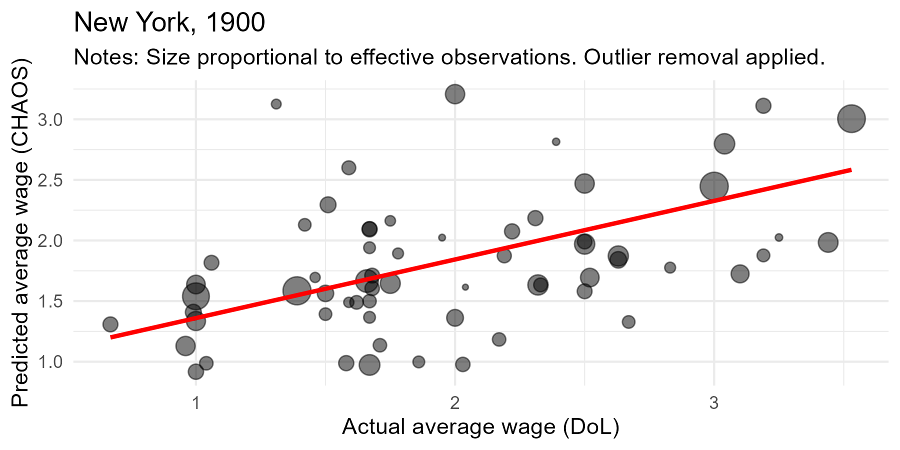

---
output:
  xaringan::moon_reader:
    seal: false
    includes:
      after_body: insert-logo.html
    self_contained: false
    lib_dir: libs
    nature:
      highlightStyle: github
      highlightLines: true
      countIncrementalSlides: false
      ratio: '16:9'
editor_options:
  chunk_output_type: console
---
class: center, inverse, middle

```{r xaringan-panelset, echo=FALSE}
xaringanExtra::use_panelset()
```

```{r xaringan-tile-view, echo=FALSE}
xaringanExtra::use_tile_view()
```

```{r xaringanExtra, echo = FALSE}
xaringanExtra::use_progress_bar(color = "#808080", location = "top")
```

```{css echo=FALSE}
.pull-left {
  float: left;
  width: 44%;
}
.pull-right {
  float: right;
  width: 44%;
}
.pull-right ~ p {
  clear: both;
}

.pull-left-wide {
  float: left;
  width: 66%;
}
.pull-right-wide {
  float: right;
  width: 66%;
}
.pull-right-wide ~ p {
  clear: both;
}

.pull-left-narrow {
  float: left;
  width: 30%;
}
.pull-right-narrow {
  float: right;
  width: 30%;
}

.pull-right-extra-narrow {
  float: right;
  width: 20%;
}

.pull-center {
  margin-left: 28%;
  width: 44%;
}

.pull-center-wide {
  margin-left: 17%;
  width: 66%;
}

.pull-center-medium {
  margin-left: 20%;
  width: 60%;
}

.pull-center-narrow {
  margin-left: 35%;
  width: 25%;
}

.tiny123 {
  font-size: 0.40em;
}

.small123 {
  font-size: 0.80em;
}

.large123 {
  font-size: 2em;
}

.red {
  color: red
}

.chaosred {
  color: #b33d3d
}

.orange {
  color: orange
}

.green {
  color: green
}

.blue {
  color: blue
}
```


# CHAOS
## Converting Historical Accounts to Occupational Scores

### Matt Curtis, Torben Johansen, Julius Koschnick, **Christian Vedel**,
### University of Southern Denmark

### Email: [christian-vs@sam.sdu.dk](mailto:christian-vs@sam.sdu.dk)

### Updated `r Sys.Date()`

???
~1 min elapsed | ~1 min for this slide

---
class: center, inverse

<br>
<br>
<br>
<br>
<br>

### *Working with Historical Data:*

--

> ## *"Chaos; a rude and undigested mass, and nothing more than an inert weight… heaped together in the same spot."*
> — Ovid, *The Metamorphoses*

???
~2 min elapsed | ~1 min for this slide

---


???
~2 min 30 sec elapsed | ~30 sec for this slide

---


???
~3 min elapsed | ~30 sec for this slide

---


???
~3 min 30 sec elapsed | ~30 sec for this slide

---


???
~4 min elapsed | ~30 sec for this slide

---
# The tool we present: *CHAOS*

--

1. If you have a *Source* containing: Occupations + some outcome (skills, income, etc.)

--

2. A *Target* containing: Occupations only (e.g. census data)

--

3. We provide a method for map any target occupation to a predicted outcome

--

**Aproach:** We do probabilistic mapping to a standardized scheme. E.g. HISCO as an intermediate step


--

.pull-left-narrow[
### What you provide:
- Source: $\{D_i, Y_i\}$

| Occupation | Income |
|---|---|
| blacksmith | $2.30 |
| tailor | $1.98 |
| farmer | $1.42 |
]

--

.pull-right-narrow[
### What you get:
- Target: $\{D_{i'}, \hat{Y}_{i'}\}$

| Occupation | Income |
|---|---|
| smith | [Estimate] |
| tailor | [Estimate] |
| agricultural worker | [Estimate] |
]

???
~6 min elapsed | ~2 min for this slide

---
name: motivation

# CHAOS: Converting Historical Accounts to Occupational Scores

.pull-left-wide[
### What we contribute:
- **Econometric formalization** of when and why occscore regressions go wrong
- **CHAOS**, a new method: efficient, ML-powered, and interpretable
- **Application** to skill premiums during industrialization, 1800–1900
]

.pull-right-narrow[
.center[]

Could you tell me the income of a *Joiner*, *Cowherd*, *Bricklayer*?

.center[]
]

???
~7 min elapsed | ~1 min for this slide

---
name: literature

# Literature

.small123[
- IPUMS occscore introduced by Sobek (1995), but similar measures used throughout the literature (e.g. Preston & Haines 1991)

- This and similar measures have become prevalent in the literature.

- However, they entail a number of problems, mainly stemming from source-target-shift (Inwood et al. 2019, Saavedra & Twinam, 2020).

- A few fixes and alternative methods proposed (Saavedra & Twinam, 2020, Paker, Stephenson & Wallis, 2025, Vafa et al 2024, Mühlbach, 2021)

]

--

> .chaosred[**We propose a new method that is efficient and ML-powered but interpretable.**]

???
~7 min 30 sec elapsed | ~30 sec for this slide. Flash it — just enough for people to see they're cited.

---
class: inverse, middle, center

# The Problem

---
name: bias

# Problem: Bias from occupational scores

$$Y_i = \alpha + \beta x_i + \varepsilon_i$$

.small123[
where $Y_i$ is the true outcome (e.g. wage) replaced with $\mu_S(D_i)$, so the proxy error is:
]

--

.pull-left-wide[
.small123[
$$m_i \;=\; \underbrace{\mu_S(D_i) - \mu_T(D_i)}_{\delta(D_i)\ \text{source-target drift}} \;+\; \underbrace{\mu_T(D_i) - Y_i}_{r_i\ \text{within-occupation residual}}$$

Then:

$$\hat{\beta} = \beta + \frac{\text{Cov}(x_i,\, m_i)}{\text{Var}(x_i)}$$
]
]

.pull-right-narrow[
### Two big problems:
.small123[
$\delta(D_i)$ — **source-target drift**
1950 US wages $\neq$ 1850 England.

$r_i$ — **within-occupation residual**
Apprentice $\neq$ master.
]
]

--

.pull-left-wide[
$$\require{cancel}$$
$m_i \;=\; \cancel{\underbrace{\mu_S(D_i) - \mu_T(D_i)}_{\delta(D_i)\ \text{source-target drift}}} \;+\; \underbrace{\mu_T(D_i) - Y_i}_{r_i\ \text{within-occupation residual}}$
]

.pull-right-narrow[
.chaosred[**CHAOS addresses the first and formalizes the second.**]
]

???
~9 min 30 sec elapsed | ~2 min for this slide

---
class: inverse, middle, center

# The Method

---
name: chaos-assumptions

# Assumptions — making the implicit explicit

--

.pull-left-wide[

> **Assumption 1 (Good Historian / Source–Target Relevance)**
> $(Y_i, D_i, H_i) \perp\!\!\!\perp R_i$

.small123[The source and target are drawn from the same population. Relationships learned in the source carry over to the target.]
]

--

.pull-left-wide[

> **Assumption 2 (Good classification system / Broadband)**
> $E(Y_i \mid D_i,\, H_i = k) = E(Y_i \mid D_i) = E(Y_i \mid H_i = k) =: \mu_k$

.small123[The classification system (e.g. HISCO) is rich enough that knowing *either* the description $D_i$ *or* the category $H_i$ is sufficient for $E(Y_i)$. No outcome-relevant information is lost in compression.]

]

--

.pull-left-wide[

> **Assumption 3 (Good classifier / Oracle Classifier)**
> We have access to $h(D_i, k) = \Pr(H_i = k \mid D_i)$

.small123[For each description, we observe the full probability vector over categories. OccCANINE provides this.]

]

--

.pull-right-narrow[
.chaosred[
**Similar (but stronger) assumptions are already implicit when researchers use any occupational score.**
]
]

???
~11 min elapsed | ~1 min 30 sec for this slide

---
name: chaos-math

# The CHAOS estimator

Let $\color{#2c5c34}{\Pr(H_i = k \mid D_i)}$ be the classifier output. Define $\color{#b33d3d}{\mu_k := E(Y_i \mid H_i = k)}$. (*Code level means*)

--

.pull-left[
.small123[
**Step 1 — by definition**
$$\color{#b33d3d}{\mu_k} = \sum_{d} E(Y_i \mid D_i\!=\!d)\,\Pr(D_i\!=\!d \mid H_i\!=\!k)$$

**Step 2 — Bayes + swap $Y$ for $D$**
$$\color{#b33d3d}{\mu_k} = \frac{\sum_{d} E(Y_i \mid D_i\!=\!d)\;\color{#2c5c34}{\Pr(H_i\!=\!k \mid D_i\!=\!d)}\;\Pr(D_i\!=\!d)}{\Pr(H_i\!=\!k)}$$

**Step 3 — sample analogue over $\mathcal{S}$**
$$\hat{\mu}_k = \frac{\sum_{i \in \mathcal{S}} Y_i\;\color{#2c5c34}{\Pr(H_i\!=\!k \mid D_i)}}{\sum_{i \in \mathcal{S}} \color{#2c5c34}{\Pr(H_i\!=\!k \mid D_i)}}$$
]
]

--

.pull-right[
.small123[
**Step 4 — apply to target (law of total expectation)**
$$\hat{Y}_{i'} = \sum_{k} \color{#b33d3d}{\hat{\mu}_k}\;\color{#2c5c34}{\Pr(H_{i'}\!=\!k \mid D_{i'})}$$

**Equivalently — convex combination over source rows**
$$\hat{Y}_{i'} = \sum_{i \in \mathcal{S}} W_{ii'}\, Y_i, \quad W_{ii'} = \sum_k \frac{\color{#2c5c34}{\Pr(H_i\!=\!k|D_i)}\;\color{#2c5c34}{\Pr(H_{i'}\!=\!k|D_{i'})}}{\sum_{j \in \mathcal{S}} \color{#2c5c34}{\Pr(H_j\!=\!k|D_j)}}$$

$W_{ii'} \geq 0$, $\textstyle\sum_i W_{ii'} = 1$.

> **Graceful degradation:** if the classifier is uninformative, $\Pr(H_i\!=\!k \mid D_i) = \Pr(H_i\!=\!k)$, then $\hat{Y}_{i'} \to \bar{Y}_{\mathcal{S}}$ — prediction reverts to the source mean.
]
]

???
~13 min elapsed | ~2 min for this slide

---
name: occcanine

# OccCANINE: the classifier

.pull-left[
.small123[w. Christian Møller Dahl & Torben Johansen — [arxiv 2408.00885](https://arxiv.org/abs/2408.00885)]

- Language model trained on **~18.5 million** observations
- 13 languages, 29 sources
- Open source, fast, highly accurate

**Key output:**

$$\text{OccCANINE}: \quad D_i \;\mapsto\; \Pr(H_i = k \mid D_i)\ \forall k$$

A full probability distribution over HISCO codes for any occupation string.

- Handles ambiguous, multi-occupation, and historical spelling

]

.pull-right[

.small123[*Conceptual architecture of OccCANINE*]
]

???
~14 min elapsed | ~1 min for this slide

---
name: method-check

# Evidence and traceability — no black box

.pull-left[
### Evidence — free byproduct of Bayes' rule

$$\text{Evidence}(D_{i'}) = \sum_k \Pr(H_i\!=\!k) \cdot \Pr(H_{i'}\!=\!k \mid D_{i'})$$

$$N_\text{eff}(D_{i'}) = N_\text{source} \times \text{Evidence}(D_{i'})$$

> *How many source observations back this prediction?*
> High $\Rightarrow$ reliable; low $\Rightarrow$ reverts to source mean.

- Every prediction is a **readable weighted average** over source rows
- Trace which HISCO codes contribute; nothing hidden
]

.pull-right[
.panelset[
.panel[.panel-name[Baker]
.center[]
]
.panel[.panel-name[Blacksmith]
.center[]
]
.panel[.panel-name[Merchant]
.center[]
]
]
]

???
~15 min 30 sec elapsed | ~1 min 30 sec for this slide

---
class: inverse, middle, center

# Data, Validation & Application

---
name: application-data

# Data

.orange[*The method can be used with whatever data source you have. But as an example:*]

--

.pull-left-wide[
### Source A — US Commissioner of Labor wages
- **84,000 occupation–place–year** wage observations
- Analysis sample (1800–1900): **135,182 obs**, 67 places (States/Countries), 4,492 occupations

### Source B — London Tradesman (1747)
- 229 occupations with natural-language skill descriptions: Use LLM trick to extract skills.
]

.pull-right-narrow[
.panelset[
.panel[.panel-name[Cover]

]
.panel[.panel-name[LTM]

]
]
]

???
~16 min 30 sec elapsed | ~1 min for this slide

---
name: demo

# Demonstration

.pull-left-narrow[

- This is all wrapped in a nice little python library.

]

.pull-right-wide[
  <iframe width="560" height="315" src="https://www.youtube.com/embed/WHCYSQp6yCk?si=lcKyQfj_3ZUYiRih" title="YouTube video player" frameborder="0" allow="accelerometer; autoplay; clipboard-write; encrypted-media; gyroscope; picture-in-picture; web-share" referrerpolicy="strict-origin-when-cross-origin" allowfullscreen></iframe>
  <br>
  [Short demonstration on YouTube](https://youtu.be/WHCYSQp6yCk)
]

???
**VIDEO IS 4 MIN — decide whether to play full or partial.**
If played in full: ~20 min 30 sec elapsed | Skip next slides and go straight to conclusion.
If skipped / partial: ~17 min 30 sec elapsed | ~1 min for this slide

---
name: validation

# Validation

*We fit CHAOS-equations on 1880 and predict 1860–1900 wages as a testcase.*

.pull-left-narrow[
- We have actual wages for 1860–1900
- $\Rightarrow$ Can check year-by-year performance
- CHAOS shows stable predictive accuracy across decades
- Small bias; predictions revert gracefully when evidence is low
]

.pull-right-wide[
.panelset[
  
.panel[.panel-name[1881]
.center[]
]

.panel[.panel-name[1900]
.center[]
]

.panel[.panel-name[Bias]
.center[]
]

.panel[.panel-name[R²]
.center[]
]

]
]

???
~18 min 30 sec elapsed | ~1 min for this slide

---
name: application

# Application: skill premiums during industrialization

.pull-left-narrow[
.chaosred[**Still preliminary**]

- Skills locked in **1747** (London Tradesman)
- Outcomes traced 1800–1900 across regions
- OLS with decade FE; SEs clustered by occupation
- Weighted by CHAOS evidence
]

.pull-right-wide[
.panelset[
.panel[.panel-name[Routine margin]
.center[]
]
.panel[.panel-name[Cognitive margin]
.center[]
]
]
]

???
~19 min 30 sec elapsed | ~1 min for this slide

---
name: conclusion

# Conclusion

.pull-left[
### Contributions

- **CHAOS:** interpretable, automatic occupation-to-outcome scoring via probabilistic HISCO mapping
- **Econometric framework:** formalizes source-target drift bias in occscore regressions
- **Empirical:** skill premiums across the industrializing world, 1800–1900 .chaosred[(preliminary)]

### What remains
- Validation, robustness, and extensions
- Bias correction (PPI-style)

**Email:** [christian-vs@sam.sdu.dk](mailto:christian-vs@sam.sdu.dk)
]

--

.pull-right[

]

???
~20 min elapsed | ~1 min for this slide

---
class: middle, center, inverse

# Appendix

---
name: appendix-math-advanced

# CHAOS: multiple sources + debiasing

.pull-left[
.small123[
### Multiple sources $s$
$$E(Y_i\mid H_i\!=\!k)=\sum_i \left[ Y_i \sum_s \left(
    \frac{\Pr(H_i\!=\!k\mid Y_i, S_s)\,\Pr(Y_i\mid S_s)\,\Pr(S_s)}{\Pr(H_i\!=\!k)} \right) \right]$$

### Gibberish input
If the classifier is uninformative: $\Pr(H_{i'}\!=\!k \mid D_{i'}) = \Pr(H_i\!=\!k)$, then:
$$E(Y_{i'}\mid D_{i'}) = E(Y_i)$$
Prediction reverts gracefully to the source mean.
]
]

.pull-right[
.small123[
### Bias correction (PPI-style)
Bias: $E(\hat{Y}_{i'})\neq E(Y_{i'})$

Under relevance assumption:
$$E(Y_{i'} - \hat{Y}_{i'}) = E(Y_i - \hat{Y}_i)$$

$\Rightarrow$ Observable via LOO-CV on the source.

$$\mu(y)\approx \mu(\hat{y})+\frac{1}{k}\mu(y-\hat{y})$$

.chaosred[**Code still being implemented**]
]
]

[Back to slides](#motivation)

---
name: appendix-the-goal

# The goal

To input:
- One or multiple sources of info on occupations
- To obtain an estimator: $E(Y_{i'} \mid D_{i'})$

--

$$\text{text}_{i'}\Rightarrow Y_{i'}$$

--

$$\text{"he is a blacksmith"}\Rightarrow \$2.563$$

--

.pull-left[
### What we have:
- Sources: $\{D_i, Y_i\}$

| Occupation | Income |
|---|---|
| blacksmith | $2.30 |
| tailor | $1.98 |
| farmer | $1.42 |
]

--

.pull-right[
### What we want:
- Target: $\{D_{i'}\}$

| Occupation | Income |
|---|---|
| smith | ? |
| tailor | ? |
| agricultural worker | ? |
]

---
name: appendix-regression-setup

# Regression setup

.pull-left-wide[
.chaosred[**Warning:** Everything that follows is proof of concept. Do not believe anything you see.]

OLS throughout; SEs clustered by occupation. Skills from a **2×2 task framework**:

**Two continuous margins:**
- Routine vs. non-routine
- Cognitive vs. manual

**Four binary quadrant indicators** (mutually exclusive):
- Routine cognitive, non-routine cognitive, routine manual, non-routine manual
]

[Back to slides](#application)

---
name: appendix-skill-premiums-full

# Skill premiums over time, by region — full results

.pull-left-narrow[
Coefficient = change in skill premium relative to 1800.

.chaosred[**Still preliminary**]

- No balancing
- No control for selection
- Just descriptive
]

.pull-right-wide[
.panelset[
.panel[.panel-name[Routine margin]
.center[]
]
.panel[.panel-name[Cognitive margin]
.center[]
]
.panel[.panel-name[Routine cognitive]
.center[]
]
.panel[.panel-name[Non-routine cognitive]
.center[]
]
.panel[.panel-name[Routine manual]
.center[]
]
.panel[.panel-name[Non-routine manual]
.center[]
]
]
]

[Back to slides](#application)

---
name: appendix-validation-full

# Validation — full panel

.pull-right-wide[
.panelset[
.panel[.panel-name[1881]
.center[]
]
.panel[.panel-name[1882]
.center[]
]
.panel[.panel-name[1883]
.center[]
]
.panel[.panel-name[1894]
.center[]
]
.panel[.panel-name[Bias by year]
.center[]
]
.panel[.panel-name[1895 base]
.center[]
]
.panel[.panel-name[1894 rebased]
.center[]
]
]
]

[Back to slides](#validation)

---
name: appendix-bias-rhs

# Bias when the occupational score is on the RHS

.pull-left-wide[
Now suppose $\hat{y}_i$ is the **explanatory variable**:

$$x_i = \alpha + \beta_2 \hat{Y}_i + \varepsilon_i, \quad \hat{Y}_i = Y_i + m_i$$

The OLS estimator gives:

$$\hat{\beta}_2 = \beta_2 \!\left(1 - \frac{\text{Var}(m_i)}{\text{Var}(Y_i)}
\right) - \frac{\text{Cov}(Y_i,\, m_i)}{\text{Var}(Y_i)} + \frac{\text{Cov}(m_i,\, \varepsilon_i)}{\text{Var}(Y_i)}$$

Two sources of bias:

1. **Attenuation** — $\text{Var}(m_i)$ dilutes the signal, shrinking $\hat{\beta}_2$ toward zero
2. **Correlation bias** — if $m_i$ co-moves with $Y_i$ or $\varepsilon_i$, slope shifts unpredictably
]

.pull-right-narrow[
Recall $m_i = \hat{Y}_i - Y_i$ decomposes as $\delta(D_i) + r_i$ (drift + residual):

- $\delta$ correlated with $x_i$ $\Rightarrow$ correlation bias. CHAOS .green[**reduces**] $\delta$.
- $r_i$ correlated with $x_i$ $\Rightarrow$ .chaosred[**irreducible.**]
- Attenuation always present; CHAOS reduces $\text{Var}(m_i)$ by eliminating $\delta$.
]

---
name: appendix-source-b

# Source B — Skills (London Tradesman, 1747)

.pull-left-wide[
- 229 occupations with natural-language skill descriptions
- **GPT-4o** extracts a JSON list of skills per occupation
- **Sentence-BERT** embeds each skill; cosine similarity to anchor phrases gives a score per dimension

**Four dimensions** — share of skills semantically close to:
- **Cognitive** — *"abstract reasoning, analytical thinking"*
- **Routine cognitive** — *"repetitive task, following explicit rules"*
- **Routine manual** — *"repetitive task, explicit rules"* (physical execution)
- **Manual** — *"operate machinery, assemble parts"*
]

.pull-right-narrow[
.panelset[
.panel[.panel-name[Book]

]
.panel[.panel-name[Example]

]
.panel[.panel-name[Semantic space]

]
]
]

[Back to slides](#application-data)

---
name: appendix-sankey

# Sankey examples — input text to estimated wage

.panelset[
.panel[.panel-name[Baker]
.center[]
]
.panel[.panel-name[Blacksmith]
.center[]
]
.panel[.panel-name[Tailor]
.center[]
]
.panel[.panel-name[Carpenter]
.center[]
]
.panel[.panel-name[Merchant]
.center[]
]
]

[Back to slides](#method-check)

---
name: appendix-regression-specs

# Regression specifications

.pull-left-wide[

**Skill premium over time** — estimated separately per skill $s$ and region $r$, reference 1800:
$$\log w_{irt} = \sum_{t \neq 1800} \beta_t \bigl(s_i \cdot \mathbf{1}[\text{decade}=t]\bigr) + \gamma_t + \varepsilon_{irt}$$

]

.pull-right-narrow[
- $\gamma_t$ = decade fixed effects
- Run separately per skill and region
- **Continuous:** routine margin, cognitive margin
- **Binary:** 2×2 quadrant membership
- Weighted by CHAOS target evidence
]

[Back to slides](#application)

---
name: appendix-chaos-flexibility

# CHAOS as a bridge between sources

.pull-right-wide[
.center[]
]

.pull-left-wide[
- Works in **any direction**
- In this application: **LTM skills (1747) $\Rightarrow$ HISCO $\Rightarrow$ DoL wages**
- The HISCO layer is the "pivot" that allows connecting different sources and time periods
- *How much do you believe in HISCO? Could use other classification systems.*
]

---
name: appendix-references

# References

.tiny123[
.pull-left[
Sobek, Matthew (1995). "The Comparability of Occupations and the Generation of Income Scores." *Historical Methods* 28(1): 47–51.

Inwood, Kris, Chris Minns, and Fraser Summerfield (2019). "Occupational Income Scores and Immigrant Assimilation." *Explorations in Economic History* 72: 114–122.

Saavedra, Martin, and Tomas Twinam (2020). "A Machine Learning Approach to Improving Occupational Income Scores." *Explorations in Economic History* 75: 101304.

Dahl, Christian Møller, Torben Johansen, and Christian Vedel (2024). "Breaking the HISCO Barrier: Automatic Occupational Standardization with OccCANINE." arXiv:2402.13604.

Vafa, Keyon et al. (2024). "CAREER: A Foundation Model for Labor Sequence Data." arXiv:2202.08370.

Autor, David H., Frank Levy, and Richard J. Murnane (2003). "The Skill Content of Recent Technological Change." *QJE* 118(4): 1279–1333.

Acemoglu, Daron, and David Autor (2011). "Skills, Tasks and Technologies." In *Handbook of Labor Economics*, Vol. 4B.
]

.pull-right[
Franck, Raphael, and Oded Galor (2022). "Technology-Skill Complementarity in the Early Phase of Industrialization." *Economic Journal* 132(642): 618–643.

Allen, Robert C. (2009). *The British Industrial Revolution in Global Perspective*. Cambridge University Press.

McCloskey, Deirdre N. (2010). *Bourgeois Dignity*. University of Chicago Press.

Goldin, Claudia, and Lawrence F. Katz (1998). "The Origins of Technology-Skill Complementarity." *QJE* 113(3): 693–732.
]
]
