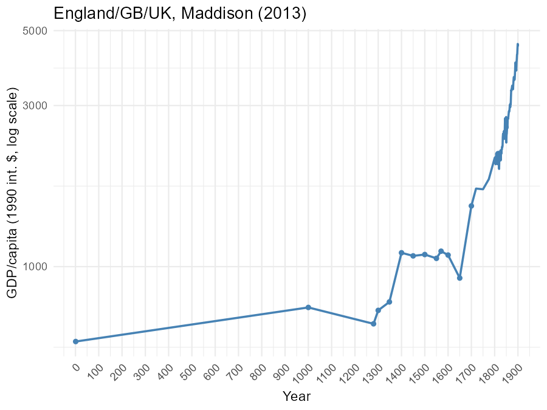
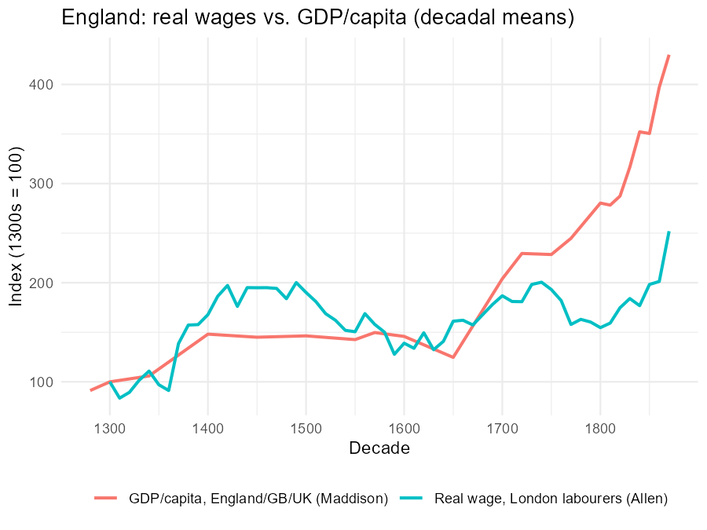

---
output:
  xaringan::moon_reader:
    seal: false
    self_contained: false
    lib_dir: libs
    nature:
      highlightStyle: github
      highlightLines: true
      countIncrementalSlides: false
      ratio: '16:9'
editor_options:
  chunk_output_type: console
---
class: center, inverse, middle

```{r xaringan-panelset, echo=FALSE}
xaringanExtra::use_panelset()
```

```{r xaringan-tile-view, echo=FALSE}
xaringanExtra::use_tile_view()
```

```{r xaringanExtra, echo = FALSE}
xaringanExtra::use_progress_bar(color = "#808080", location = "top")
```

```{css echo=FALSE}
.pull-left {
  float: left;
  width: 44%;
}
.pull-right {
  float: right;
  width: 44%;
}
.pull-right ~ p {
  clear: both;
}


.pull-left-wide {
  float: left;
  width: 66%;
}
.pull-right-wide {
  float: right;
  width: 66%;
}
.pull-right-wide ~ p {
  clear: both;
}

.pull-left-narrow {
  float: left;
  width: 30%;
}
.pull-right-narrow {
  float: right;
  width: 30%;
}

.tiny123 {
  font-size: 0.40em;
}

.small123 {
  font-size: 0.80em;
}

.large123 {
  font-size: 2em;
}

.red {
  color: red
}

.orange {
  color: orange
}

.green {
  color: green
}
```


# Economic History of Europe
## Exercise 1: Measuring Growth and Living Standards

### Christian Vedel,<br>Department of Economics

### Email: [christian-vs@sam.sdu.dk](mailto:christian-vs@sam.sdu.dk)

### Updated `r Sys.Date()`


.footnote[
.left[
.small123[
*Exercise class based on old exam questions — see Absalon for the full exams*
]
]
]

???

- First exercise class. Groups A/B split; laptops with Excel required.
- Keep energy up: the point is doing, not listening.

---
class: middle
# Today's exercise
.pull-left-wide[
**Getting your fingers dirty with the course's most fundamental question: how do we know who was rich, and when?**

- **Theme:** Measuring growth and living standards before and after industrialization
- **Chapters:** Introduction (efficiency, TFP), Ch. 3 (Malthus), Ch. 4 (pre-industrial growth) — plus a first look at Ch. 6
- **Today's seminar papers:** paintings as welfare data (Gorin et al.), city sizes from clay tablets (Barjamovic et al.) — same question, more exotic data
]

.pull-right-narrow[

]

???

- Frame: everything in this course rests on knowing who was rich, when. Today we learn the measurement toolkit.
- Mention seminar link: same day they present Theme 1 papers.

---
# How this works

.pull-left-wide[
**First ~45 minutes — group work:**

- Each group prepares its question (next slide)
- Aim for a short presentation (5 min), not a polished answer
- Use Excel where the question asks for data work

**Second half — presentations and discussion:**

- Together your four answers make up one full exam question
- Interrupt each other — disagreement is the point
]

.pull-right-narrow[
.small123[
**Data:** `Maddision_data2013.xlsx` + `Wages.xlsx` — the exam questions call these `mpd_2013-01.xlsx` and `Labourers.xlsx`
]
]

???

- 45 min on paper, realistically 25-30 of focused work. Walk around and help.
- Presentations 5 min each, then I fill gaps with the answer slides.

---
# Group assignments

.small123[
| Group | Question | Topic |
|-------|----------|-------|
| 1 | Exam 2021, Q1 i–ii | Why living standards matter; GDP/capita pros & cons; Maddison graph *(Excel)* |
| 2 | Exam 2021, Q1 iii–iv | Other measures of living standards; the Industrious Revolution |
| 3 | Exam 2014, Q1 ii–iv | GDP/capita vs. real wages — same country, different stories |
| 4 | Exam 2020, Q1 i + 2021 Q1 v | Why was preindustrial growth slow? Was the Industrial Revolution a *growth* revolution? |
]

--

> Everything after the questions is my walkthrough. We go through it together after your presentations — or as a fallback if a group is missing.

???

- Assign groups quickly, don't negotiate. Group 1 does the Excel work today.
- Data file is on Absalon; check everyone can open it.

---
class: center, inverse
# Full questions

???

- Leave the relevant question slide up during prep. Encourage them to sketch an answer structure first, then fill in.

---
# Group 1 — exam 2021, Q1 i–ii

.pull-left-wide[
.small123[
> This question asks you to consider the measurement of preindustrial standards of living.
>
> **i.** Explain why economic historians (and others) argue that it is important to understand standards of living in preindustrial times. Discuss the advantages and disadvantages of GDP/capita measures for this.
>
> **ii.** The Maddison dataset presents one way of measuring the extent of preindustrial growth in many countries. Use the Maddison data to illustrate this and discuss some of the theoretical determinants of the patterns of preindustrial growth you observe.
>
> *N.B. The 2013 version of the Maddison database is in the file "mpd_2013-01.xlsx".*
]
]

???

- Emphasize: (i) is a 'why do we care' question, (ii) is a 'do it' question. Both needed for full marks.

---
# Group 2 — exam 2021, Q1 iii–iv

.pull-left-wide[
.small123[
> **iii.** Real wages are often also used to illustrate standards of living in history. In the absence of both GDP/capita measures and real wages, how else might we measure standards of living in preindustrial times?
>
> **iv.** What does the concept of an "Industrious Revolution" imply? Explain why this might impact on how we interpret measures of living standards based on real wages. Why do economic historians often use real wages to measure preindustrial standards of living?
]
]

???

- Hint if stuck: think about what cities imply, and what a day wage misses.

---
# Group 3 — exam 2014, Q1 ii–iv

.pull-left-wide[
.small123[
> You are asked to consider the growth record of a European country before industrialization.
>
> **ii.** Using data available on the textbook's website, and for the same country in each case, make graphs of GDP/capita and real wages.
>
> **iii.** Explain how they differ from each other. Why might this be?
>
> **iv.** Relate your findings to the theories you discussed in (i) above. *[For today: the determinants of preindustrial growth — Smith and Malthus]*
]
]

???

- They can use the wages file + Maddison. Same country both series — England is easiest.

---
# Group 4 — exam 2020 Q1 i + exam 2021 Q1 v

.pull-left-wide[
.small123[
> *(2020, Q1)* Some countries are rich and other countries are poor. This question asks you to consider why this might be the case.
>
> **i.** Why was preindustrial growth so slow?

> *(2021, Q1)*
>
> **v.** What was the Industrial Revolution? Did it mark a revolution in economic growth rates?
]
]

???

- Pure theory questions - good for a group without laptop confidence.

---
class: center, inverse
# Answers

???

- Only advance past here after presentations. If a group is missing, use their section as teaching material.

---
class: inverse, middle, center
# Group 1
## Why measure living standards — and how? (2021 Q1 i–ii)

???

- Walkthrough of the measurement question.

---
# Q i. Why do we care about *preindustrial* living standards?

.pull-left-wide[
- All countries started poor. **When and why the rich became rich** is the same question as why the world is unequal today
- If growth only began with industrialization, explaining modern inequality means explaining **who industrialized first and why**
- Preindustrial data also test our theories: Malthus predicts *stagnation* — did it hold?
]

--

.pull-left-wide[
> The exam rewards making this explicit: measurement is not bookkeeping, it is how we **test theories** of growth.
]

???

- Key line: all countries started poor, so today's inequality IS history.
- Push them: measurement is theory-testing, not stamp collecting.

---
# Q i. GDP/capita: advantages and disadvantages

.pull-left[
### Advantages
- One common yardstick — comparable **across countries and centuries**
- Well-defined national-accounts framework
- Correlates with much of what we care about (health, education)
]

.pull-right[
### Disadvantages
- Historical estimates are **reconstructions** built on strong assumptions
- Misses non-market production, leisure, health, rights
- Averages hide **distribution** — a rich elite can mask a poor majority
]

--

**Link to today's seminar:** Gorin et al. read *experienced welfare* from 600 years of paintings — exactly because GDP misses part of welfare. AJR use **urbanization** as their income proxy for 1500–1800.

???

- Comparability vs. reconstruction assumptions. Ask class for one more item per column.
- Segue: paintings paper this afternoon is exactly the 'GDP misses welfare' point.

---
# Q ii. The Maddison data: what you should produce

.pull-left[

.small123[*Data: `Maddision_data2013.xlsx` (England/GB/UK column) — the file the exams call `mpd_2013-01.xlsx`. Also see Fig. 4.4 in Chapter 4 (GDP per head in European and Asian nations 1000–1870)*]
]

```{r maddison-uk-code, eval=FALSE, include=FALSE}
# Code that generated Figures/maddison_uk.png from the Maddison 2013 file
library(readxl)
library(ggplot2)
mpd <- read_excel("../Maddision_data2013.xlsx", col_names = FALSE)
hdr <- as.character(mpd[3, ])
year <- suppressWarnings(as.numeric(mpd[[1]]))
uk <- suppressWarnings(as.numeric(mpd[[which(hdr == "England/GB/UK")]]))
d1 <- data.frame(year, uk)
d1 <- d1[!is.na(d1$year) & !is.na(d1$uk) & d1$year <= 1900 & d1$year > 0, ]
p <- ggplot(d1, aes(year, uk)) +
  geom_line(color = "steelblue", linewidth = 0.8) +
  geom_point(data = d1[d1$year <= 1700, ], color = "steelblue", size = 1.4) +
  scale_y_log10() +
  scale_x_continuous(breaks = seq(0, 1900, by = 100)) +
  labs(x = "Year", y = "GDP/capita (1990 int. $, log scale)",
       title = "England/GB/UK, Maddison (2013)") +
  theme_minimal() +
  theme(axis.text.x = element_text(angle = 45, hjust = 1))
ggsave("Figures/maddison_uk.png", p, width = 6, height = 4.5, dpi = 150, bg = "white")
```

.pull-right[
- **Log scale!** Growth *rates* are slopes — the key trick for reading long-run data
- Before ~1700: centuries of **near-flat** income, small reversals
- After ~1820: the line bends — **modern economic growth**
- In Excel: scatter/line chart, set the vertical axis to logarithmic
]

???

- Log scale is the exam trick: slopes = growth rates. Show axis setting in Excel live if time.
- Point at the flat line pre-1700 and the bend after 1820.

---
# Q ii. Theory: what should we *expect* to see?

.pull-left-wide[
**Malthus** — income gains are eaten by population:

$$\text{income} \uparrow \; \Rightarrow \; \text{births} \uparrow, \text{deaths} \downarrow \; \Rightarrow \; \text{population} \uparrow \; \Rightarrow \; \text{income} \downarrow$$

- Technology shifts the level, **population absorbs it** → long-run stagnation at subsistence
- Fits the flat pre-1700 line
]

--

.pull-left-wide[
**Smith** — gains from specialization and trade:

- Division of labour ← market size ← trade and cities
- Slow, *positive* preindustrial growth where trade expands (the Dutch Republic, England after 1650)
]

--

.pull-left-wide[
.small123[
**Seminar link:** Matranga (tomorrow) is Malthus at the dawn of agriculture: farming raised *numbers*, not welfare — early farmers were shorter than foragers.
]
]

???

- Malthus: tech gains -> population, not income. Smith: trade -> slow positive growth.
- The data show both: flat-ish + slow rise where trade grew.

---
class: inverse, middle, center
# Group 2
## Beyond GDP and wages (2021 Q1 iii–iv)

???

- Walkthrough: measurement beyond GDP and wages.

---
# Q iii. No GDP, no wages — what else?

.pull-left-wide[
- **Urbanization**: cities need an agricultural surplus — a higher urban share signals higher productivity (AJR's proxy for 1500–1800)
- **TFP calculations**: back out efficiency from what we *do* know (land, labour, output prices)
- **Heights** from skeletal remains and conscription records — net nutrition
- **Book production, city sizes, archaeology** — coins, buildings, shipwrecks
]

--

.pull-left-wide[
.small123[
**Seminar links:** Gorin et al. (today) — *paintings* as welfare data. Barjamovic et al. (today) — city sizes inferred from trade records. Boehm & Chaney (next week) — coin finds. Same problem, increasingly creative proxies.
]
]

???

- Urbanization is the workhorse (AJR use it). Then heights, TFP, books, archaeology.
- Name-drop today's seminar papers: paintings, tablets, coins.

---
# Q iv. The Industrious Revolution

.pull-left-wide[
> **Industrious Revolution** (de Vries): before the Industrial Revolution, households began working **more days per year** — plausibly to buy new consumer goods (sugar, tea, textiles).
]

--

.pull-left-wide[
Why it matters for measurement:

- Preindustrial wages are **day wages**
- Annual income = day wage $\times$ days worked
- If days worked $\uparrow$ while day wages $\downarrow$, *annual* living standards can rise while *daily* real wages fall (Box 4.3)
- So real-wage pessimism about early industrialization may partly be a working-year artefact
]

--

.pull-left-wide[
Why use real wages anyway? Often the **only** data we have — and they measure what a labourer could actually buy.
]

???

- Core mechanic: annual income = day wage x days. Days worked rose (de Vries).
- So falling day wages can coexist with rising annual living standards. Box 4.3.

---
class: inverse, middle, center
# Group 3
## GDP/capita vs. real wages (2014 Q1 ii–iv)

???

- Walkthrough: two measures, two stories.

---
# Two measures, two stories

.pull-left[

.small123[*Data: London real wages from `Wages.xlsx` (Allen), GDP/capita from `Maddision_data2013.xlsx`, decadal means. Related in Chapter 4: Fig. 4.3 makes the same point as scatters against population size (England and Wales 1270–1798); Fig. 4.2 shows welfare ratios for labourers across European cities*]
]

```{r wages-vs-gdp-code, eval=FALSE, include=FALSE}
# Code that generated Figures/wages_vs_gdp.png from the two data files.
# Wages.xlsx layout: years in col 1 (rows 10+), four blocks of 17 cities
# (row 9 headers): nominal wage cols 3-19, CPI 22-38, REAL WAGE 40-56,
# welfare ratios 59-75. London real wage = col 42.
library(readxl)
library(ggplot2)
lab <- read_excel("../Wages.xlsx", col_names = FALSE)
stopifnot(as.character(lab[9, 42]) == "London")
w <- data.frame(year = suppressWarnings(as.numeric(lab[[1]])),
                rw = suppressWarnings(as.numeric(lab[[42]])))
w <- w[!is.na(w$year) & w$year >= 1260 & w$year <= 1913, ]
w$dec <- floor(w$year / 10) * 10
wd <- aggregate(rw ~ dec, data = w, FUN = mean, na.rm = TRUE)

mpd <- read_excel("../Maddision_data2013.xlsx", col_names = FALSE)
hdr <- as.character(mpd[3, ])
g <- data.frame(year = suppressWarnings(as.numeric(mpd[[1]])),
                uk = suppressWarnings(as.numeric(mpd[[which(hdr == "England/GB/UK")]])))
g <- g[!is.na(g$year) & !is.na(g$uk) & g$year >= 1260 & g$year <= 1870, ]
g$dec <- floor(g$year / 10) * 10
gd <- aggregate(uk ~ dec, data = g, FUN = mean)

base <- min(intersect(wd$dec[!is.na(wd$rw)], gd$dec))  # 1300
wd$idx <- 100 * wd$rw / wd$rw[wd$dec == base]
gd$idx <- 100 * gd$uk / gd$uk[gd$dec == base]
d3 <- rbind(data.frame(dec = wd$dec, idx = wd$idx, series = "Real wage, London labourers (Allen)"),
            data.frame(dec = gd$dec, idx = gd$idx, series = "GDP/capita, England/GB/UK (Maddison)"))
d3 <- d3[!is.na(d3$idx) & d3$dec <= 1870, ]
p <- ggplot(d3, aes(dec, idx, color = series)) +
  geom_line(linewidth = 0.9) +
  labs(x = "Decade", y = paste0("Index (", base, "s = 100)"),
       title = "England: real wages vs. GDP/capita (decadal means)", color = NULL) +
  theme_minimal() +
  theme(legend.position = "bottom")
ggsave("Figures/wages_vs_gdp.png", p, width = 6, height = 4.5, dpi = 150, bg = "white")
```

.pull-right[
- **Black Death (1348)**: wages *soar* — fewer workers, same land. GDP/capita moves much less
- **1500s**: population recovers → wages fall back. Pure Malthus
- After 1650: GDP/capita **grows away** from flat wages
]

???

- Black Death: wages double, GDP/capita barely moves - fewer workers, same land.
- Post-1650: GDP grows away from wages = distribution shifting from labour.

---
# Q iv. Why do they differ?

.pull-left-wide[
- Real wages track **one group**: unskilled day labourers. GDP/capita averages over *everyone* — landowners, merchants, farmers
- A gap opening between them = **distribution shifting** away from labour
- Wages are *prices*; GDP is a *quantity aggregate* — they answer different questions
- Plus the Industrious Revolution problem (group 2): day wages miss changes in days worked
]

--

.pull-left-wide[
> Exam gold: don't pick a winner — explain **what each measures** and read the gap as information.
]

???

- Wages = one group's price; GDP = average over everyone.
- Exam gold: read the GAP as information, don't pick a winner.

---
class: inverse, middle, center
# Group 4
## Slow growth, sudden revolution? (2020 Q1 i + 2021 Q1 v)

???

- Walkthrough: slow growth, modest revolution.

---
# Q i. Why was preindustrial growth so slow?

.pull-left-wide[
Three complementary answers:

- **Malthus**: productivity gains → population growth → back to subsistence. Growth in *people*, not income
- **Knowledge**: innovation by tinkering, not science; no systematic R&D; ideas travelled slowly
- **Institutions**: serfdom, guilds, insecure property, thin markets → weak incentives, limited division of labour
]

--

.pull-left-wide[
.small123[
Not *zero* growth: Smithian gains where trade expanded (Dutch Republic, England). Slow ≠ static.
]
]

???

- Three answers: Malthus eats gains, knowledge by tinkering, weak institutions.
- Stress: slow, not zero - Smithian growth existed.

---
# Q v. Was the Industrial Revolution a growth revolution?

.pull-left-wide[
> **Industrial Revolution**: rising share of population and output in industry, with efficiency gains from new technologies *and* institutions (the factory system).
]

--

.pull-left-wide[
- Modern estimates (Crafts–Harley): British growth 1760–1830 was **modest** — well under 1% per year in GDP/capita
- The "revolution" is in the **composition** of the economy and the *onset of sustained* growth — not a sudden take-off in rates
- Growth rates only become historically exceptional from the mid-nineteenth century (see §6.2)
]

--

.pull-left-wide[
.small123[
**Seminar link:** Cinnirella et al. (tomorrow) — the knowledge institutions behind this slow build-up.
]
]

???

- Crafts-Harley: under 1% per year 1760-1830. Revolution in composition + onset of SUSTAINED growth.
- Common student error: assuming a growth take-off in 1760.

---
class: middle
# Wrapping up

.pull-left[
- Measurement is theory-testing, not bookkeeping
- GDP/capita: comparable but incomplete — know **both** halves
- Log scale + Maddison = the exam's favourite figure
- Tomorrow: Malthus and knowledge (Exercise 2, Theme 2 papers)
]

.pull-right[

]

???

- Recap the three exam skills: log scale, know both halves of GDP pros/cons, read wage-GDP gaps.
- Tomorrow: Malthus and knowledge.
