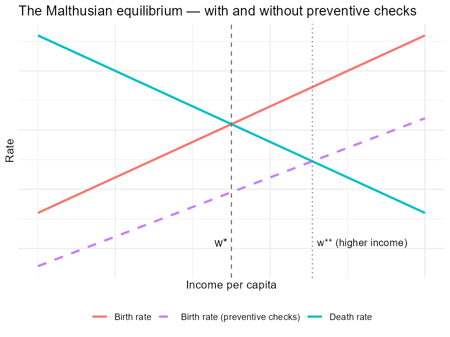
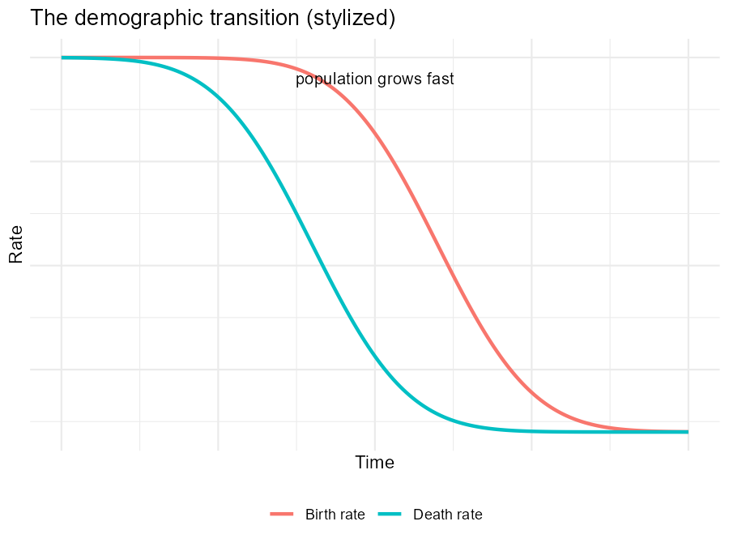
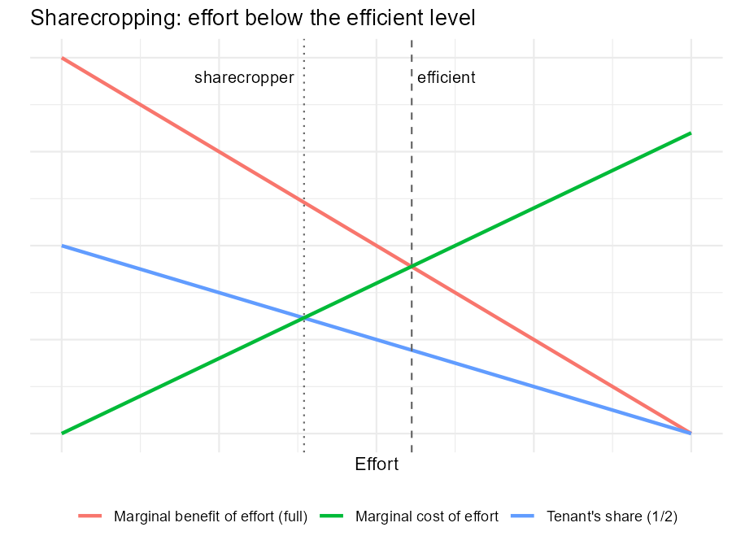

---
output:
  xaringan::moon_reader:
    seal: false
    self_contained: false
    lib_dir: libs
    nature:
      highlightStyle: github
      highlightLines: true
      countIncrementalSlides: false
      ratio: '16:9'
editor_options:
  chunk_output_type: console
---
class: center, inverse, middle

```{r xaringan-panelset, echo=FALSE}
xaringanExtra::use_panelset()
```

```{r xaringan-tile-view, echo=FALSE}
xaringanExtra::use_tile_view()
```

```{r xaringanExtra, echo = FALSE}
xaringanExtra::use_progress_bar(color = "#808080", location = "top")
```

```{css echo=FALSE}
.pull-left {
  float: left;
  width: 44%;
}
.pull-right {
  float: right;
  width: 44%;
}
.pull-right ~ p {
  clear: both;
}


.pull-left-wide {
  float: left;
  width: 66%;
}
.pull-right-wide {
  float: right;
  width: 66%;
}
.pull-right-wide ~ p {
  clear: both;
}

.pull-left-narrow {
  float: left;
  width: 30%;
}
.pull-right-narrow {
  float: right;
  width: 30%;
}

.tiny123 {
  font-size: 0.40em;
}

.small123 {
  font-size: 0.80em;
}

.large123 {
  font-size: 2em;
}

.red {
  color: red
}

.orange {
  color: orange
}

.green {
  color: green
}
```


# Economic History of Europe
## Exercise 2: Malthus, Institutions, and the Industrial Revolution

### Christian Vedel,<br>Department of Economics

### Email: [christian-vs@sam.sdu.dk](mailto:christian-vs@sam.sdu.dk)

### Updated `r Sys.Date()`


.footnote[
.left[
.small123[
*Exercise class based on old exam questions — see Absalon for the full exams*
]
]
]

???

- Session 2. Same format as yesterday; groups should be quicker now.

---
class: middle
# Today's exercise
.pull-left-wide[
**How Europe escaped stagnation: population, institutions, and knowledge.**

- **Theme:** The Malthusian world and the three escapes — the demographic transition, efficient institutions, useful knowledge
- **Chapters:** Ch. 3 (population), Ch. 5 (institutions), Ch. 6 (Industrial Revolution)
- **Today's seminar papers:** agriculture as a Malthusian trap (Matranga), the potato experiment (Nunn & Qian), economic societies (Cinnirella et al.), migrant knowledge (Boberg-Fazlić & Sharp)
]

.pull-right-narrow[

]

???

- Frame: yesterday was measurement, today is the theory core - Malthus and the escapes.
- Seminar link: Matranga and the potato paper are Malthus in action.

---
# Group assignments

.small123[
| Group | Question | Topic |
|-------|----------|-------|
| 1 | Exam 2016, Set 1.1–1.4 | Population growth ±; the Malthusian equilibrium; positive vs. preventive checks |
| 2 | Exam 2016, Set 1.5–1.6 + 2020 Q1 iii | The demographic transition; why fertility falls when income rises |
| 3 | Exam 2014, Q2 | Sharecropping — an inefficient but long-lived institution (with diagram) |
| 4 | Exam 2014, Q3 + 2022 Q1 iii | The Industrial Revolution: why England? General Purpose Technologies |
]

--

> ~45 min preparation, then presentations. After the questions: my walkthrough, used after your presentations or if a group is missing.

???

- No Excel group today (all theory) - or steer group 1 to sketch the Malthus diagram on the board.

---
class: center, inverse
# Full questions

???

- 2016 exam is unusually structured - good scaffold for weaker groups.

---
# Group 1 — exam 2016, Set 1.1–1.4

.pull-left-wide[
.small123[
> Population growth can have both negative and positive effects on per capita income growth.
>
> **1.1** Discuss the potential positive effects on income per capita of population growth?
>
> **1.2** Discuss the potential negative effects on income of population growth?
>
> **1.3** Characterize the Malthusian equilibrium and discuss the historical relevance of that concept.
>
> **1.4** How did pre-industrial societies limit population growth? Discuss the relative importance of positive and preventive checks in this connection.
]
]

???

- Remind them: 1.3 wants the equilibrium characterized precisely, not just described.

---
# Group 2 — exam 2016 Set 1.5–1.6 + exam 2020 Q1 iii

.pull-left-wide[
.small123[
> *(2016, Set 1)*
>
> **1.5** What is the 'demographic transition' and when did it start in Western Europe?
>
> **1.6** Why is family size (completed fertility) declining in the 20th century when household income is increasing.

> *(2020, Q1)*
>
> **iii.** What was the role of the demographic transition for the onset of modern economic growth?
]
]

???

- The 1.6 paradox (fertility falls as income rises) is the interesting bit - quality-quantity.

---
# Group 3 — exam 2014, Q2

.pull-left-wide[
.small123[
> Sharecropping is often considered to be an example of an inefficient but long-lasting institution in economic history.
>
> **i.** What was sharecropping?
>
> **ii.** Why was it inefficient? Illustrate your answer with a diagram.
>
> **iii.** Can you think of other inefficient institutions in history?
>
> **iv.** Why might inefficient institutions persist?
]
]

???

- The diagram is mandatory. Marshallian sharecropping picture: tenant keeps share s of marginal product.

---
# Group 4 — exam 2014 Q3 + exam 2022 Q1 iii

.pull-left-wide[
.small123[
> *(2014, Q3)* What was the Industrial Revolution, and why did it start in England?

> *(2022, Q1)*
>
> **iii.** Discuss briefly the role of technology for economic development. Highlight in particular the importance of General Purpose Technologies (GPTs), and provide some examples.
]
]

???

- Push for the Allen vs. Mokyr contrast, not just a list of inventions.

---
class: center, inverse
# Answers

???

- Advance only after presentations.

---
class: inverse, middle, center
# Group 1
## The Malthusian model (2016 Set 1.1–1.4)

???

- Malthus walkthrough.

---
# Q 1.1–1.2. Population growth: good or bad for income?

.pull-left[
### Positive effects
- **Smith**: more people → bigger markets → division of labour
- **Boserup**: population pressure *induces* agricultural innovation
- Scale: more potential innovators
]

.pull-right[
### Negative effects
- **Malthus/Ricardo**: fixed land + more labour → **diminishing returns**
- Lower land–labour ratio → lower output per worker
- Capital dilution (later formalized in Solow)
]

???

- Positive: Smith (markets), Boserup (induced innovation). Negative: diminishing returns on fixed land.
- Both were right at different times - that's the punchline.

---
# Q 1.3. The Malthusian equilibrium

.pull-left[

.small123[*Also see Fig. 3.2 in Chapter 3 ("Malthus graphically speaking")*]
]

```{r malthus-cross-code, eval=FALSE, include=FALSE}
# Code that generated Figures/malthus_cross.png
library(ggplot2)
w <- seq(0.5, 3, 0.01)
df <- data.frame(w = w,
                 births = 0.5 + 0.6*w,
                 births_pc = 0.1 + 0.5*w,  # preventive checks: lower fertility at every income
                 deaths = 2.6 - 0.6*w)
# equilibria: births = deaths -> w* = 1.75; with preventive checks -> w** = 25/11
p <- ggplot(df) +
  geom_line(aes(w, births, color = "Birth rate"), linewidth = 1) +
  geom_line(aes(w, births_pc, color = "Birth rate (preventive checks)"), linewidth = 1, linetype = "dashed") +
  geom_line(aes(w, deaths, color = "Death rate"), linewidth = 1) +
  geom_vline(xintercept = 1.75, linetype = "dashed", color = "grey40") +
  geom_vline(xintercept = 25/11, linetype = "dotted", color = "grey40") +
  annotate("text", x = 1.75, y = 0.55, label = "w*", hjust = 1.3, size = 4) +
  annotate("text", x = 25/11, y = 0.55, label = "w** (higher income)", hjust = -0.05, size = 3.5) +
  labs(x = "Income per capita", y = "Rate", color = NULL,
       title = "The Malthusian equilibrium — with and without preventive checks") +
  scale_color_manual(values = c("Birth rate" = "#F8766D",
                                "Birth rate (preventive checks)" = "#C77CFF",
                                "Death rate" = "#00BFC4")) +
  theme_minimal() +
  theme(legend.position = "bottom", axis.text = element_blank())
ggsave("Figures/malthus_cross.png", p, width = 6, height = 4.5, dpi = 150, bg = "white")
```

.pull-right[
- Births rise with income, deaths fall → population grows whenever $w > w^*$
- Population growth pushes $w$ back down (diminishing returns on fixed land)
- **Stable equilibrium at subsistence**: technology shifts raise *population*, not long-run income
- **Preventive checks** (dashed): lower fertility at every income → equilibrium at **higher income** $w^{**}$
- Fits the flat pre-1700 income record (Exercise 1!) and post-Black Death wage spike
]

???

- Walk the cross: births up in income, deaths down -> stable point at subsistence.
- Tech shock shifts level -> population absorbs it. Fits yesterday's flat line.
- Dashed line previews 1.4: preventive checks push the birth schedule down -> equilibrium at higher income (European Marriage Pattern).

---
# Q 1.4. Positive vs. preventive checks

.pull-left-wide[
> **Positive check**: mortality rises when income falls — famine, disease, war.

> **Preventive check**: fertility restrained *before* the crisis — later marriage, celibacy.
]

--

.pull-left-wide[
- The **European Marriage Pattern**: late marriage (mid-20s), many never married — fertility responded to economic conditions via *marriage age*
- Northwestern Europe leaned on preventive checks → equilibrium at **higher income** (the dashed line and $w^{**}$ on the previous slide); positive checks dominated elsewhere
- One candidate for Europe's early lead (links back to Theme 1's Great Divergence question)
]

--

.pull-left-wide[
.small123[
**Seminar link:** Matranga (today) — the *invention of agriculture* as consumption smoothing under seasonality: Malthusian logic at humanity's biggest turning point. Farmers were more numerous but *shorter* — population absorbed the gains.
]
]

???

- Positive = mortality, preventive = fertility restraint (marriage age).
- European Marriage Pattern: preventive checks -> equilibrium at higher income. Candidate for Europe's edge.

---
class: inverse, middle, center
# Group 2
## The demographic transition (2016 Set 1.5–1.6 + 2020 Q1 iii)

???

- Demographic transition walkthrough.

---
# Q 1.5. What is the demographic transition?

.pull-left[

.small123[*Related in Chapter 3: Fig. 3.4 shows the same transition differently — fertility vs. life expectancy regimes on an iso-growth curve; Fig. 3.1 has the European population 400 BCE–2000 CE*]
]

```{r dem-transition-code, eval=FALSE, include=FALSE}
# Code that generated Figures/dem_transition.png
library(ggplot2)
t <- seq(0, 10, 0.05)
df <- data.frame(t = t,
  deaths = 3 - 1.8*pnorm(t, 4, 1.2),
  births = 3 - 1.8*pnorm(t, 6, 1.2))
p <- ggplot(df) +
  geom_line(aes(t, births, color = "Birth rate"), linewidth = 1) +
  geom_line(aes(t, deaths, color = "Death rate"), linewidth = 1) +
  annotate("text", x = 5, y = 2.9, label = "population grows fast", size = 3.5) +
  labs(x = "Time", y = "Rate", color = NULL,
       title = "The demographic transition (stylized)") +
  theme_minimal() +
  theme(legend.position = "bottom", axis.text = element_blank())
ggsave("Figures/dem_transition.png", p, width = 6, height = 4.5, dpi = 150, bg = "white")
```

.pull-right[
- **Death rates fall first** (nutrition, sanitation, public health) — from the late 18th century in Western Europe
- **Birth rates follow with a lag** (France early ~1800; most of Western Europe from ~1870–1890)
- In between: the population explosion
- End state: low mortality, low fertility — population growth no longer eats income gains
]

???

- Deaths fall first, births lag -> population explosion in between.
- Dates: mortality from late 1700s; fertility from ~1870-90 (France early, ~1800).

---
# Q 1.6. Why does fertility *fall* as income rises?

.pull-left-wide[
Malthus predicts the opposite! Resolving the paradox:

- **Quality–quantity trade-off**: parents choose fewer children and invest more in each (education) — returns to human capital rose
- **Falling child mortality**: fewer births needed for a target family size
- Rising **opportunity cost of women's time**
- Old-age support shifts from children to markets and the state (→ Exercise 4)
]

--

.pull-left-wide[
**Q (2020) — role for modern growth:** the transition breaks the Malthusian link — technology gains now raise income *per head*, and human-capital investment feeds back into more growth. It is the hinge between the Malthusian world and modern growth.
]

???

- Quality-quantity trade-off is the star answer; child mortality and women's time cost support it.
- 2020 iii: the transition is the hinge from Malthus to modern growth.

---
class: inverse, middle, center
# Group 3
## Inefficient institutions (2014 Q2)

???

- Institutions walkthrough.

---
# Q i–ii. Sharecropping and why it is inefficient

.pull-left[

.small123[*The standard Marshallian-inefficiency diagram — see the suggested answers to exam 2014 Q2*]
]

```{r sharecropping-code, eval=FALSE, include=FALSE}
# Code that generated Figures/sharecropping.png
library(ggplot2)
e <- seq(0, 10, 0.05)
df <- data.frame(e = e, mb = 10 - e, mb_half = 0.5*(10 - e), mc = e*0.8)
p <- ggplot(df) +
  geom_line(aes(e, mb, color = "Marginal benefit of effort (full)"), linewidth = 1) +
  geom_line(aes(e, mb_half, color = "Tenant's share (1/2)"), linewidth = 1) +
  geom_line(aes(e, mc, color = "Marginal cost of effort"), linewidth = 1) +
  geom_vline(xintercept = 5.56, linetype = "dashed", color = "grey40") +
  geom_vline(xintercept = 3.85, linetype = "dotted", color = "grey40") +
  annotate("text", x = 5.56, y = 9.5, label = "efficient", hjust = -0.1, size = 3.5) +
  annotate("text", x = 3.85, y = 9.5, label = "sharecropper", hjust = 1.1, size = 3.5) +
  labs(x = "Effort", y = "", color = NULL, title = "Sharecropping: effort below the efficient level") +
  theme_minimal() +
  theme(legend.position = "bottom", axis.text = element_blank())
ggsave("Figures/sharecropping.png", p, width = 6, height = 4.5, dpi = 150, bg = "white")
```

.pull-right[
- **Sharecropping**: tenant farms the land, pays the landlord a *share* (often half) of output
- The tenant bears the **full** cost of effort but keeps only half the marginal product → works less than the efficient amount (Marshallian inefficiency)
- A fixed rent would restore incentives — so why did sharecropping survive for centuries?
]

???

- Tenant bears full effort cost, keeps half the marginal benefit -> works too little.
- Draw it live if the group's diagram was shaky.

---
# Q iii–iv. Persistence of inefficient institutions

.pull-left-wide[
Why sharecropping persisted:

- **Risk sharing**: fixed rent loads all harvest risk on a poor tenant; a share contract splits it
- Tenant's limited capital and **enforcement problems**
- So: inefficient in effort terms, but a *second-best* answer to missing insurance and credit markets
]

--

.pull-left-wide[
Other candidates + the general lesson:

- **Serfdom** (Ch. 5): labour tied to land — but persisted where lords held political power
- **Guilds**: entry barriers protecting insiders
- Institutions persist when the **losers can't pay off the winners** — distribution beats efficiency (Acemoglu–Robinson logic, seminar Theme 1!)
]

--

.pull-left-wide[
.small123[
**Seminar link:** Temin & Voth (next week) — usury laws as another institution that redistributed credit rather than insured anyone.
]
]

???

- Second-best insight: sharecropping = insurance when credit/insurance markets are missing.
- Persistence = distribution beats efficiency (winners can block).
- Other examples: serfdom, guilds, usury laws (next week's Temin-Voth).

---
class: inverse, middle, center
# Group 4
## The Industrial Revolution and GPTs (2014 Q3 + 2022 Q1 iii)

???

- Industrial Revolution walkthrough.

---
# What was the Industrial Revolution — and why England?

.pull-left-wide[
**What**: shift of labour and output into industry; factory system; mechanization; onset of *sustained* efficiency growth (modest rates at first — recall Exercise 1).
]

--

.pull-left-wide[
**Why England?** A menu of explanations (see Lecture 6):

- **Allen**: high wages + cheap coal → labour-saving machines *profitable in Britain first*
- **Mokyr**: the Industrial Enlightenment — access to useful knowledge, scientific culture
- **Clark**: the spread of "middle-class values" — patience, hard work, literacy (*A Farewell to Alms*)
- **McCloskey**: ideas, not resources — a new "liberty and dignity" for the commercial classes
- **Acemoglu et al.**: institutions after the Glorious Revolution of 1688 — property rights, Parliament (+ Atlantic trade, seminar Theme 1)
- Preceded by the **Industrious Revolution**: longer working years (recall Exercise 1)
]

--

.pull-left-wide[
.small123[
No consensus — and that's the point. Good exam answers show the *diversity* of explanations and engage with more than one.
]
]

???

- Definition first (composition + factory system), then the debate.
- Walk the menu: Allen (prices), Mokyr (knowledge), Clark (values/demography), McCloskey (ideas/rhetoric), AJR (institutions).
- Note the caveats from the lecture: early IR ran on water not coal; mechanization first took hold where wages were low but mechanical skills high.
- The debate is genuinely open - reward students who engage several explanations rather than crowning one.

---
# General Purpose Technologies

.pull-left-wide[
> A **GPT** is a technology used across many sectors, with room for continuous improvement, that spawns further innovation.
]

--

.pull-left-wide[
| GPT | Era | Why transformative |
|-----|-----|--------------------|
| Water- & windmill | medieval–early modern | The **first** GPT (textbook Box 2.2): grinding, sawing, fulling, land drainage |
| Steam engine | 18th–19th c. | Power anywhere — factories, rail, ships |
| Electricity | late 19th c. | Divisible power → factory reorganization |
| Computing | 20th–21st c. | Coordination and information costs collapse |
]

--

.pull-left-wide[
.small123[
**Seminar links:** Cinnirella et al. (today) — the societies that spread the useful knowledge behind these. Pascali (Theme 1) — the steamship as a GPT reshaping world trade. Note GPT effects come with **long lags** — reorganization takes decades.
]
]

???

- Definition: pervasive, improvable, spawns innovation.
- Stress the LAGS - electricity needed factory redesign; same for AI today.

---
class: middle
# Wrapping up

.pull-left[
- Malthus: the model that explains 10,000 years of stagnation
- Escape route 1: preventive checks and the demographic transition
- Escape route 2: institutions that reward efficiency
- Escape route 3: useful knowledge and GPTs
- Next exercise (Wed): money, trade, and the interwar disaster
]

.pull-right[

]

???

- One sentence: Malthus explains 10,000 years; three escapes explain the last 200.
- Next exercise Wednesday: money, trade, gold standard.
