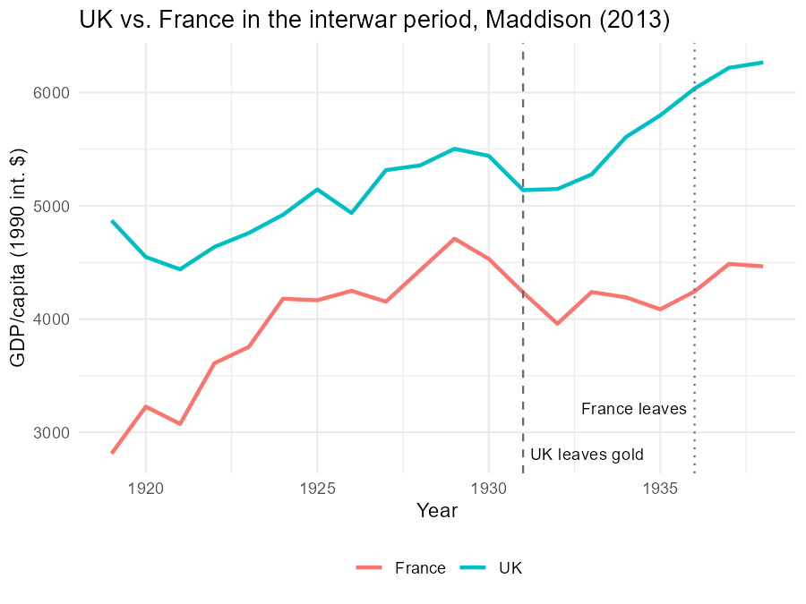

---
output:
  xaringan::moon_reader:
    seal: false
    self_contained: false
    lib_dir: libs
    nature:
      highlightStyle: github
      highlightLines: true
      countIncrementalSlides: false
      ratio: '16:9'
editor_options:
  chunk_output_type: console
---
class: center, inverse, middle

```{r xaringan-panelset, echo=FALSE}
xaringanExtra::use_panelset()
```

```{r xaringan-tile-view, echo=FALSE}
xaringanExtra::use_tile_view()
```

```{r xaringanExtra, echo = FALSE}
xaringanExtra::use_progress_bar(color = "#808080", location = "top")
```

```{css echo=FALSE}
.pull-left {
  float: left;
  width: 44%;
}
.pull-right {
  float: right;
  width: 44%;
}
.pull-right ~ p {
  clear: both;
}


.pull-left-wide {
  float: left;
  width: 66%;
}
.pull-right-wide {
  float: right;
  width: 66%;
}
.pull-right-wide ~ p {
  clear: both;
}

.pull-left-narrow {
  float: left;
  width: 30%;
}
.pull-right-narrow {
  float: right;
  width: 30%;
}

.tiny123 {
  font-size: 0.40em;
}

.small123 {
  font-size: 0.80em;
}

.large123 {
  font-size: 2em;
}

.red {
  color: red
}

.orange {
  color: orange
}

.green {
  color: green
}
```


# Economic History of Europe
## Exercise 3: Money, Trade, and the Interwar Economy

### Christian Vedel,<br>Department of Economics

### Email: [christian-vs@sam.sdu.dk](mailto:christian-vs@sam.sdu.dk)

### Updated `r Sys.Date()`


.footnote[
.left[
.small123[
*Exercise class based on old exam questions — see Absalon for the full exams*
]
]
]

???

- Week 2, session 3. Chapters 7-9 were lectured Mon-Tue.

---
class: middle
# Today's exercise
.pull-left-wide[
**The machinery of exchange — and what happened when it broke in the 1930s.**

- **Theme:** Money and banking, why nations trade, and the gold standard's interwar collapse
- **Chapters:** Ch. 7 (money, credit and banking), Ch. 8 (trade and globalization), Ch. 9 (monetary regimes)
- **Today's seminar papers:** usury laws (Temin & Voth), the Napoleonic blockade (Juhász), the slide to protectionism (Eichengreen & Irwin), coins and the end of antiquity (Boehm & Chaney)
]

.pull-right-narrow[

]

???

- Frame: the machinery of exchange, and the 1930s as the great stress test.
- Same-day seminar: Theme 3 - usury, blockade, protectionism, coins.

---
# Group assignments

.small123[
| Group | Question | Topic |
|-------|----------|-------|
| 1 | Exam 2020, Q2 + 2021 Q2 | Why would the world be poorer without money? Trust, banks, and growth |
| 2 | Exam 2015, Q2 | Comparative advantage; 19th vs. 20th century trade; why people oppose free trade |
| 3 | Exam 2023, Q2 | The gold standard: what it was, why it failed interwar, return today? |
| 4 | Exam 2020, Q3 | Maddison graph: UK vs. France in the interwar period *(Excel)* |
]

--

> ~45 min preparation, then presentations. After the questions: my walkthrough, used after your presentations or if a group is missing.

???

- Group 4 has the Excel task (UK vs France) - the single most exam-like task of the course.

---
class: center, inverse
# Full questions

???

- Gold standard has appeared in five exams - tell them that.

---
# Group 1 — exam 2020 Q2 + exam 2021 Q2

.pull-left-wide[
.small123[
> *(2020, Q2)* "Money, money, money / Must be funny / In the rich man's world". But why would the world be poorer without money?

> *(2021, Q2)* In what way did trust impact on the emergence of a modern banking system? And are banks good for growth and development? Explain your answer.
]
]

???

- The ABBA quote is bait: the answer is transaction costs and the double coincidence of wants.

---
# Group 2 — exam 2015, Q2

.pull-left-wide[
.small123[
> The Nobel Prize winning economist Paul Samuelson once said that comparative advantage is 'the best example of an economic principle that is undeniably true yet not obvious to intelligent people'.
>
> **i.** Explain the concept of comparative advantage.
>
> **ii.** How did the structure of trade change between the 19th and 20th centuries?
>
> **iii.** Why do you think comparative advantage might not be 'obvious to intelligent people'? Why do people often oppose free trade based on comparative advantage?
]
]

???

- Insist on a numeric 2x2 example - that's what makes the answer rigorous.

---
# Group 3 — exam 2023, Q2

.pull-left-wide[
> What was the gold standard and why did it fail in the interwar period? Discuss the practicability of a return to the gold standard in today's world.
]

???

- Three parts: what it was, why it failed, return today. Most forget the third.

---
# Group 4 — exam 2020, Q3

.pull-left-wide[
> Use the Maddison dataset to make a graph of GDP/capita for the UK and France over the interwar period. According to these data, which country performed better in the 1920s, and which country performed better in the 1930s? Explain your findings.
>
> *N.B. The 2013 version of the Maddison database is in the file "mpd_2013-01.xlsx".*
]

???

- The graph is half the answer; the parity story is the other half.

---
class: center, inverse
# Answers

???

- Advance only after presentations.

---
class: inverse, middle, center
# Group 1
## Money, trust, and banks (2020 Q2 + 2021 Q2)

???

- Money and banks walkthrough.

---
# Why would the world be poorer without money?

.pull-left-wide[
Barter requires a **double coincidence of wants** — I must want what you have *and* you must want what I have.
]

--

.pull-left-wide[
Money solves this with three functions:

- **Medium of exchange** — cuts search/transaction costs
- **Unit of account** — one price per good, not a matrix of exchange ratios
- **Store of value** — separate selling from buying in time
]

--

.pull-left-wide[
Lower transaction costs → more trade → deeper **division of labour** (Smith, Ch. 2!) → higher efficiency. Money is infrastructure for specialization.
]

???

- Double coincidence of wants -> three functions -> lower transaction costs -> division of labour.
- Tie back to Smith (Ch. 2) explicitly.

---
# Trust and the emergence of banking

.pull-left-wide[
- Paper money and deposits are **promises** — they work only if people believe they will be honoured (§7.2–7.3)
- Medieval **bills of exchange**: merchants' IOUs circulating on reputation networks — banking born from trust between strangers
- **Fractional reserve banking**: banks lend most deposits — inherently illiquid, so trust is *self-fulfilling* (and bank runs are the dark side)
]

--

.pull-left-wide[
**Are banks good for growth?** Yes: they screen borrowers, pool savings, spread risk — necessary for a modern economy (§7.4). But crises are the recurring price (§7.6).
]

--

.pull-left-wide[
.small123[
**Seminar link:** Temin & Voth (today) — when regulation capped interest rates, England's premier bank rationed credit to the rich and connected. Finance under constraints may have contributed little to the Industrial Revolution.
]
]

???

- Money and deposits are promises; bills of exchange ran on reputation.
- Fractional reserve = inherently illiquid -> trust is self-fulfilling; runs are the dark side.
- Seminar link: Temin-Voth - what regulation did to credit allocation.

---
class: inverse, middle, center
# Group 2
## Comparative advantage (2015 Q2)

???

- Comparative advantage walkthrough.

---
# "True but not obvious"

.pull-left-wide[
**Samuelson**: comparative advantage is *"undeniably true yet not obvious to intelligent people."*

Ricardo's original example (labourers needed per unit):

| | Cloth | Wine |
|---|---|---|
| **England** | 100 | 120 |
| **Portugal** | 90 | 80 |
]

--

.pull-left-wide[
- Portugal is better at **both** (absolute advantage)
- But opportunity costs differ: one wine costs England 1.2 cloth, Portugal only ~0.9 → both gain if Portugal makes wine, England cloth
- **Opportunity cost**, not productivity, decides who exports what

.small123[
*Same numbers worked through in Box 8.3 ("Comparative advantage") in Chapter 8; Box 8.4 covers Heckscher–Ohlin*
]
]

???

- Work the 2x2 slowly: Portugal better at both, still gains from trade.
- Opportunity cost decides specialization - say it twice.

---
# Trade patterns and the opposition to trade

.pull-left-wide[
**19th vs. 20th century trade** (§8.4):

- 19th c.: **inter-industry** trade — manufactures for primary products, driven by comparative advantage between *different* economies
- 20th c.: **intra-industry** trade — cars for cars between *similar* economies; scale economies and variety, not comparative advantage
]

--

.pull-left-wide[
**Why the opposition?**

- Gains are diffuse; losses are **concentrated** — import-competing workers and landowners know who they are
- Trade shifts income *between groups* (Stolper–Samuelson logic): a country's scarce factor loses
- "Not obvious": the gains flow through prices, invisibly
]

--

.pull-left-wide[
.small123[
**Seminar links:** Eichengreen & Irwin (today) — when politics reached for protection. Juhász (today) — the one good argument (infant industries) and its evidence. Pascali (Theme 1) — gains from trade were *conditional* on institutions.
]
]

???

- 19th c. inter-industry vs. 20th c. intra-industry.
- Opposition: concentrated losses, diffuse gains; scarce factor loses (Stolper-Samuelson intuition only).

---
class: inverse, middle, center
# Group 3
## The gold standard (2023 Q2)

???

- Gold standard walkthrough.

---
# What was the gold standard?

.pull-left-wide[
> Each currency convertible into gold at a **fixed parity** → all exchange rates fixed. The international system c. 1870–1914.
]

--

.pull-left-wide[
Adjustment was automatic (price–specie flow): trade deficit → gold out → money supply shrinks → prices fall → competitiveness restored.

Which means: **no independent monetary policy** — the trilemma. You pick fixed rates + capital mobility, you give up the printing press.

.small123[
*Also see Fig. 9.2 in Chapter 9 (the Obstfeld–Taylor open economy trilemma) — the suggested answers to exam 2014 Q4 build the whole answer around it*
]
]

--

.pull-left-wide[
Why it worked pre-1914: **credibility** (markets believed parities) + flexible wages/prices + luck (no huge shocks).
]

???

- Fixed parities via gold convertibility; adjustment automatic; no independent monetary policy (trilemma).
- Credibility was the pre-1914 glue.

---
# Why did it fail between the wars?

.pull-left-wide[
- WWI: everyone off gold; return in the 1920s at **wrong parities** (UK 1925: overvalued)
- **Asymmetric adjustment**: deficit countries must deflate; surplus countries (US, France) hoarded gold and didn't inflate
- Deflation with **rigid wages** (unions, democracy) → unemployment, not smooth adjustment
- Credibility was gone: speculators attacked, reserves drained
- Countries that **left gold early recovered first** — "golden fetters"
]

--

.pull-left-wide[
**Return today?** Gold supply doesn't track economic growth (deflationary bias); no lender of last resort; and modern democracies won't deflate wages for a parity. The Eurozone repeats parts of the experiment (§10.5).
]

--

.pull-left-wide[
.small123[
**Seminar link:** Eichengreen & Irwin (today) — staying on gold *caused* protectionism: no devaluation left tariffs as the only lever. Group 4's graph shows the same story in GDP.
]
]

???

- Wrong parities (UK 1925), asymmetric adjustment, rigid wages, dead credibility.
- 'Left gold early = recovered first' is the sentence to remember.
- Return today? Deflationary bias + no lender of last resort; Eurozone parallel.

---
class: inverse, middle, center
# Group 4
## UK vs. France interwar (2020 Q3, Excel)

???

- UK vs France walkthrough.

---
# What the Maddison data show

.pull-left[

.small123[*Data: `Maddision_data2013.xlsx` (the exam's `mpd_2013-01.xlsx`) — exactly the graph the exam asks for. Also see Fig. 9.3 in Chapter 9 ("Contrasting fortunes: GDP/capita of France and the UK 1920–1939", indexed 1929=100 with stars marking the gold exits) — the suggested answers to exam 2020 Q3 point to exactly that figure*]
]

```{r uk-france-code, eval=FALSE, include=FALSE}
# Code that generated Figures/uk_france_interwar.png from the Maddison 2013 file
library(readxl)
library(ggplot2)
mpd <- read_excel("../Maddision_data2013.xlsx", col_names = FALSE)
hdr <- as.character(mpd[3, ])
year <- suppressWarnings(as.numeric(mpd[[1]]))
d <- data.frame(year,
                UK = suppressWarnings(as.numeric(mpd[[which(hdr == "England/GB/UK")]])),
                France = suppressWarnings(as.numeric(mpd[[which(hdr == "France")]])))
d <- d[!is.na(d$year) & d$year >= 1919 & d$year <= 1938, ]
dl <- rbind(data.frame(year = d$year, gdp = d$UK, country = "UK"),
            data.frame(year = d$year, gdp = d$France, country = "France"))
p <- ggplot(dl, aes(year, gdp, color = country)) +
  geom_line(linewidth = 1) +
  geom_vline(xintercept = 1931, linetype = "dashed", color = "grey40") +
  geom_vline(xintercept = 1936, linetype = "dotted", color = "grey40") +
  annotate("text", x = 1931.2, y = min(dl$gdp), label = "UK leaves gold", hjust = 0, size = 3.2) +
  annotate("text", x = 1935.8, y = min(dl$gdp) + 400, label = "France leaves", hjust = 1, size = 3.2) +
  labs(x = "Year", y = "GDP/capita (1990 int. $)", color = NULL,
       title = "UK vs. France in the interwar period, Maddison (2013)") +
  theme_minimal() +
  theme(legend.position = "bottom")
ggsave("Figures/uk_france_interwar.png", p, width = 6, height = 4.5, dpi = 150, bg = "white")
```

.pull-right[
- **1920s: France wins on growth.** Undervalued franc (stabilized 1926) → export boom and rapid catch-up from a low post-war level. The UK grew only sluggishly: back on gold at the old, overvalued parity (1925), deflation, the 1926 General Strike
- **1930s: UK wins.** Britain leaves gold in **1931**, devalues, cheap money → early, strong recovery. France clings to gold until **1936** → deflation and stagnation after 1929
]

???

- Read the two decades off the chart: France catches up fast in the 20s; UK recovers after leaving gold in 31 while France stagnates to 36.

---
# The explanation is the exchange-rate regime

.pull-left-wide[
- Same two countries, opposite fortunes in each decade — the difference is **who was shackled to gold at a bad parity**
- The 1920s and 1930s are mirror images: overvalued loses, devalued recovers
- This is the micro-story behind "countries that left gold early recovered first"
]

--

.pull-left-wide[
> Exam gold: the graph plus *one sentence per decade* naming the parity problem beats a page of narrative.

.small123[
**Excel tips:** filter the Maddison sheet to UK + France, 1919–1938; line chart; consistent axis. Mark 1925/1926/1931/1936 with vertical gridlines or annotations.
]
]

???

- Mirror image decades; the difference is who was shackled at a bad parity.
- Excel tips are on the slide - demo the log/line chart if time.

---
class: middle
# Wrapping up

.pull-left[
- Money and banks: trust infrastructure for specialization
- Comparative advantage: true, unpopular, and on the exam
- Gold standard: fixed rates without flexibility = the Depression's amplifier
- Friday: welfare states, inequality, and the big picture
]

.pull-right[

]

???

- The 1930s lesson in one line: fixed rates without flexibility amplify shocks.
- Friday: welfare, inequality, synthesis.
