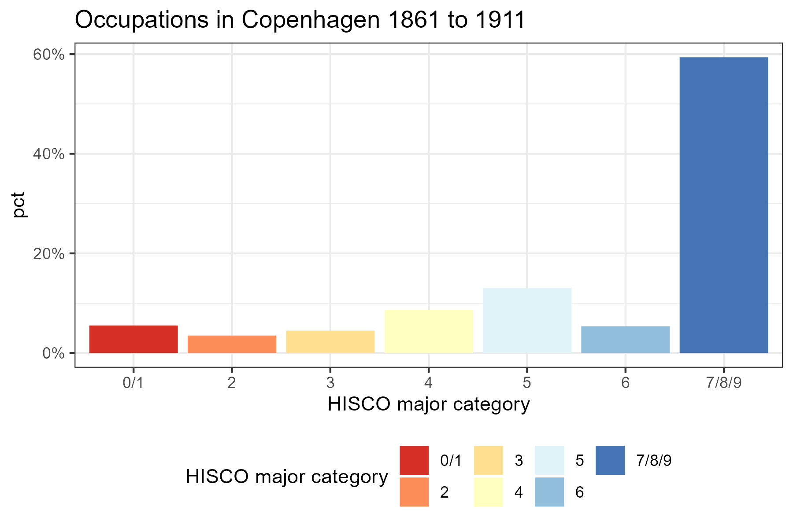

---
output:
  xaringan::moon_reader:
    includes:
      after_body: insert-logo.html
    self_contained: false
    lib_dir: libs
    nature:
      highlightStyle: github
      highlightLines: true
      countIncrementalSlides: false
editor_options: 
  chunk_output_type: console
---
class: center, inverse

```{r xaringan-panelset, echo=FALSE}
xaringanExtra::use_panelset()
```

```{r xaringan-tile-view, echo=FALSE}
xaringanExtra::use_tile_view()
```

```{r xaringanExtra, echo = FALSE}
xaringanExtra::use_progress_bar(color = "#808080", location = "top")
```

```{css echo=FALSE}
.pull-left {
  float: left;
  width: 48%;
}
.pull-right {
  float: right;
  width: 48%;
}
.pull-right ~ p {
  clear: both;
}

.pull-left-wide {
  float: left;
  width: 66%;
}
.pull-right-wide {
  float: right;
  width: 66%;
}
.pull-right-wide ~ p {
  clear: both;
}

.pull-left-narrow {
  float: left;
  width: 30%;
}
.pull-right-narrow {
  float: right;
  width: 30%;
}

.small123 {
  font-size: 0.80em;
}

.large123 {
  font-size: 2em;
}

.huge123 {
  font-size: 4em;
}

.red {
  color: red;
}

.highlight {
  background-color: yellow;
}
```


# Breaking the HISCO Barrier: 
## *AI and Occupational Data Standardization*
## Christian Møller-Dahl
## Christian Vedel
### University of Southern Denmark, HEDG

#### Twitter: @ChristianVedel,
#### Email: christian-vs@sam.sdu.dk
#### Updated `r Sys.Date()` 

---
# Motivation

.pull-left[
- The 2023 Nobel Prize was given to Claudia Goldin
> *"for having advanced our understanding of women’s labour market outcomes"* (NobelPrize.org, 2023)

- This type of work inherently requires data about the labour market

- *We are working on an algorithm, which can automatically classify occupations based on raw textual entries from archival data*

]

.pull-right[

*Claudia Goldin, wikimedia*
]

---
# Open questions
.pull-left[
- The role of technology and change of technology
- The dynamics of income inequality 
- Social mobility 
- Returns to education
- Much more


- **All of it requires data**

### This presentation:
- A tool to automatically systematise occupational descriptions

]
.pull-right[

.small123[*beta.dreamstudio.ai*]
]

---
# Data examples
```{r echo = FALSE, message=FALSE, warning=FALSE}
library(tidyverse)
```


```{r echo=FALSE}
load("Data_example_presentation.Rdata")
rownames(tmp) = NULL

tmp = tmp %>% 
  select(occ1) %>% 
  filter(nchar(occ1) > 23) %>% 
  rename(`Raw entry` = occ1)

DT::datatable(
  tmp,
  fillContainer = FALSE, options = list(pageLength = 5)
)
```

---
# HISCO codes
- Derived from ISCO (International Standard Classification of Occupations) 
- Invented for the sake of international comparability  
- Introduced by Leuwen, Maas, Miles (2002) based on ISCO68  
- Hiearchical structure well suited for analysis


---
.pull-left[
# The old solution
- Spend weeks, months or years manually reading and categorising 

- 17865 different occupational descriptions fit with "farm servant" in DK censuses ("in service", "servant girl", "servant boy", "servant woman", "servant karl") 

- Spelling mistakes, **negations**, and different spelling conventions
]

.pull-right[
# Our solution

- Use existing categorised archives 
- Fine tune a Language model to replicate their findings 
- **CANINE:** Transformer at character level
]

---
# Thanks to data contributors
```{r echo=FALSE, message=FALSE, warning=FALSE}
x = read_csv2("Data_sources.csv")$Source %>% unique() %>% paste(collapse = "<br>")
```

**Based on ~20 million already labelled cases from various sources**
.small123[
`r x`
]


--
.red[**Please send us some data. We owe you HISCO codes in return**]  
.red[christian-vs@sam.sdu.dk]


---
# The product
```{r echo=TRUE, message=TRUE, warning=TRUE, eval=FALSE}
# Example prompts
model.predict("A farmer")
model.predict("Tailor of beautiful dresses")
model.predict("The train's fireman")
```

--

```{r echo=FALSE, message=TRUE, warning=TRUE}
# Example prompts
rbind(
  data.frame(
    string = "A farmer",
    hisco = "61110",
    description = "General Farmer"
  ),
  data.frame(
    string = "Tailor of beautiful dresses",
    hisco = "79100",
    description = "Tailor, Specialisation Unknown"
  ),
  data.frame(
    string = "The train's fireman",
    hisco = "98330",
    description = "Railway SteamEngine Fireman"
  )
)

```

.footnote[
***See 'PREDICT_HISCOs.py'***
]


---
```{r include=FALSE, message=FALSE, warning=FALSE}
library(tidyverse)
library(plotly)

loadR1 = function(x){
  load(x)
  return(p3d)
}
loadR2 = function(x){
  load(x)
  return(p2d)
}

p3d_wlang_base = loadR1("Figures/CANINE baseline (w. lang)Interactive_tsne_3d.Rdata")
p3d_wlang = loadR1("Figures/CANINE finetuned (w. lang)Interactive_tsne_3d.Rdata")
p3d_wolang_base = loadR1("Figures/CANINE baseline (wo. lang)Interactive_tsne_3d.Rdata")
p3d_wolang = loadR1("Figures/CANINE finetuned (wo. lang)Interactive_tsne_3d.Rdata")

p2d_wlang_base = loadR2("Figures/CANINE baseline (w. lang)Interactive_tsne_2d.Rdata")
p2d_wlang = loadR2("Figures/CANINE finetuned (w. lang)Interactive_tsne_2d.Rdata")
p2d_wolang_base = loadR2("Figures/CANINE baseline (wo. lang)Interactive_tsne_2d.Rdata")
p2d_wolang = loadR2("Figures/CANINE finetuned (wo. lang)Interactive_tsne_2d.Rdata")
```

# Why do we want a finetuned model?
.pull-left-narrow[
- The model learns to understand occupational structures *semantically*
- Vastly improves performance* 
- Natural starting point for other general tasks related to occupation

*This is evident from the the embeddings: 768 dimensions reduced to 2* $\rightarrow$
]

.pull-right-wide[
.panelset[
.panel[.panel-name[Unaligned CANINE]
.center[
```{r echo=FALSE, message=FALSE, warning=FALSE, fig.width=7, fig.height=5}
p2d_wlang_base %>% layout(autosize = F, width = 500, height = 400)
```
]
]
.panel[.panel-name[Finetuned CANINE]
```{r echo=FALSE, message=FALSE, warning=FALSE, fig.width=7, fig.height=5}
p2d_wlang %>% layout(autosize = F, width = 500, height = 400)
```
]
]
]

---
# Performance 
.panelset[
.panel[.panel-name[All]
.center[
```{r echo=FALSE, message=FALSE, warning=FALSE, fig.width=7, fig.height=5}
knitr::include_graphics("Figures/All.png")
```
]
]
.panel[.panel-name[Swedish]
```{r echo=FALSE, message=FALSE, warning=FALSE, fig.width=7, fig.height=5}
knitr::include_graphics("Figures/Lang_se.png")
```
]
.panel[.panel-name[English]
```{r echo=FALSE, message=FALSE, warning=FALSE, fig.width=7, fig.height=5}
knitr::include_graphics("Figures/Lang_en.png")
```
]
.panel[.panel-name[Danish]
```{r echo=FALSE, message=FALSE, warning=FALSE, fig.width=7, fig.height=5}
knitr::include_graphics("Figures/Lang_da.png")
```
]
.panel[.panel-name[Dutch]
```{r echo=FALSE, message=FALSE, warning=FALSE, fig.width=7, fig.height=5}
knitr::include_graphics("Figures/Lang_nl.png")
```
]
.panel[.panel-name[All languages]
```{r echo=FALSE, message=FALSE, warning=FALSE, fig.width=7, fig.height=5}
knitr::include_graphics("Figures/Performance_lang_wise2.png")
```
]
]

---
# The nature of the mistakes
.panelset[
.panel[.panel-name[Example 1]
.center[
```{r echo=FALSE, message=FALSE, warning=FALSE, out.height="450px", out.width="675px"}
knitr::include_graphics("Figures/CANINE_preds_w_lang/RowID_EN_marr_cert3742836.png")
```
]
]
.panel[.panel-name[Example 2]
.center[
```{r echo=FALSE, message=FALSE, warning=FALSE, out.height="450px", out.width="675px"}
knitr::include_graphics("Figures/CANINE_preds_w_lang/RowID_EN_parish33715.png")
```
]
]
.panel[.panel-name[Example 3]
.center[
```{r echo=FALSE, message=FALSE, warning=FALSE, out.height="450px", out.width="675px"}
knitr::include_graphics("Figures/CANINE_preds_w_lang/RowID_EN_uk_ipums2325523.png")
```
]
]
.panel[.panel-name[Example 4]
.center[
```{r echo=FALSE, message=FALSE, warning=FALSE, out.height="450px", out.width="675px"}
knitr::include_graphics("Figures/CANINE_preds_w_lang/RowID_DK_census1787182508.png")
```
]
]
.panel[.panel-name[More]
.center[
#### *More in Figures/CANINE_preds_w_lang*
]
]
]

---
# Application: Copenhagen Burial Records 
*Data from CPH burial records - 90% accuracy with early version of algorithm*

*388,057 Copenhageners from around ~1861 to ~1911*

```{r echo=FALSE, message=FALSE, warning=FALSE, cache=TRUE}
data0 = read_csv2("CPH_hisco_codes_clean.csv")
data1 = read_csv("CBP.csv")

data1 = data1 %>% select(
  pa_id, event_year
) %>% 
  rename(Year = event_year)

data0 = data0 %>% 
  left_join(data1, by = "pa_id") %>% 
  pivot_longer(
    cols = hisco1:hisco5
  ) %>% 
  distinct(Year, pa_id, occ1, name, value) %>% 
  drop_na(value) %>% 
  mutate(
    value = as.character(value)
  ) %>% 
  mutate( # Fix leading zeros
    value = ifelse(nchar(value)==4, paste("0", value), value)
  ) %>% 
  mutate(
    HISCO1st = substr(value, 1, 1)
  ) %>% 
  select(-name) %>% 
  rename(hisco = value)

```

.small123[
```{r echo=FALSE, message=FALSE, warning=FALSE, cache=TRUE}
set.seed(20)
tmp = data0 %>% 
  distinct(Year, occ1, hisco, HISCO1st) %>% 
  sample_frac() %>% 
  rename(
    Occupation = occ1,
    `1 st digit`= HISCO1st
  )
tmp = tmp[1:100,]

DT::datatable(
  tmp,
  fillContainer = FALSE, options = list(pageLength = 4)
)
```

]

.footnote[
Data from Link Lives. See https://link-lives.dk/
]

---
# Application: Copenhagen Burial Records
```{r echo=FALSE, message=FALSE, warning=FALSE, cache=TRUE}
p1 = data0 %>% 
  filter(Year >= 1861) %>% 
  filter(Year <= 1911) %>% 
  mutate(
    HISCO1st = ifelse(
      HISCO1st %in% c("0", "1"), "0/1", HISCO1st
    )
  ) %>% 
  mutate(
    HISCO1st = ifelse(
      HISCO1st %in% c("7", "8", "9"), "7/8/9", HISCO1st
    )
  ) %>% 
  group_by(HISCO1st) %>% 
  count() %>% 
  ungroup() %>% 
  mutate(
    pct = n/sum(n)
  ) %>% 
  ggplot(aes(HISCO1st, y = pct, fill = HISCO1st)) + 
  geom_bar(stat = "identity") + 
  scale_fill_brewer(palette = "RdYlBu") + 
  labs(fill = "HISCO major category", x = "HISCO major category") + 
  theme_bw() +
  theme(legend.position = "bottom") +
  scale_y_continuous(labels = scales::percent) +
  labs(
    title = "Occupations in Copenhagen 1861 to 1911"
  )

ggsave("Figures/CPH_stats.png", plot = p1, width = 6, height = 4)
```



---
# Conclusion
.pull-left[
- Something that took weeks, months and years, now takes an afternoon
- Enables new research 
- Enables more time on caring about the quality of sources and their nature

**Steps ahead:**  
- Still work in progress
- More data, more training
]

.pull-right[
**Feel free to reach out**  
Twitter: @ChristianVedel  
christian-vs@sam.sdu.dk  
]


