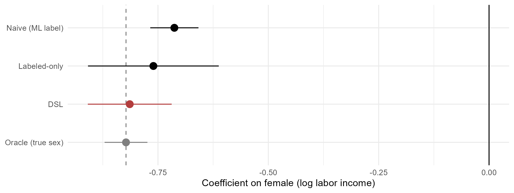
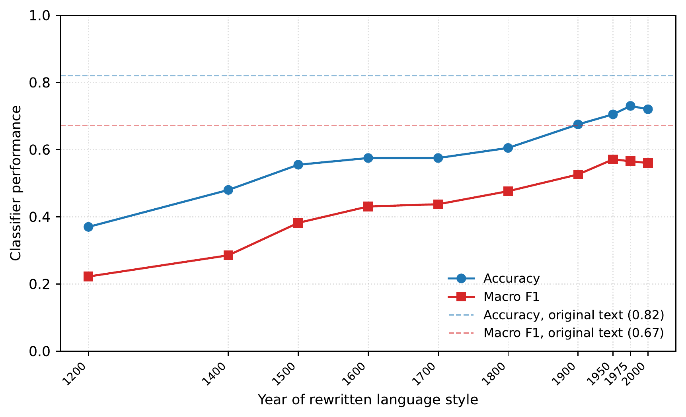
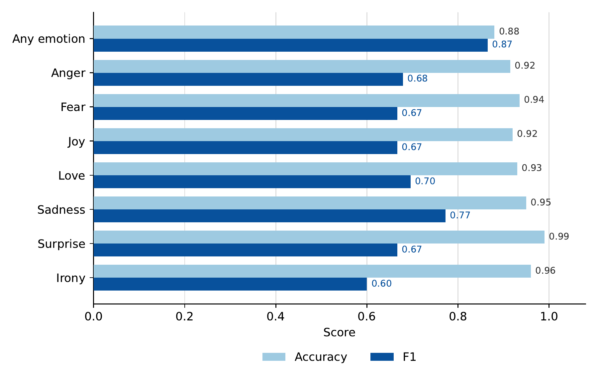
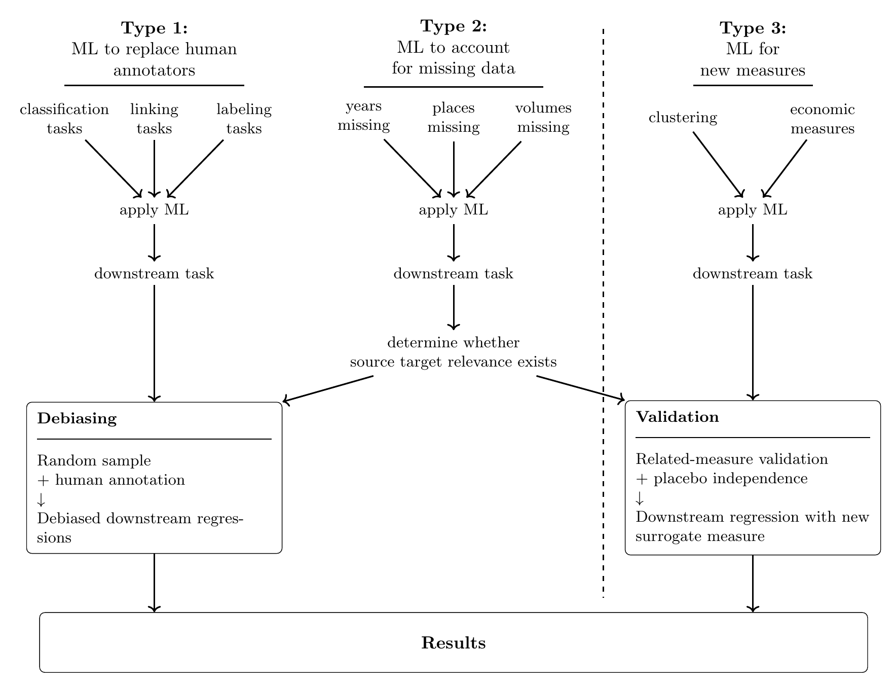
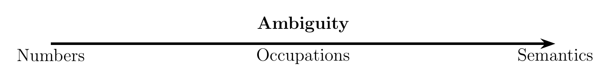
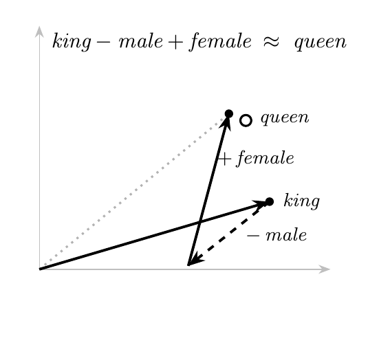
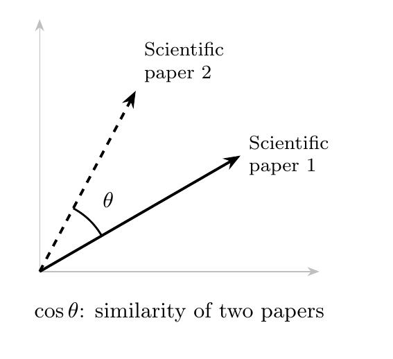
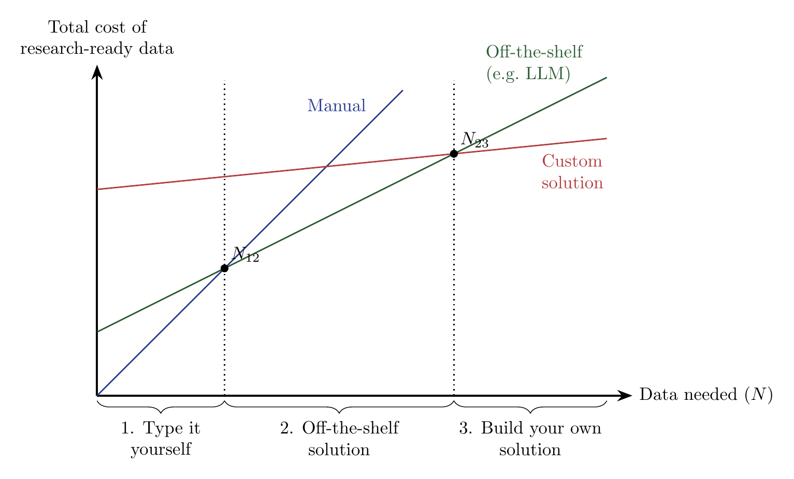
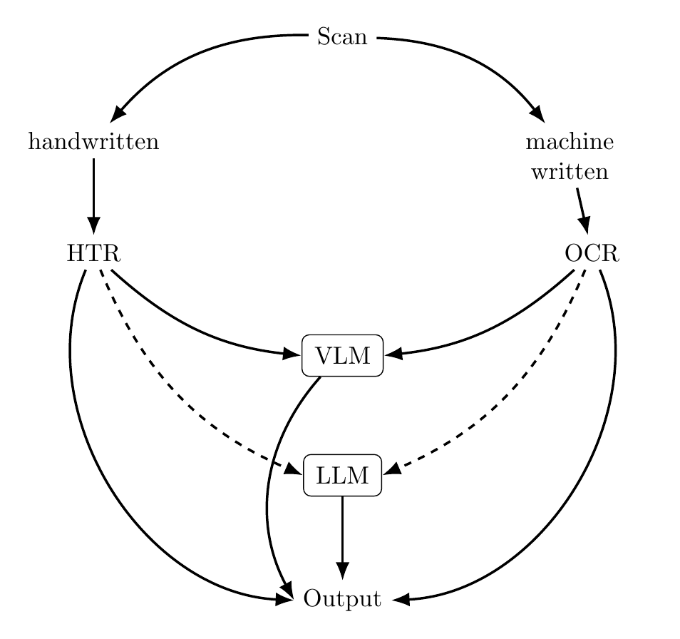
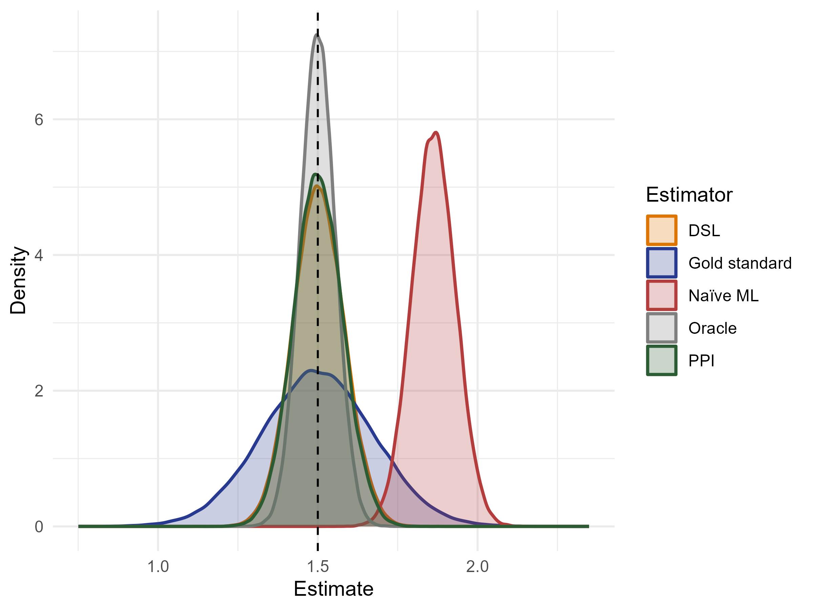

---
output:
  xaringan::moon_reader:
    seal: false
    includes:
      after_body: [insert-logo.html, slide-numbers.html]
    self_contained: false
    lib_dir: libs
    nature:
      highlightStyle: github
      highlightLines: true
      countIncrementalSlides: false
      ratio: '16:9'
editor_options:
  chunk_output_type: console
---
class: center, inverse, middle

```{r xaringan-panelset, echo=FALSE}
xaringanExtra::use_panelset()
```

```{r xaringan-tile-view, echo=FALSE}
xaringanExtra::use_tile_view()
```

```{r xaringanExtra, echo = FALSE}
xaringanExtra::use_progress_bar(color = "#808080", location = "top")
```

```{css echo=FALSE}
.pull-left {
  float: left;
  width: 44%;
}
.pull-right {
  float: right;
  width: 44%;
}
.pull-right ~ p {
  clear: both;
}

.pull-left-wide {
  float: left;
  width: 66%;
}
.pull-right-wide {
  float: right;
  width: 66%;
}
.pull-right-wide ~ p {
  clear: both;
}

.pull-left-narrow {
  float: left;
  width: 30%;
}
.pull-right-narrow {
  float: right;
  width: 30%;
}

.pull-right-extra-narrow {
  float: right;
  width: 20%;
}

.pull-center {
  margin-left: 28%;
  width: 44%;
}

.pull-center-wide {
  margin-left: 17%;
  width: 66%;
}

.pull-center-medium {
  margin-left: 20%;
  width: 60%;
}

.pull-center-narrow {
  margin-left: 35%;
  width: 25%;
}

.tiny123 {
  font-size: 0.40em;
}

.small123 {
  font-size: 0.80em;
}

.large123 {
  font-size: 2em;
}

.red {
  color: red
}

.chaosred {
  color: #b33d3d
}

.orange {
  color: orange
}

.green {
  color: green
}

.blue {
  color: blue
}

/* Full-bleed plate slides: image fills the slide below the title */
.plate img {
  max-height: 390px;
  width: auto;
  max-width: 100%;
  display: block;
  margin: 0 auto;
}
.plate-tall img {
  max-height: 440px;
  width: auto;
  max-width: 100%;
  display: block;
  margin: 0 auto;
}
.plate-short img {
  max-height: 330px;
  width: auto;
  max-width: 100%;
  display: block;
  margin: 0 auto;
}
.plate-xl img {
  max-height: 515px;
  width: auto;
  max-width: 100%;
  display: block;
  margin: 0 auto;
}

/* Text box over a full-bleed painting */
.overlay-box {
  background: rgba(0, 0, 0, 0.62);
  color: #fff;
  padding: 0.6em 1.1em;
  border-radius: 6px;
  display: inline-block;
}
.overlay-box h1, .overlay-box h2 {
  color: #fff;
  margin: 0.2em 0 0.3em 0;
}
.overlay-spoiler {
  margin-top: 0.8em;
}
.overlay-credit {
  position: absolute;
  bottom: 12px;
  left: 20px;
  font-size: 0.55em;
  color: #fff;
  background: rgba(0, 0, 0, 0.55);
  padding: 2px 8px;
  border-radius: 4px;
}
```


# How to deal with machine learning bias in economic history

### Torben S. D. Johansen, Julius Koschnick, **Christian Vedel**,
### University of Southern Denmark

### Email: [christian-vs@sam.sdu.dk](mailto:christian-vs@sam.sdu.dk)

### Updated `r Sys.Date()`

.footnote[
.small123[
Paper: [arxiv.org/abs/2606.28063](https://arxiv.org/abs/2606.28063). Code: [github.com/juliuskoschnick/Machine-learning-and-bias-in-economic-history](https://github.com/juliuskoschnick/Machine-learning-and-bias-in-economic-history)
]
]

---
name: newtech
class: left, top
background-image: url(Figures/kroyer_foundry.jpg)
background-size: cover

.overlay-box[
## A world of wondrous new technology

Is it good? Is it bad? No one knows.

**We offer practical advice for economic historians.**
]

.overlay-credit[
P.S. Krøyer, *Fra Burmeister & Wains jernstøberi* (1885). SMK, KMS3605, public domain.
]

--

.overlay-box.overlay-spoiler[
In this talk: how to use machine learning **and still draw credible conclusions**.

*Spoiler: economic history still needs good historians.*
]

---
name: utopia

# Utopia kicking in

.pull-left-wide[
**ML substitutes manual labour in economic history ...**

- At very low marginal cost (Korinek 2023)
- Sometimes matches or exceeds expert annotators (Gilardi et al. 2023; Törnberg 2024; Stewart 2026)
- $n_{\text{human}} \ll n_{\text{machine}}$ for a fixed research budget
]

.pull-right-narrow[
> **Research possibility frontier** has shifted: digitization, linking, imputation, and text as a primary source.
]

--

.pull-left-wide[
**... and opens up text as a primary source**

- Census linking, occupation coding (Dahl et al. 2026; Arora et al. 2024)
- Newspaper-scale topic and event extraction (Dell et al. 2023; Silcock et al. 2024)
- Sentiment, beliefs, political stance (van Binsbergen et al. 2024; Posch & Raz 2025; Gentzkow et al. 2019)
- Subject classification of historical publications; History LLMs with hard knowledge cut-offs (Koschnick 2025; Göttlich et al. 2025)
]

---
name: dystopia

# Dystopia kicking in

.pull-left-wide[
**Structural prediction errors create downstream bias**

- Even above 90–95% accuracy can flip estimated coefficients (Egami et al. 2024)
- LLMs confidently output wrong answers: "stochastic parrots" (Bender et al. 2021)
- Implicit societal biases reproduced from training data (Fang et al. 2024)
]

.pull-right-narrow[
> **Validation alone cannot detect these errors.** Accuracy is silent on *structural* bias.
]

--

.pull-left-wide[
**Historical settings amplify the problem**

- Archaic syntax and semantics differ from the training corpora
- Anachronisms and temporal contamination (Crane, Karra & Soto 2025)
- Correct interpretation depends on extensive historical context
]

---
name: question

# The question of this paper

.pull-left-wide[
> *How should economic historians use machine learning without sacrificing credible inference?*
]

--

.pull-left-wide[
**Our answer: adopt a debiasing framework** (Angelopoulos et al. 2023; Egami et al. 2023, 2024; Ludwig et al. 2025; Carlson & Dell 2025)

1. Hand-code a **random** subsample of the data
2. Use it to estimate the **structure of the bias**
3. Correct downstream estimates accordingly
]

--

.pull-right-narrow[
**Complements, not substitutes**

- **ML** scales prediction across millions of observations
- **The historian** engages critically with the gold-standard sample
]

---
name: summary

# Summary of the paper

.pull-left-wide[
This paper ...

- ... formally introduces **debiasing frameworks** to economic history
- ... documents why ML **performs worse on historical data**
- ... offers a **taxonomy** of three ML tasks and maps a bias-mitigation strategy onto each
- ... closes with best practices: scale, digitization, $\varepsilon$-reproducibility
]

.pull-right-narrow[
> **Central claim:** debiasing should become the default response to ML in the discipline.
]

.footnote[
.small123[
Taxonomy: (1) *ML to replace human annotators*, (2) *ML to account for missing data*, (3) *ML for new measures*.
]
]

---
class: inverse, middle, center

# The debiasing framework

---
name: stockholm-setup

# A motivating example: gender wage gap, Stockholm 1920

.pull-left-wide[
**Setup: a test case from Bengtsson & Molinder (2024)**

- Tax records on 3,271 Stockholm residents in 1920
- Income *and* gender observed: we can compute the ground truth
- Now pretend we did *not* have gender, only **names**

.small123[
$$\log(\textit{income}_i) = \beta_0 + \beta_1 \mathbf{1}(\textit{female}_i) + \varepsilon_i$$
]
]

.pull-right-narrow[
> **The classifier** is deliberately simple: Naive Bayes on 2,000 Scandinavian name–gender pairs. 81% accuracy, 97.6% precision, 67.2% recall: it rarely labels a man as a woman, but misclassifies a third of women as men.
]

--

.pull-left-wide[
**Three different estimates**

1. **Oracle:** observed gender for all 3,271 observations (only feasible here)
2. **Naive ML:** Naive Bayes on names, plug $\hat{g}(\text{name})_i$ into the regression
3. **Labeled-only:** hand-verify gender for a 10% random subsample $(n = 326)$
]

---
name: what-goes-wrong

# What goes wrong

.center[]

.pull-left-wide[
- **Naive ML is confident but wrong:** $-0.71$ vs. oracle $-0.82$; tight CI around the wrong number
- **Labeled-only is honest but noisy:** discards 90% of the data, CI $3\times$ wider
- Misclassifications are **systematic**, not random: names correlate with social status
]

.pull-right-narrow[
.small123[*Coefficient on female, log labor income. Bars: 95% CI. Dashed line: oracle. Data: Bengtsson & Molinder (2024).*]
]

---
name: debiasing-setup

# The debiasing setup, formally

.pull-left-wide[
A researcher has

- A large corpus of $N$ observations
- An ML predictor $f$ producing $\hat{Y}_i = f(X_i)$ for every $i$
- A random subsample of size $n \ll N$ hand-coded to obtain gold-standard $Y_i$
]

.pull-right-narrow[
> **Two recent estimators**
> - Prediction-powered inference, **PPI** (Angelopoulos et al. 2023)
> - Design-based supervised learning, **DSL** (Egami et al. 2023, 2024)
> - Asymptotically equivalent
]

--

.pull-left-wide[
**Three steps, no assumptions on $f$**

1. Use the ML model to label *all* $N$ observations
2. Compare predictions to gold-standard labels on the $n$-sample $\Rightarrow$ *estimate the bias of $f$*
3. Estimate the quantity of interest from the ML predictions, corrected by the estimated bias

[PPI vs. DSL](#appendix-ppi-vs-dsl)
]

---
name: ppi-mean

# Mean estimation with PPI

.pull-left-wide[
Target $\theta = \mathbb{E}[Y]$. We observe $X_i$ for all $i$, but $Y_i$ only on the random subsample of size $n$.

.small123[
$$\hat{\theta}_{\text{GS}} = \frac{1}{n}\sum_{i=1}^{n} Y_i \qquad \text{Gold standard only}$$

$$\hat{\theta}_{\text{ML}} = \frac{1}{N}\sum_{i=1}^{N} f(X_i) \qquad \text{Naive ML}$$

$$\hat{\theta}_{\text{DB}} = \frac{1}{N-n}\sum_{i=n+1}^{N} f(X_i) - \underbrace{\frac{1}{n}\sum_{i=1}^{n}\big(f(X_i) - Y_i\big)}_{\text{bias correction}} \qquad \text{Debiased (PPI)}$$
]
]

.pull-right-narrow[
- $\hat{\theta}_{\text{GS}}$: unbiased, but $n \ll N$ $\Rightarrow$ noisy
- $\hat{\theta}_{\text{ML}}$: precise, but meaningless if $f$ is biased
- $\hat{\theta}_{\text{DB}}$: **unbiased and exploits all $N$**

> More precise than $\hat{\theta}_{\text{GS}}$ whenever $\text{Var}(f(X_i) - Y_i) < \text{Var}(Y_i)$

[Simulation](#appendix-simulation-lhs)
]

---
name: dsl-regressor

# Correcting bias in a regressor with DSL

Estimate $\beta$ in $Y_i = \alpha + \beta Z_i + \varepsilon_i$ when $Z_i$ is ML-predicted, with gold-standard indicator $R_i \in \{0,1\}$ and sampling probability $\pi \approx n/N$.

.panelset[
.panel[.panel-name[Step 1: pseudo-outcomes]
.pull-left-wide[
.small123[
$$\widetilde{Z}_i := f(X_i) + \underbrace{\tfrac{R_i}{\pi}\big(Z_i - f(X_i)\big)}_{\text{bias correction}}$$

$$\widetilde{Z_i^2} := f(X_i)^2 + \tfrac{R_i}{\pi}\big(Z_i^2 - f(X_i)^2\big), \qquad \widetilde{Z_iY_i} := f(X_i)Y_i + \tfrac{R_i}{\pi}\big(Z_iY_i - f(X_i)Y_i\big)$$
]
]
.pull-right-narrow[
> The correction acts only on the $n$ gold-standard observations $(R_i = 1)$ but is scaled up by $1/\pi$.
]
]
.panel[.panel-name[Step 2: plug into OLS]
.pull-left-wide[
.small123[
$$\hat{\beta}_{\text{DB}} = \frac{\tfrac{1}{N}\sum_i \widetilde{Z_iY_i} - \big(\tfrac{1}{N}\sum_i \widetilde{Z}_i\big)\big(\tfrac{1}{N}\sum_i Y_i\big)}{\tfrac{1}{N}\sum_i \widetilde{Z_i^2} - \big(\tfrac{1}{N}\sum_i \widetilde{Z}_i\big)^2}$$
]
]
.pull-right-narrow[
> Ordinary OLS moments, with the pseudo-outcomes in place of the predicted regressor.
]
]
.panel[.panel-name[Software]
.pull-left-wide[
- **R:** `dsl` package (Egami et al. 2025)
- **Python:** `ppi-python` (Angelopoulos et al. 2023)
- IV, DiD, RD extensions: replication archive of Carlson & Dell (2025)

[Simulation](#appendix-simulation-rhs)
]
]
]

---
name: revisit

# Revisiting the example: the solution

.center[]

.pull-left-wide[
- **DSL** point estimate $-0.81$: *statistically indistinguishable from the oracle* $(-0.82)$
- CI **36% narrower** than labeled-only: uses all 3,271 predictions while correcting their bias
- Best of both worlds, **no assumptions on the ML model**
]

.pull-right-narrow[
.small123[*Same data, with DSL applied using the 10% gold-standard subsample.*]
]

---
name: revisit-table

# The numbers

```{r echo=FALSE}
read.csv("Tables/stockholm_dsl_results.csv") |>
  dplyr::mutate(dplyr::across(dplyr::where(is.numeric), ~signif(., 3))) |>
  DT::datatable(fillContainer = FALSE, options = list(pageLength = 5))
```

.small123[*Outcome: log labor income, Stockholm 1920. Gold-standard sample: 326 observations sampled independently with probability 0.1.*]

---
name: beyond

# Beyond means and slopes

.pull-left[
**The framework generalizes**

- Linear, logistic, Poisson regressions (Angelopoulos et al. 2023; Egami et al. 2024)
- High-dimensional fixed effects (Egami et al. 2024)
- IV, DiD, RDD (Carlson & Dell 2025; Ludwig et al. 2025)
- Aggregated data: fine, as long as labels and sampling probabilities are aggregated by the same function
]

.pull-right[
**Why this works for *any* black-box model**

- The researcher *controls the propensity score* through random sampling of gold-standard labels
- Known sampling design $\Rightarrow$ bias correction has expectation zero regardless of the model
- Precision gains scale with the model's predictive ability
]

.footnote[
.small123[
**Caveats:** the same gold standard cannot be used both to train $f$ *and* to estimate its bias. Convenience sampling or ad hoc sampling probabilities invalidate the correction.
]
]

---
name: careful-historian

# The careful historian

.pull-left-wide[
**Source criticism comes *before* coding** (Ranke 1824; Bloch 1954; Tosh 2015)

- Place the source in temporal and spatial context
- Identify the author's intent and position in society
- Document gaps in the data-generating process
- Cross-check against alternative sources
]

.pull-right-narrow[
**Replication packages should report**

- Source-criticism summary
- Background of expert labellers
- Codebook and ambiguities encountered
]

--

.pull-left-wide[
> Debiasing is only as good as the historical craftsmanship in the gold-standard sample. The framework re-introduces the historian as a **structural input**, not a competitor to ML.
]

---
class: inverse, middle, center

# ML performance with historical data

---
name: why-worse

# Why ML is worse on historical data

.pull-left-wide[
**The root:** pre-trained models (BERT, all LLMs) learn from modern corpora. Historical data has a different structure.

- **Anachronism and temporal contamination:** models project modern notions onto the past; "period prompting" only imitates a perspective with modern knowledge (Crane, Karra & Soto 2025)
- **Harder text:** archaic syntax and semantics, thin non-English data, unknown events and debates
- **Selected training data:** survival bias, Western over-representation, sources read literally
]

.pull-right-narrow[
> Errors correlate with **period, language, region, and complexity** $\Rightarrow$ systematic, not classical measurement error.
]

.footnote[
.small123[
History LLMs with hard knowledge cut-offs (Varnum et al. 2024; Göttlich et al. 2025) remove contamination but are less capable and still inherit the biases of their corpora. [More](#appendix-hllm)
]
]

---
name: exercise-bert

# Exercise 1: accuracy falls on older English

.pull-left[

.small123[*Pre-trained BERT emotion classifier on 200 texts rewritten by an LLM into the English of each period. Dashed: performance on the original modern texts.*]
]

.pull-right[
- 200 texts from `dair-ai/emotion` with human labels (joy, sadness, anger, fear, love, surprise)
- `gpt-5.4-mini` rewrites each into the written English of 1200–2000, emotion held fixed
- `j-hartmann/emotion-english-distilroberta-base` classifies every version

> Performance **declines steadily** as the language becomes archaic. LLM-rewritten prose is easier than real historical text, so this is a *conservative* baseline.
]

---
name: exercise-eebo

# Exercise 2: GPT-5.5 vs. close reading, 17th century

.pull-left[

.small123[*`gpt-5.5` labels vs. author hand-coding, 200 random paragraphs from Early English Books Online (Civil War era).*]
]

.pull-right[
- Emotions plus **irony**, an integral part of seventeenth-century rhetoric
- Accuracy looks high (0.94 across the basic emotions) ...
- ... but **F1 is 0.69 overall and 0.60 for irony**: the accuracy conceals substantial disagreement

> Close reading shows the misses are not random: the LLM misses **historical context**, source structure, and period rhetoric.
]

---
class: inverse, middle, center

# A taxonomy of ML tasks in economic history

---
name: taxonomy
class: plate-xl

# When can the bias be corrected?



---
name: taxonomy-words

# The taxonomy in words

.pull-left-wide[
> **Type 1: ML to replace human annotators.** ML labels what humans *could* label, at scale. Record linkage, occupation coding, sentiment, topics. $\Rightarrow$ **always debias.**
]

--

.pull-left-wide[
> **Type 2: ML to account for missing data.** A source $\mathcal{S}$ where the variable is observed fills in a target $\mathcal{T}$ where it is not. $\Rightarrow$ **reframe as Type 1 if source–target relevance holds, else Type 3.**
]

--

.pull-left-wide[
> **Type 3: ML for new measures.** Continuous proxies humans *cannot* directly produce. Innovation, sentiment, political stance. $\Rightarrow$ **validate against proxies and placebos.**
]

--

.pull-left-wide[
> **Each type has a different relationship to the debiasing framework.** Type 1 covers a large share of the field.
]

---
class: inverse, middle, center

# Type 1: ML to replace human annotators

---
name: type1-lit

# Type 1 in the recent literature

.pull-left-wide[
- **Record linkage and entity resolution:** Feigenbaum (2016); Price et al. (2021); Arora et al. (2024); Silcock et al. (2024): 2.7m newswire articles
- **Occupation and subject coding:** *OccCANINE* (Dahl et al. 2026); Liu et al. (2025): `gpt-4o-search` $\Rightarrow$ cognitive / manual / interpersonal; BERT on ESTC (Koschnick 2025)
- **Political sentiment and stance:** Giommoni et al. (2026) on French Revolution speeches; de Pleijt et al. (2026) on Civil War students; Gentzkow et al. (2019)
- **Science, religion, culture, images:** Almelhem et al. (2026); Grajzl & Murrell (2024); Gatti & Huesler (2025) on Michelangelo's letters; Voth & Yanagizawa-Drott (2024) on yearbook photos
]

.pull-right-narrow[
> **Common pattern:** reconstruct *unobservables* from *related observables*, at scales infeasible for human coding.

Economic historians cannot create new data on the past. ML predictions are necessary where direct observables are few.
]

---
name: type1-workflow

# Recommended workflow for Type 1

.panelset[
.panel[.panel-name[Validation]
.pull-left-wide[
- Report accuracy, precision, recall, F1 on a human-verified subset
- Good practice whether or not you debias
- **But do not stop here:** accuracy is silent on structural bias
]
]
.panel[.panel-name[Random sampling]
.pull-left-wide[
- Draw $n$ observations with a **known** design: every observation gets a strictly positive, recorded probability $\pi_i$
- Default to uniform $\pi_i$; stratify only for a reason, and pass the weights to the estimator
- In practice $n \sim 500$--$3{,}000$ (Egami et al. 2024; Yang et al. 2025); pilot with a small $n_0$, then top up
]
]
.panel[.panel-name[Annotation]
.pull-left-wide[
- By historically trained experts: source criticism first, coding documented, ambiguities recorded
- Skill required rises with the semantic ambiguity of the task
]
.pull-right-narrow[

]
]
.panel[.panel-name[Debiasing]
.pull-left-wide[
- PPI (Angelopoulos et al. 2023) or DSL (Egami et al. 2024)
- `dsl` in R, `ppi-python` in Python
- Consistent by design; more precise than the hand-coded sample alone given a reasonable model and large $N$
]
]
]

---
class: inverse, middle, center

# Type 2: ML to account for missing data

---
name: type2-setup

# Source–target setup and the strategic move

.pull-left-wide[
**Setup**

- **Source** $\mathcal{S}$: where the variable of interest *is* observed
- **Target** $\mathcal{T}$: the dataset of analysis, with missingness
- Stack as $(X_i, R_i Y_i)$ with $R_i = \mathbf{1}\{i \in \mathcal{S}\}$
- No extant record from which a human could read off the truth in $\mathcal{T}$
]

.pull-right-narrow[
> **Source–target relevance** (Carlson & Dell 2025, Assumption 2)
> $$(X_i, Y_i) \perp\!\!\!\perp R_i$$
> Features and outcomes are jointly independent of whether we observe them.
]

--

.pull-left-wide[
**The strategic move**

- **If the assumption holds:** cross-validate within $\mathcal{S}$ $\Rightarrow$ a Type 1 problem $\Rightarrow$ debias as before
- **If not:** treat as Type 3 and validate the surrogate against external proxies
- Relevance disciplines how $\mathcal{S}$ generalizes to $\mathcal{T}$; it does **not** sanitize a biased source
]

---
name: type2-examples

# Type 2 in practice

.pull-left[
**Reframable as Type 1**

- **Name-based proxies:** foreign vs. domestic names for assimilation (Abramitzky et al. 2020), Danish identity (Bentzen et al. 2024), name commonness for collectivism (Knudsen 2024), Jewish identity (Kok 2026). Tradition from the Black Name Index (Fryer & Levitt 2004)
- All are Naive Bayes-style classifiers: accuracy testable on a held-out part of $\mathcal{S}$
- **Occupational scores** for a verifiable quantity such as wages (Sobek 1995; Saavedra & Twinam 2020)
]

.pull-right[
**The Type 3 route**

- Historical GDP per capita imputed from biographical data (Koch et al. 2024): the binding assumption, that the relationship travels to the missing cells, is untestable
- Validated instead against urbanization, height, well-being, church building
- Occupational *status* as an abstract construct: no ground truth to pin down

> Proxy validation makes source–target relevance more credible; it does not remove it.
]

---
class: inverse, middle, center

# Type 3: ML for new measures

---
name: type3-point

# Beyond substitution

.pull-left-wide[
**The Type 1 and Type 2 logic: ML *substitutes* the annotator**

- Does what a human *could* do, at scale (Type 1)
- Or fills in what a human could have observed in another source (Type 2)
]

--

.pull-left-wide[
**Type 3: ML *expands* the feasible empirical set**

- Continuous proxies for concepts that exceed direct human coding
- Innovation, sentiment, political stance, gender stereotypes, emotional content of paintings
- **No gold-standard human label exists, by construction**
]

--

.pull-left-wide[
> Plausibly the *largest* long-run impact on the field, but the route to credibility is different.
]

---
name: type3-embeddings

# The workhorse: embedding spaces

.panelset[
.panel[.panel-name[The geometry]
.pull-left[
.center[]
.small123[*Arithmetic on word meanings: subtracting* male *and adding* female *to* king *lands near* queen.]
]
.pull-right[
.center[]
.small123[*Similarity between documents: the cosine of the angle between two document vectors.*]
]
]
.panel[.panel-name[Cosine similarity]
.pull-left-wide[
BERT-style models map text into a high-dimensional space (768 dimensions per token in BERT-base). The geometry encodes semantic relationships.

$$\cos(\mathbf{x}_i, \mathbf{x}_j) = \frac{\mathbf{x}_i \cdot \mathbf{x}_j}{\|\mathbf{x}_i\|\,\|\mathbf{x}_j\|}$$

- Close to 1: semantically aligned; close to 0: unrelated
- Same logic for words, sentences, and whole documents
]
.pull-right-narrow[
> Distances and directions in embedding space become **empirical measures** of semantic relationships. Builds on the distributional view of meaning (Harris 1954; Firth 1957).

[More](#appendix-embeddings)
]
]
]

---
name: type3-innovation

# Innovation: from bag-of-words to embeddings

.pull-left-wide[
**The basic logic** (Kelly et al. 2021): a document is innovative if it is closer to *subsequent* than to *previous* text.

.small123[
$$\text{Innov}_i = \frac{\text{FS}_i}{\text{BS}_i}, \qquad \text{BS}_i = \tfrac{1}{N}\sum_{j \in T_{t-1}} d(i,j), \qquad \text{FS}_i = \tfrac{1}{N}\sum_{j \in T_{t+1}} d(i,j)$$
]

- **Bag-of-words tradition:** `tf-idf` on US patents 1840–2010 (Kelly et al. 2021), Swedish patents (La Mela et al. 2025), 17th-century English books (Grajzl & Murrell 2026), new scientific words (Iaria, Schwarz & Waldinger 2018)
- *But:* information-inefficient and semantically biased (Dell 2025; Carlson & Dell 2025)
]

.pull-right-narrow[
> **Embedding-based extension** (Koschnick 2026): Kelly's logic in a BERT space; extends to **spillovers between fields**; *MacBERTh* fine-tuned on early-modern text to avoid anachronism.

Used to test Mokyr's feedback-loop hypothesis.
]

---
name: type3-validation

# Validation: convergent + discriminant

.pull-left-wide[
A gold standard is unavailable by construction. Borrow the logic of **surrogates** from medicine and psychometrics (Prentice 1989; Pepe 2003; Campbell & Fiske 1959), recently formalized for economics by Athey et al. (2025).

> **Two conditions for adoption**
> 1. **Convergent validity:** strong correlation with, ideally, multiple established proxies
> 2. **Discriminant validity:** no systematic correlation with conceptually similar but economically unrelated measures (placebo; guards against Goodhart's law)
]

.pull-right-narrow[
**Example:** Koschnick (2026)

- Correlates with patent citations and number of editions
- Placebo spillovers from unrelated fields: no effect
- LLM rewriting rules out style as the driver
]

.footnote[
.small123[
*Caveat:* new proxies can mean different things. Text-based innovation captures *textual influence over time*; citations capture *conscious reference*. Athey et al. (2025) propose a shared library of vetted surrogates.
]
]

---
class: inverse, middle, center

# Best practices

---
name: scale

# Thinking about the scale of your problem

.pull-left-wide[
.center[]
.small123[*Stylized total cost curves for research-ready data: fixed cost plus marginal cost per observation.*]
]

.pull-right-narrow[
**Ask:** how many hours would this take by hand?

- **Hours to tens:** type it yourself
- **Hundreds to thousands:** off-the-shelf LLM / VLM
- **Thousands+:** build your own

> An open custom model becomes a Mode 2 tool for the field (*MacBERTh*, *OccCANINE*).
]

.footnote[
.small123[
"Research-ready" = extracted + cleaned + validated + documented + **debiased**. Unanticipated failure modes raise the *effective* fixed cost of automation, so it pays off later than it looks.
]
]

---
name: digitization

# Digitization: OCR / HTR + (V)LM

.pull-left[
.center[]
]

.pull-right[
- VLMs (e.g. *Gemini*) take the image directly and handle tables and layout; LLMs alone did not
- **Recommendation:** pass *both* the OCR/HTR text *and* the image to a VLM
- Prompt: "never use text or numbers absent from the OCR"
- Cuts hallucinated numbers (Bhaskaran et al. 2025; Greif et al. 2025)

> On German patents 1877–1918, VLM error rates fall **below** those of research assistants (Grießhaber et al. 2025).
]

.footnote[
.small123[
Dashed line: OCR/HTR text straight to a classic LLM when there is no visual structure. Validate output against the original scans; consider LLM-as-judge multi-agent setups (Zheng et al. 2023).
]
]

---
name: reproducibility

# $\varepsilon$-reproducibility

.pull-left[
**Why exact reproducibility is hard with LLMs**

- GPU floating-point addition is non-associative: $(a+b)+c \neq a+(b+c)$
- Parallel reductions $\Rightarrow$ run-to-run drift, amplified through softmax
- Even with seed and temperature 0, OpenAI states "determinism is not guaranteed"
- Forcing determinism costs output quality and speed
]

--

.pull-right[
**Our proposal: $\varepsilon$-reproducibility**

- Allow tiny stochastic variation, like a careful RA labelling the same data twice
- Editorial threshold: downstream coefficients should match within e.g. 1%
- If results move more, the problem is the downstream model, not the LLM

> The real threat is **model deprecation**. Prefer locally stored open models (Ollion et al. 2024; Ludwig et al. 2025).
]

---
class: inverse, middle, center

# Conclusion

---
name: conclusion

# Conclusion: from dystopia to utopia?

.pull-left-wide[
- ML has reshaped the research frontier in economic history, but **high accuracy is not credibility**
- **Debiasing** is the principled response to ML-induced bias: hand-code a random sample, estimate the bias, correct
- A taxonomy maps each task to a strategy: **Type 1** always debias; **Type 2** reframe as Type 1 if defensible, else Type 3; **Type 3** validate against proxies and placebos
- Best practices: think about scale, combine OCR with VLMs, accept $\varepsilon$-reproducibility

**What remains**

- More applications; a shared library of vetted surrogates for Type 3
- Ready-to-use debiasing software for IV, DiD, RD is still catching up
]

.pull-right-narrow[
> ML and the careful historian are **complements**. Debiasing operationalizes that complementarity.

**Contact**

- Email: [christian-vs@sam.sdu.dk](mailto:christian-vs@sam.sdu.dk)
- Twitter/X: [@ChristianVedel](https://twitter.com/ChristianVedel)
- BlueSky: [@christianvedel.bsky.social](https://bsky.app/profile/christianvedel.bsky.social)
]

---
name: appendix
class: middle, center, appendix

# Appendix

---
name: appendix-ppi-vs-dsl

# PPI vs. DSL: side by side

.pull-left[
**PPI** (Angelopoulos et al. 2023): average ML predictions on $N - n$, then subtract the bias estimated on $n$

.small123[
$$\hat{\theta}_{\text{PPI}} = \tfrac{1}{N-n}\sum_{i=n+1}^{N} f(X_i) - \tfrac{1}{n}\sum_{i=1}^{n}\big(f(X_i) - Y_i\big)$$
]
]

.pull-right[
**DSL** (Egami et al. 2023, 2024): build pseudo-outcomes, then take a plain average

.small123[
$$\widetilde{Y}_i = f(X_i) + \tfrac{R_i}{\pi}\big(Y_i - f(X_i)\big), \qquad \hat{\theta}_{\text{DSL}} = \tfrac{1}{N}\sum_{i=1}^{N} \widetilde{Y}_i$$
]
]

.pull-left-wide[
- Asymptotically equivalent
- DSL is double-robust and allows explicit weights $\pi_i$ and high-dimensional fixed effects
- Software: `ppi-python` (Python), `dsl` (R)
]

[Back to slides](#debiasing-setup)

---
name: appendix-simulation-lhs

# Synthetic simulation: estimating a mean

.pull-left-wide[
.center[]
.small123[*N = 1,000, π = 0.1, X ~ U(0,1), Y = 2X, biased predictor f(X) = 2.1X − 0.5X². Density of estimates of the mean across 100,000 simulations.*]
]

.pull-right-narrow[
- **Naive ML** is biased; 95% CI coverage: 0%
- **Gold standard** is unbiased but noisy
- **PPI** and **DSL** approach the oracle; coverage $\approx 95\%$
]

[Back to slides](#ppi-mean)

---
name: appendix-simulation-rhs

# Synthetic simulation: predicted regressor

.pull-left-wide[
.center[]
.small123[*Y = 1 + 1.5Z + ε, Z = 2X, biased predictor f(X) = 2.1X − 0.5X². Density of the slope estimate across 100,000 simulations.*]
]

.pull-right-narrow[
- Naive ML coverage of $\beta$: 0%
- Gold standard / PPI / DSL: coverage $\approx 95\%$
- PPI and DSL recover the oracle behaviour with $n/N \approx 10\%$ of labels
]

[Back to slides](#dsl-regressor)

---
name: appendix-embeddings

# Embedding spaces: intuition and caveats

.pull-left-wide[
- In a well-trained embedding space: $\mathbf{v}_{\text{king}} - \mathbf{v}_{\text{male}} + \mathbf{v}_{\text{female}} \approx \mathbf{v}_{\text{queen}}$
- Builds on the distributional view of meaning (Harris 1954; Firth 1957), vector-space retrieval (Salton et al. 1975), latent semantic analysis (Deerwester et al. 1990)
- Same logic extends to longer text in BERT-style models; semantic relations operationalized through cosine similarity (Pennington et al. 2014; Caliskan et al. 2017; Ethayarajh 2019)
]

.pull-right-narrow[
**Practical caveats**

- Anisotropy of trained spaces (Gao et al. 2019)
- Classification-trained BERT is poor at similarity $\Rightarrow$ fine-tune with SimCSE (Gao et al. 2021)
- Historical text: pre-train or fine-tune on period corpora (*MacBERTh*; Koschnick 2026)
]

[Back to slides](#type3-embeddings)

---
name: appendix-hllm

# History LLMs

.pull-left-wide[
- *HistoryLLMs*: LLMs pre-trained on historical data with hard knowledge cut-offs
- Address anachronisms and temporal contamination directly
- Examples: *MacBERTh* (Manjavacas & Fonteyn 2021), *Ranke-Redux* (Göttlich et al. 2025), the 774m-parameter HLLM trained on 1880–1914 text (Underwood et al. 2025)
- Use cases: classification, path-dependency studies, psychological traits of past societies (Varnum et al. 2024)
]

.pull-right-narrow[
**Caveats remain**

- Still inherit the societal biases of the training corpora
- Survival bias of extant texts (Western archives over-represented)
- Period coverage may not match the question; less capable than modern LLMs
]

[Back to slides](#why-worse)

---
name: appendix-references

# Selected references

.pull-left[
.small123[
- Abramitzky, Boustan & Eriksson (2020). Do immigrants assimilate more slowly today than in the past? *AER: Insights*.
- Angelopoulos et al. (2023). Prediction-powered inference. *Science*.
- Athey, Chetty, Imbens & Kang (2025). Surrogate indices.
- Bengtsson & Molinder (2024). Incomes and income inequality in Stockholm, 1870–1970.
- Carlson & Dell (2025). A unifying framework for robust and efficient inference with unstructured data.
- Crane, Karra & Soto (2025). Total recall? Temporal contamination in LLMs.
- Dahl, Johansen & Vedel (2026). OccCANINE.
- Dell et al. (2023). American Stories.
- Egami, Hinck, Stewart & Wei (2023, 2024). Using LLM annotations for the social sciences: DSL.
]
]

.pull-right[
.small123[
- Gentzkow, Shapiro & Taddy (2019). Measuring group differences in high-dimensional choices. *Econometrica*.
- Grießhaber et al. (2025). Multimodal LLMs for historical datasets.
- Kelly, Papanikolaou, Seru & Taddy (2021). Measuring technological innovation over the long run. *AER: Insights*.
- Koch, Stojkoski & Hidalgo (2024). Augmenting the availability of historical GDP per capita estimates through machine learning.
- Koschnick (2026). Did a feedback mechanism between propositional and prescriptive knowledge create modern growth?
- Ludwig, Mullainathan & Rambachan (2025). LLMs: an applied econometric framework.
- Manjavacas & Fonteyn (2021). MacBERTh.
- Ollion et al. (2024). The dangers of using proprietary LLMs for research.
- van Binsbergen et al. (2024). (Almost) 200 years of news-based economic sentiment.
]
]
