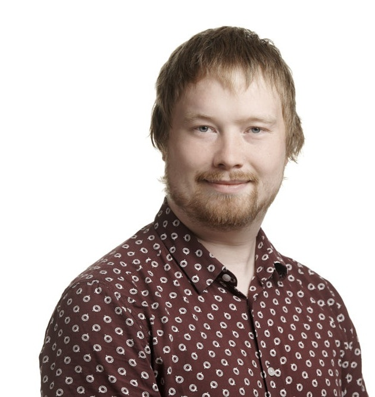
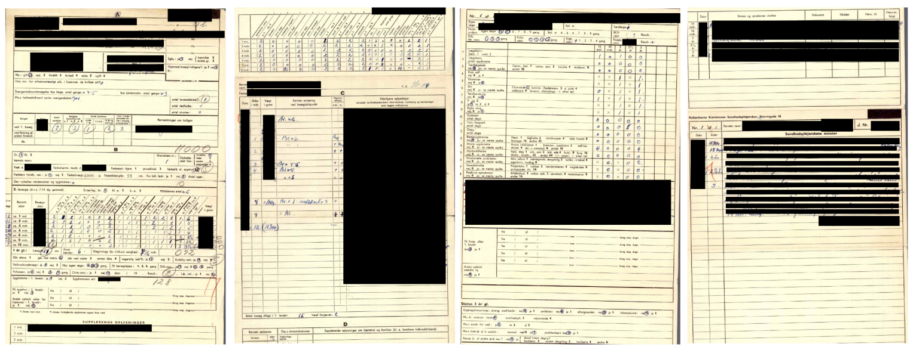

---
output:
  xaringan::moon_reader:
    seal: false
    includes:
      after_body: insert-logo.html
    self_contained: false
    lib_dir: libs
    nature:
      highlightStyle: github
      highlightLines: true
      countIncrementalSlides: false
      ratio: '16:9'
editor_options: 
  chunk_output_type: console
---
class: center, inverse, middle

```{r xaringan-panelset, echo=FALSE}
xaringanExtra::use_panelset()
```

```{r xaringan-tile-view, echo=FALSE}
xaringanExtra::use_tile_view()
```

```{r xaringanExtra, echo = FALSE}
xaringanExtra::use_progress_bar(color = "#808080", location = "top")
```

```{css echo=FALSE}
.pull-left {
  float: left;
  width: 44%;
}
.pull-right {
  float: right;
  width: 44%;
}
.pull-right ~ p {
  clear: both;
}

.pull-left-wide {
  float: left;
  width: 66%;
}
.pull-right-wide {
  float: right;
  width: 66%;
}
.pull-right-wide ~ p {
  clear: both;
}

.pull-left-narrow {
  float: left;
  width: 30%;
}
.pull-right-narrow {
  float: right;
  width: 30%;
}

.pull-right-extra-narrow {
  float: right;
  width: 20%;
}

.pull-center {
  margin-left: 28%;
  width: 44%;
}

.pull-center-narrow {
  margin-left: 30%;
  width: 28%;
}

.tiny123 {
  font-size: 0.40em;
}

.small123 {
  font-size: 0.80em;
}

.medium123 {
  font-size: 1.5em;
}

.large123 {
  font-size: 2em;
}

.red {
  color: red
}

.orange {
  color: orange
}

.green {
  color: green
}
```


# Hvad er meningen med... 
## ... Kunstig intelligens i samfundsvidenskabelig forskning?

#### Christian Vedel,<br>Økonomisk Institut

#### Email: [christian-vs@sam.sdu.dk](christian-vs@sam.sdu.dk)

#### `r Sys.Date()`


---

# Frygt og truslen om forandring

.pull-left-narrow[

#### 2021
- Dengang skrev man selv sin danskstil
- Dengang måtte man selv skrive udkast til emails
- Dengang blev man tvunget til at bruge noget der hedder 'google'

#### 2022
- ChatGPT

#### 2026-2036
- ??

]

--

.pull-right-wide[
.pull-center[

.small123[*AI genereret billede*]
]

### Planen i dag: Et blik fremmad
- Gode grunde til optimisme og bekymring. Men i én lys side
- *Hvad gør AI aktuelt i forskningen?*
- Hvad finder vi ud af? 
- Hvordan kan vores metoder komme andre til gavn?
]


???
- I december 2022 ramte chatGPT os
- Men det byger ovenpå en lang udvikling
- Og den udvikling er stadig undervejs

---
class: middle

# Hvem er vi? Og hvad er værdien af det vi laver?
.pull-left[
#### Økonomisk institut - andet end penge
- Økonomisk udvikling
- Velfærd
- Ulighed
- Klimaforandringer
- Kunst og kultur
- Knappe resourcer

#### *Vi har også én af Europas ledende grupper for økonomisk historie*
- Groft sagt: Vi skaber indsigter i alt det der betyder mest

]

--

.pull-right[
.pull-left[

.small123[
.small123[
#### *Christian Vedel, adjunkt*
- Økonomisk historie
- Økonomisk geografi
- Machine learning
]
]
]

.pull-right[

.small123[
.small123[
#### *Torben Johansen, adjunkt*
- Statistiske metoder
- Velfærd & sundhed
- Machine learning
- Økonomisk historie
]
]
]
]


---
class: middle

# Hvordan vi bruger maskinerne
- Vi er modelbyggere ligeså meget som modelbrugere
- 'små' modeller (~100 mio. parametre) 
- Konkrete opgaver

---
# Hvordan ser sådan en model-fætter ud?

*Bare rolig - detaljeret forklaring følger ikke*

.pull-left-wide[

]

.pull-right-narrow[
### Det vigtige er:

- Alt er open source
- Alt er nemt og 'modulært'
- Vi kan nemt bygge løsninger der virker
  + ...Og det kan vores studerende også
]

---
# Hvad lavede folk i gamle dage

--

.pull-left-narrow[
#### Hvad lavede folk egentlig

- Viden om folks arbejde er nyttigt
- Social mobilitet, velstand, økonomisk udvikling


#### Heldigvis har vi folketællinger

.tiny123[
*(Folketælling, Odense, 1850, Rigsarkivet)*
]


- 'Kun' 13.7 mio. beskrivelser at gennemgå 
- $=$ 20 medarbejdere i ét år

]


--

.pull-right-wide[

.pull-left[


]


.pull-right[
#### Data
> `"byens bedste hattemager"`  
> `"karretssmed"`  
> `"togets fyrbøder"`  
> `"han er bare landmand"`  

#### Løsning


]

- På 26 sekunder kan vores model standardisere 10.000 beskrivelser
- 10 timer versus 38.833 timer

.pull-right-wide[
.tiny123[
#### Reference
Dahl, C. M., Johansen, T., & Vedel, C. (2024). Breaking the HISCO barrier: Automatic occupational standardization with OccCANINE. arXiv. https://arxiv.org/abs/2402.13604
]
]


]


---
class: middle

# Resultat


]

---
# Hvordan giver vi børn den bedste start på livet?

.pull-left-narrow[
### Udfordringen
- Vi tror at tidlige indsater er vigtige
- Men hvor vigtige er de?
- Og hvordan skal man prioritere knappe ressourcer?

#### De viser sig ...
- ... At en læge i 60 besluttede 'tilfældigt' at give nogle børn mere sundhedspleje
- ... At der blev ført grundige journaler
- ... Og disse journaler nu kan blive automatisk digitaliseret
]

--

.pull-right-wide[


.pull-left-narrow[


]

.pull-right-wide[
.small123[
#### Resultater
- Data på tusindvis af mennesker gennem hele livet
- Få ressourcer brugt i barndommen har lange positive effekter for resten af livet
]
]
  
.tiny123[
#### Reference
Baker, J. L., Bjerregaard, L. G., Dahl, C. M., Johansen, T. S. D., Sørensen, E. N., & Wüst, M. (2023). Universal investments in toddler health: Learning from a large government trial (IZA DP No. 16270). IZA.
]

]

---
# Studenterbiografier

.pull-left-narrow[
- Det er er 150 år siden i år, at kvinder fik adgang til universitetsuddannelser
- Men hvordan blev Danmark et videnssamfund?
- Og gør viden os mere velstående?

- Alt dette forsøger vi at besvare for hele Norden i et stor projekt med samarbejde i Norge, Danmark, Tyskland og Sverige
]

--

.pull-right-wide[
#### Biografier
*Der findes i tusindvis a studenterbiografier for 25 års jublæer*

.pull-left-narrow[

]

.pull-right-wide[

]

- Uddannelse og livsmuligheder på tværs af lande og århundrede

]

---
class: middle
# Hvorfor?

.pull-left-wide[
.medium123[
1. Fordi vi gerne vil forstå verden
2. Fordi vi gerne vil gøre verden bedre
3. Fordi vores metoder kan bruges andetsteds
]
]


---
class: inverse

## *En anden version af AI-revolution: Små smart løsninger*


.pull-left-narrow[
- En masse bøvl på vej væk
- Fokus på de bedste løsninger
- Replikation
- En verden af modelbyggere
]


.pull-right-wide[


]

---
class: middle

# ...Eller?

.pull-left[
- Det er svært at spå
  + ... *især* om fremtiden
  
- Hvad sker der, når arbejde/opgaver bliver erstattet?
  + Over årtier: Alt bliver måske fint?
  + I det korte løb: ?
  
.pull-left[

]

]

.pull-right-narrow[


*På vej mod en mere oplyst fremtid eller Jevons paradox?*

]


---
class: middle, inverse

.huge123[
# Tak for nu
]


