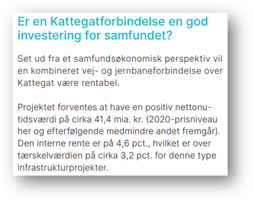
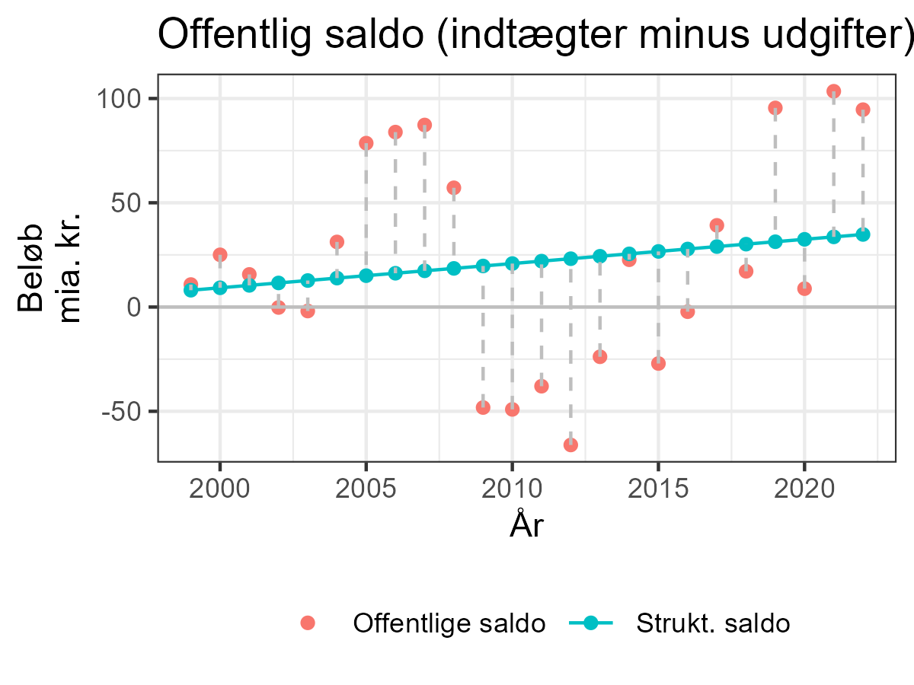
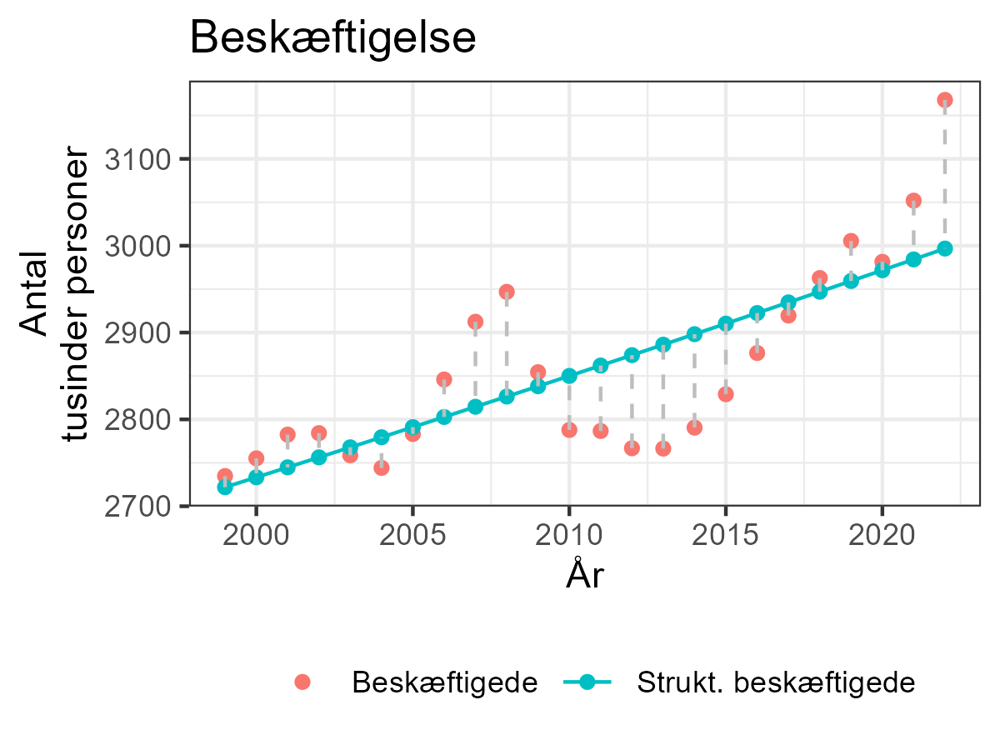
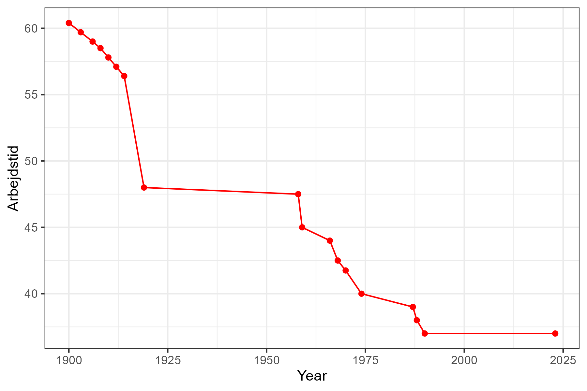
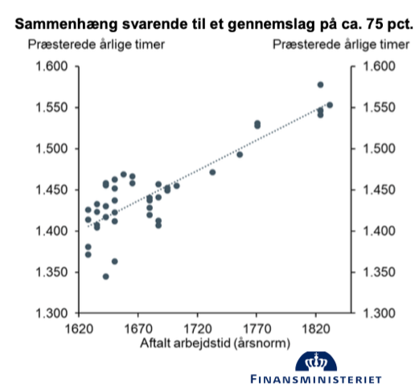
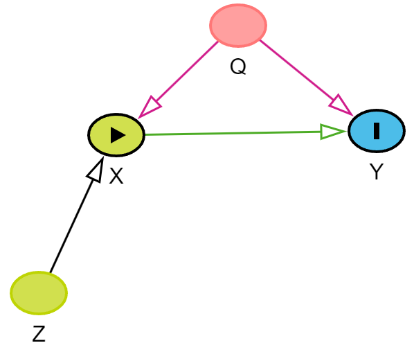

```{r setup, include=FALSE}
knitr::opts_chunk$set(eval=TRUE, include=TRUE, cache=TRUE, warnings = FALSE, message = FALSE, echo = FALSE)
library(tidyverse)
```

```{css echo=FALSE}
.pull-left {
  float: left;
  width: 48%;
}
.pull-right {
  float: right;
  width: 48%;
}
.pull-right ~ p {
  clear: both;
}


.pull-left-wide {
  float: left;
  width: 66%;
}
.pull-right-wide {
  float: right;
  width: 66%;
}
.pull-right-wide ~ p {
  clear: both;
}

.pull-left-narrow {
  float: left;
  width: 30%;
}
.pull-right-narrow {
  float: right;
  width: 30%;
}

.small123 {
  font-size: 0.80em;
}

.large123 {
  font-size: 2em;
}

.huge123 {
  font-size: 4em;
}

.highlight {
  background-color: yellow;
}

```

# Hvem er jeg
.pull-left[

- Økonom - nyuddannet PhD d. 25. september 2023
- Adjunkt på økonomisk institut
- Forskning i krydsfeltet mellem machine learning og økonomisk historie
- Underviser i alt fra machine learning fag til indledende mikroøkonomi
- IB student fra Nyborg Gymnasium i 2013 - 10 år siden. 

]

.pull-right[

.small123[*Dimission 2013*]
]

---
# TL;DR
- Stol aldrig på finansministeriet 
- Stol lidt på dem alligevel 
- På økonomistudiet på SDU kan man lære at gøre det bedre 
- (Og så kunne man f.eks. arbejde i finansministeriet og få styr på deres sager)

---
**Tal over det hele**
--

--
.pull-right[

]
--
.pull-left-wide[

]
--
.pull-right-narrow[
***...Og senest Store Bededag***
]

---
### Finansministeriets vurdering af effekten ved afskaffelse af en helligdag

> "En afskaffelse af en helligdag, som hvert år falder på en hverdag, vurderes at kunne øge den samlede præsterede arbejdstid med ca. 0,34 pct. årligt svarende til en stigning i strukturelle beskæftigelse på ca. .highlight[8.500 fuldtidsbeskæftigede]. Forslaget skønnes at styrke den .highlight[strukturelle offentlige saldo med i omegnen af 3 mia. kr.] og øge strukturelt BNP med ca. 9,4 mia. kr., jf. tabel 1." - [Faktaark, fm.dk](https://fm.dk/media/26738/faktaark_finansministeriets-vurdering-af-effekten-ved-afskaffelse-af-en-helligdag.pdf)

--

.pull-left[
**Spørgsmål**
1. Hvad betyder det?
2. Hvordan ved de, at det er 8500 mere? 
3. Hvad er usikkerheden på det tal? 
4. Hvordan har de beregnet det? 
5. Hvordan *bør* man beregne det?
]

.pull-right[
**Svar (til uddybning)**
1. Budgettet i de lange løb 
2. Det gør de ikke 
3. Meget stor 
4. Med en ringe metode
5. Med en bedre metode / Overhoved ikke
]

---
# 1. Hvad betyder det? 
### Hvad betyder 'strukturel'?

```{r}
# Read data
gov_finance = read_csv2("Data/DST_OFF3.csv", col_names = c("Year", "Indtaegter", "Saldo"))
empl = read_csv2("Data/DST_NAHB.csv", col_names = c("Year", "Beskaeftiget"))

# Param
start_year = 1999

# Data wrangling 
gov_finance = gov_finance %>% 
  filter(Year >= start_year) %>% 
  mutate( # Convert units to milliarder
    Indtaegter = Indtaegter / 1000,
    Saldo = Saldo / 1000
  ) %>% 
  mutate(
    Indtaegter_strukturel = exp(predict(lm(log(Indtaegter) ~ Year, .))),
    Saldo_strukturel = predict(lm(Saldo ~ Year, .))
  ) %>% 
  mutate(
    Indtaegter_detrended = Indtaegter - Indtaegter_strukturel,
    Saldo_detrended = Saldo - Saldo_strukturel
  )

empl = empl %>% filter(Year >= start_year) %>% 
  mutate( # Convert units to thousands
    Beskaeftiget = Beskaeftiget / 1000
  ) %>% 
  mutate(
    Beskaeftiget_strukturel = exp(predict(lm(log(Beskaeftiget) ~ Year, .)))
  ) %>% 
  mutate(
    Beskaeftiget_detrended = Beskaeftiget - Beskaeftiget_strukturel
  )

p1 = ggplot(gov_finance, aes(y = Indtaegter, x = Year)) +
  geom_point(aes(col = "Offentlige indtægter")) +
  geom_point(aes(y = Indtaegter_strukturel, col = "Strukt. offentlige indtægter")) + 
  geom_line(aes(y = Indtaegter_strukturel, col = "Strukt. offentlige indtægter")) +
  geom_segment(aes(xend = Year, yend = Indtaegter_strukturel), col = "grey", lty = 2) +
  # geom_point(aes(col = "Forskel:\nOffentlige indtægter - Strukt. offentlige indtægter", y = Indtaegter_detrended )) + 
  # geom_hline(yintercept = 0, col = "grey") +
  # geom_segment(aes(xend = Year, yend = Indtaegter_detrended), y = 0, col = "grey", lty = 2) + 
  labs(
    title = "Offentlige indtægter",
    y = "Beløb (mia. kr.)",
    col = "",
    x = "År"
  ) + 
  theme_bw() +
  theme(
    legend.position = "bottom"
  )

p2 = ggplot(gov_finance, aes(y = Saldo, x = Year)) +
  geom_point(aes(col = "Offentlige saldo")) +
  geom_point(aes(y = Saldo_strukturel, col = "Strukt. saldo")) + 
  geom_line(aes(y = Saldo_strukturel, col = "Strukt. saldo")) +
  geom_segment(aes(xend = Year, yend = Saldo_strukturel), col = "grey", lty = 2) + 
  geom_hline(yintercept = 0, col = "grey") +
  labs(
    title = "Offentlig saldo (indtægter minus udgifter)",
    y = "Beløb\nmia. kr.",
    col = "",
    x = "År"
  ) + 
  theme_bw() +
  theme(
    legend.position = "bottom"
  )

p3 = ggplot(empl, aes(y = Beskaeftiget, x = Year)) +
  geom_point(aes(col = "Beskæftigede")) +
  geom_point(aes(y = Beskaeftiget_strukturel, col = "Strukt. beskæftigede")) + 
  geom_line(aes(y = Beskaeftiget_strukturel, col = "Strukt. beskæftigede")) +
  geom_segment(aes(xend = Year, yend = Beskaeftiget_strukturel), col = "grey", lty = 2) + 
  labs(
    title = "Beskæftigelse",
    y = "Antal\ntusinder personer",
    col = "",
    x = "År"
  ) + 
  theme_bw() +
  theme(
    legend.position = "bottom"
  )

ggsave("Figures/Offentlige_indtaegter.png", plot = p1, width = 4, height = 4)
ggsave("Figures/Offentlige_saldo.png", plot = p2, width = 4, height = 4)
ggsave("Figures/Beskaetigelse.png", plot = p3, width = 4, height = 4)
```


.pull-left[

]

.pull-right[

]


.footnote[
.small123[
**Noter:**
*Kilde DST, dataserie OFF3*  
*Simple 'strukturelle' beregninger baseret på lineære tendenser.*
]
]

---
# 1. Hvad betyder det?
### Afskaffelsen af en helligdag vil betyde 8500 flere strukturelt beskfætiget
.pull-left[
**Scenarie 1 - store bededag bibeholdt:**  
2.996.730 personer 'strukturelt' beskæftiget

]

.pull-right[
**Scenarie 2 - store bededag afkaffet:**  
2.996.730 .highlight[\+ 8500] personer 'strukturelt' beskæftiget
]

### Hvornår kan man det? 
- Når man har en god model, der kan forudsige kontrafakta 
- Hvordan (ideelt):
  + Afskaf store bededag for halvdelen af befolkning. Mål forskellen. 
- Hvordan (realistisk):
  + Brug et eller flere *gode* naturlige eksperimenter 


---
# Begreber

.pull-left[
## Bruttoeffekt
- Den umiddelbare effekt 
- F.eks. den ekstra arbejdstid på papiret
]

.pull-right[
## Nettoeffekt
- Den endelige effekt baseret på faktisk adfærd og 'tilbageløb'
- F.eks. den ekstra arbejdstid folk faktisk ender med at præstere
]

--
.pull-right-wide[
**Gemmemslag**
- Hvor meget af bruttoeffekten 'slår igennem' til nettoeffekten
- F.eks. 75%, 0% eller -10%
]


---
# 2. Hvordan ved de at det er 8500 mere?

- **Strukturel beskæfitgelse:** 2.5 mio. 
- **Arbejdsdage på et år:** 220
- **Bruttoforøgelse af arbejdstid:** 1/220 $\approx$ 0,45%
- **Gennemslag:** .highlight[Ubekendt men estimeret til 75%]
- **Nettoforøgelse af arbejdstid:** $Gennemslag \times Bruttoforøgelse \approx 0.34\%$
- **Ændring i strukturel beskæftigelse:** $0.34\% \times 2.5 mio. \approx 8500$ 
--
$Nettoforøgelse\:af\:arbejdstid\times Strukturel\:beskæfitgelse \approx 8500$
--

$\mathbf{Gennemslag} \times Bruttoforøgelse\times Strukturel beskæfitgelse \approx 8500$

--
.huge123[.center[???]]
--
.center[Så hvor kommer .highlight[gennemslaget] fra?]

```{r}
# Strukturel beskæftigelse iflg. notat
strkt_besk = 8500/0.0034
arbejdsdage = 220
bruttoforoegelse = 1/arbejdsdage
gennemslag = 0.75
nettoforoegelse = gennemslag * bruttoforoegelse # 0.34%

delta_beskf = nettoforoegelse * strkt_besk
# round(delta_beskf, -2)
```

---
# 2. Hvordan ved de at det er 8500 mere?
### Hvor kommer gennemslaget fra?
--
```{r}
data0 = read_csv2("Data/Arbejdstid.csv")
colnames(data0) = c("Year", "Arbejdstid")
data0 = data0 %>% bind_rows(data.frame(Year = 2023, Arbejdstid = 37))

p1 = ggplot(data0, aes(y = Arbejdstid, x = Year))+
  geom_point(col = "red") +
  geom_line(col = "red") +
  theme_bw()

ggsave("Figures/Arbejdstid.png", plot = p1, width = 6, height = 3)
```

.small123[*Arbejdstid i Danmark fra denstoredanske.lex.dk*]


---
# 2. Hvordan ved de at det er 8500 mere?
### Hvor kommer gennemslaget fra?
--
.center[

]

---
# Katte og statistik
.center[
.middle[
<iframe width="560" height="315" src="https://www.youtube.com/embed/HUti6vGctQM?si=VpeL6ydO60RoiHG5" title="YouTube video player" frameborder="0" allow="accelerometer; autoplay; clipboard-write; encrypted-media; gyroscope; picture-in-picture; web-share" allowfullscreen></iframe>
]
]

---

# 2. Hvordan ved de at det er 8500 mere?
.pull-left[
***FMs naturlige eksperiment***
- Vi er interesseret i $\mathbf{X}\rightarrow\mathbf{Y}$, hvor $\mathbf{X}$ er en ændring i den officielle arbejdstid og $\mathbf{Y}$ er en ændring i den faktiske arbejdstid. 
- Den officielle arbejdstid ændrer sig over tid 
- Hvor meget ændre folks faktiske arbejdstid sig så?  

***Problemer***
- *Reichenbach's læresætning om fælles årsag*: Når vi ser en sammenhæng skyldes det enten:
  + A: $\mathbf{X}\rightarrow\mathbf{Y}$
  + B: $\mathbf{Y}\rightarrow\mathbf{X}$
  + C: $\mathbf{Z}\rightarrow\mathbf{Y}$ og $\mathbf{Z}\rightarrow\mathbf{X}$
]
--

.pull-right[
- Hvad er sandsynligt?:
  + A: Den officielle arbejdstid har indflydelse på den faktiske arbejdstid (*FMs antagelse*)
  + B: Den faktiske arbejdstid har indflydelse på den officielle arbejdstid (*Plausibelt*) 
  + C: En tredje *fælles årsag* til begge dele. F.eks. lyst til mere fritid (*Meget sandsynligt*) - se f.eks. Overvismandens kritik i [politiken](https://politiken.dk/indland/art9157437/Overvismand-studser-over-regeringens-regnestykke)
- Moderne økonomiske metoder tager stilling til den slags problemer ([Nobelpris 2021](https://www.nobelprize.org/prizes/economic-sciences/2021/popular-information/)). Det gør FM ikke her. 
- Is og badning

]

---
# Is og badning
- Bør man vente med at bade til lang tid efter man har spist is? 
- [Is_draber.xlsx](https://github.com/christianvedels/Guest_Lectures_and_misc_talks/blob/main/Hvor%20kommer%20tallene%20fra/Is_draeber.xlsx)
- 10 is slår 7 børn ihjel! Genmmenslaget er 70%!

--

*Som faktisk forklares udmærket af noget tredje - sommer*

---
# Hvad er et godt naturligt eksperiment? 

.pull-left[
Eksperimentet, $Z$, skal være *eksogent* ('udefrakommende') og *relevant* 
]

.pull-right-wide[


]

---
class: inverse, center, middle
# Skamløs annanas i egen juice:
## '[A perfect storm*](https://raw.githack.com/christianvedels/Slides-for-PhD-defence/main/Defence_slides.html#3)'-projektet: 
### Et ret godt naturligt eksperiment for infrastruktur

.footnote[
\* Det er et link. Man kan klikke på det!
]


