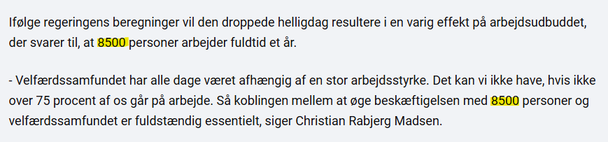

```{r setup, include=FALSE}
knitr::opts_chunk$set(eval=TRUE, include=TRUE, cache=TRUE, warnings = FALSE, message = FALSE, echo = FALSE)
library(tidyverse)
```

```{r xaringan-panelset, echo=FALSE}
xaringanExtra::use_panelset()
```

```{r xaringan-tile-view, echo=FALSE}
xaringanExtra::use_tile_view()
```

```{r xaringanExtra, echo = FALSE}
xaringanExtra::use_progress_bar(color = "#808080", location = "top")
```

```{css echo=FALSE}
.pull-left {
  float: left;
  width: 44%;
}
.pull-right {
  float: right;
  width: 44%;
}
.pull-right ~ p {
  clear: both;
}


.pull-left-wide {
  float: left;
  width: 66%;
}
.pull-right-wide {
  float: right;
  width: 66%;
}
.pull-right-wide ~ p {
  clear: both;
}

.pull-left-narrow {
  float: left;
  width: 30%;
}
.pull-right-narrow {
  float: right;
  width: 30%;
}

.tiny123 {
  font-size: 0.40em;
}

.small123 {
  font-size: 0.80em;
}

.large123 {
  font-size: 2em;
}

.huge123 {
  font-size: 4em;
}

.red {
  color: red
}

.orange {
  color: orange
}

.green {
  color: green
}

.highlight {
  background-color: yellow;
}
```

--

--
.pull-right-narrow[

]
--
.pull-left-wide[

]
--
.pull-right-narrow[
***...Og senest Store Bededag:***
]

--
.center[
.pull-right[

]
]

---
# Hvem er jeg
.pull-left[

- Økonom - nyuddannet PhD d. 25. september 2023
- Adjunkt på økonomisk institut
- Forskning i krydsfeltet mellem machine learning og økonomisk historie
- Underviser i alt fra statistik, data science og nere klassiske økonomiske fag
- IB student fra Nyborg Gymnasium i 2013 - 12 år siden. 

]

.pull-right[

.small123[*Dimission 2013*]
]

---
### TL;DR (Den korte version)
- Stol aldrig på finansministeriet 
- Stol lidt på dem alligevel
- På økonomistudiet på SDU kan man lære at gøre det bedre 
- (Og så kunne man f.eks. arbejde i finansministeriet og få styr på deres sager) 
- 75% 

---
### Finansministeriets vurdering af effekten ved afskaffelse af en helligdag

> "En afskaffelse af en helligdag, som hvert år falder på en hverdag, vurderes at kunne øge den samlede præsterede arbejdstid med ca. 0,34 pct. årligt svarende til en stigning i strukturelle beskæftigelse på ca. .highlight[8.500 fuldtidsbeskæftigede]. Forslaget skønnes at styrke den .highlight[strukturelle offentlige saldo med i omegnen af 3 mia. kr.] og øge strukturelt BNP med ca. 9,4 mia. kr., jf. tabel 1." - [Faktaark, fm.dk](https://fm.dk/media/26738/faktaark_finansministeriets-vurdering-af-effekten-ved-afskaffelse-af-en-helligdag.pdf)


---
# Hvad betyder det?
### Afskaffelsen af en helligdag vil betyde 8500 flere strukturelt beskæftiget
.pull-left[
**Scenarie 1 - store bededag bibeholdt:**  
2.996.730 personer 'strukturelt' beskæftiget

]

.pull-right[
**Scenarie 2 - store bededag afkaffet:**  
2.996.730 .highlight[\+ 8500] personer 'strukturelt' beskæftiget
]

### Hvornår kan man det? 
- Når man har en god model, der kan forudsige kontrafakta 
- Hvordan (ideelt):
  + Afskaf store bededag for halvdelen af befolkning. Mål forskellen. 
- Hvordan (realistisk):
  + Brug et eller flere *gode* naturlige eksperimenter 

---
# Beregning skridt for skridt

- **Strukturel beskæfitgelse:** 2.5 mio. 
- **Arbejdsdage på et år:** 220
- **Bruttoforøgelse af arbejdstid:** 1/220 $\approx$ 0,45%
- **Gennemslag:** .highlight[Ubekendt men estimeret til 75%]
- **Nettoforøgelse af arbejdstid:** $Gennemslag \times Bruttoforøgelse \approx 0.34\%$
- **Ændring i strukturel beskæftigelse:** $0.34\% \times 2.5 mio. \approx 8500$ 

```{r}
# Strukturel beskæftigelse iflg. notat
strkt_besk = 8500/0.0034
arbejdsdage = 220
bruttoforoegelse = 1/arbejdsdage
gennemslag = 0.75
nettoforoegelse = gennemslag * bruttoforoegelse # 0.34%

delta_beskf = nettoforoegelse * strkt_besk
# round(delta_beskf, -2)
```


---
# 2. Hvordan ved de at det er 8500 mere?

--
.pull-left[
### Hvor kommer gennemslaget fra?

]

--
.pull-right[
- Kan man gøre sådan? (*Nej*)
]


---

# 2. Hvordan ved de at det er 8500 mere?

.pull-left-wide[
- De antager at:
  $$\textit{Officiel arbejdstid} \rightarrow \textit{Faktisk arbejdstid}$$
]
--
.pull-left-wide[
- Hvad er sandsynligt?:
  + A: Den officielle arbejdstid har indflydelse på den faktiske arbejdstid (*FMs antagelse*)
  + B: Den faktiske arbejdstid har indflydelse på den officielle arbejdstid (*Plausibelt*) 
  + C: En tredje *fælles årsag* til begge dele. F.eks. lyst til mere fritid (*Meget sandsynligt*) - se f.eks. Overvismandens kritik i [politiken](https://politiken.dk/indland/art9157437/Overvismand-studser-over-regeringens-regnestykke)
]

--
.pull-left-wide[
- Moderne økonomiske metoder tager stilling til den slags problemer ([Nobelpris 2021](https://www.nobelprize.org/prizes/economic-sciences/2021/popular-information/)). Det gør FM ikke her. 
- Is og badning (om lidt)
]

---
# Hvad er et godt naturligt eksperiment? (Nobelprisøkonomi på 30 sekunder)

.pull-left[
- Eksperimentet, $Z$, skal være *eksogent* ('udefrakommende') og *relevant*
- *Det lære I mere om I økonometri*

- Eksempel 
  + $Z$: Tilfældig ændring i arbejdsdage
  + F.eks. nogle Andelsmejerier indførte søndagslukkethed
]

.pull-right-narrow[


]

---
# Et dårligt naturligt eksperiment: Is og badning

.pull-left-narrow[
- Bør man vente med at bade til lang tid efter man har spist is? 
- [Is_draber.xlsx](https://github.com/christianvedels/Presentations/raw/refs/heads/main/Hvor%20kommer%20tallene%20fra/Is_draeber.xlsx)
- 10 is slår 7 børn ihjel! Genmmenslaget er 70%!
]

--
.pull-right-wide[

*Som faktisk forklares udmærket af noget tredje - sommer*

]

---
# Konklusion

- Hvor kommer tallene fra?
  + Grundig overvejelse af, hvad mennesker gør
  + Altid indeholdende store usikkerheder
  + Men måske bedre end at navigere efter mavefornemmelser


---
class: middle, inverse

# Tak for nu
## Vi ses på Oecon-studiet!
.pull-left-narrow[

]


