---
output:
  xaringan::moon_reader:
    seal: false
    includes:
      after_body: insert-logo.html
    self_contained: false
    lib_dir: libs
    nature:
      highlightStyle: github
      highlightLines: true
      countIncrementalSlides: false
      ratio: '16:9'
editor_options:
  chunk_output_type: console
---
class: center, inverse, middle

```{r setup, echo=FALSE, message=FALSE, warning=FALSE}
knitr::opts_chunk$set(echo = FALSE, message = FALSE, warning = FALSE)
```

```{r xaringan-extras, echo=FALSE}
xaringanExtra::use_panelset()
xaringanExtra::use_tile_view()
xaringanExtra::use_progress_bar(color = "#808080", location = "top")
```

```{css echo=FALSE}
.pull-left  { float: left;  width: 44%; }
.pull-right { float: right; width: 44%; }
.pull-right ~ p { clear: both; }

.pull-left-wide   { float: left;  width: 66%; }
.pull-right-wide  { float: right; width: 66%; }
.pull-right-wide ~ p { clear: both; }

.pull-left-narrow  { float: left;  width: 30%; }
.pull-right-narrow { float: right; width: 30%; }

.tiny123  { font-size: 0.40em; }
.small123 { font-size: 0.80em; }
.large123 { font-size: 2em;    }

.red    { color: red;    }
.orange { color: orange; }
.green  { color: green;  }

.hl { background-color: #fffacd; padding: 0 3px; border-radius: 2px; }

.book-img img { width: 100%; max-height: 75vh; object-fit: contain; }

.caption { font-size: 0.65em; color: #888; text-align: center; margin-top: 4px; }

.note {
  font-size: 0.6em;
  color: #888;
  position: absolute;
  bottom: 1.5em;
  left: 2em;
  right: 2em;
}

.step-box {
  background: #f5f5f5;
  border-left: 4px solid #888;
  padding: 6px 10px;
  margin-bottom: 8px;
  border-radius: 0 4px 4px 0;
}
.step-box strong { color: #333; }

.scroll-box {
  overflow-y: auto;
  max-height: 380px;
  font-size: 0.62em;
  background: #f8f8f8;
  border: 1px solid #ddd;
  border-radius: 4px;
  padding: 8px 12px;
}
```


# Copenhagen Tax Book Project
## 2.1 million taxpayer records, 1862–1919

### Casper W. Hansen, Christian Vedel & Asger M. Wingender
### University of Copenhagen · University of Southern Denmark

### Updated `r Sys.Date()`

.footnote[
.left[.small123[*Work in progress — please do not circulate*]]
]

---
class: middle

# Outline

.pull-left-wide[
1. **The Source** — Copenhagen's income tax books
2. **Famous Copenhageners** in the data
3. **Digitisation** — Google Gemini pipeline
4. **Key findings**
   - Inequality over time
   - Top income shares
   - Occupational structure
   - Wealth
5. **Future work**
]

.pull-right-narrow[
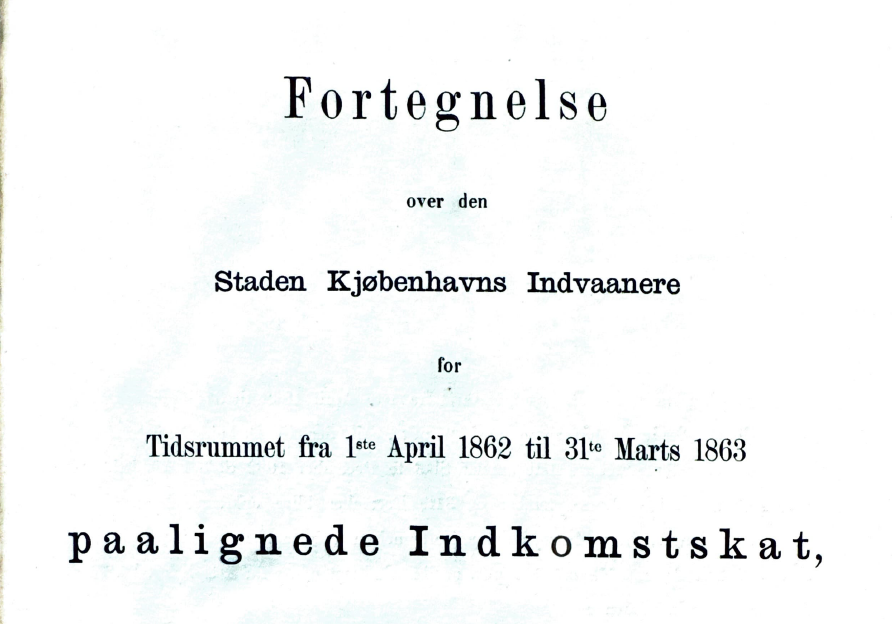
.caption[Front page of a tax book]
]

---
class: inverse, middle, center

# The Tax Books

---
# Copenhagen's Income Tax

.pull-left[
**The law**
- Enacted **15 May 1861**
- 50 years before national tax
- Covers residents and wealthy non-residents

**What was taxed**
- Salaries, profits, rents, investments
- Net income after expenses
]

.pull-right[
**Key features**
- 800 kr basic deduction
- Tax unit: household head
- Available annually **1862–1918**

**Scale**
- 40 books digitised
- ~2.1 million records
- ~17,000 (1862) → ~164,000 (1919) taxpayers
]

---
# Page from a Tax Book — 1863–64

<div class="book-img">
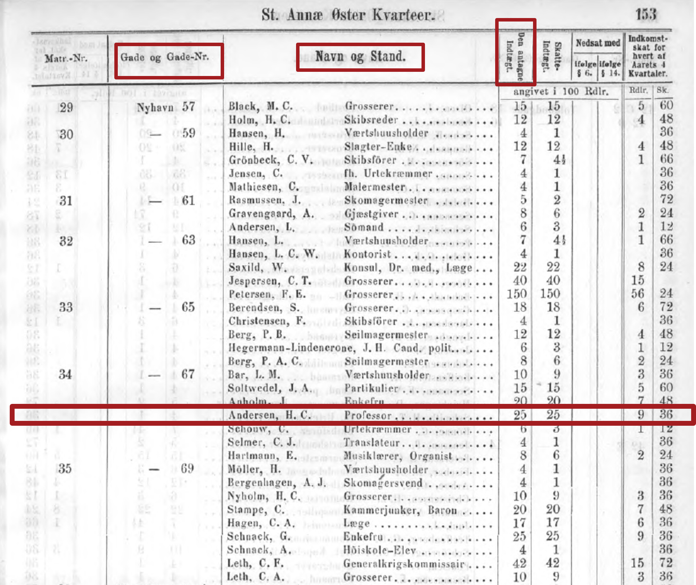
</div>
.caption[Each row: name · address · occupation · income · tax paid. Format stable through 1903]

---
# Page from a Tax Book — 1917–18

<div class="book-img">
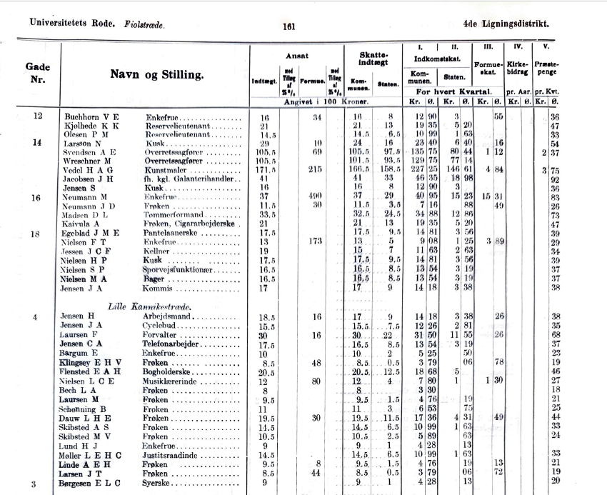
</div>
.caption[Later format adds wealth columns and deductions]

---
class: inverse, middle, center

# Famous Copenhageners in the Books

---
# C.E. Frijs (1817–1896)

.pull-left-wide[
- Prime Minister, 1865–1870
- Income: .hl[500,000 kr annually, 1869–72]
- ~50 million kr in today's terms
- Highest recorded income in CPH
- Occupation: .hl[Konseilspræs] · .hl[Lensgreve]
- Residence: .hl[Toldbodvej 26]

.small123[Illustrates ultra-rich landed aristocracy — rents, not wages]
]

.pull-right-narrow[
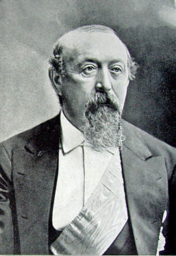
.caption[Source: Wikipedia]
]

---
# H.C. Andersen (1805–1875)

.pull-left-wide[
- Renowned Danish fairy-tale author
- Income: .hl[3,600 kr (1865)] · .hl[4,000 kr (1869–74)]
- Top 20% of earners in 1870
- Occupation: .hl[Professor (1865)] · .hl[Etatsraad (1869)]
- .hl[Nyhavn 67] · .hl[Lille Kongensgade 1] · .hl[Høibroplads 21]

.small123[Well-paid cultural figure — far below the industrialists]
]

.pull-right-narrow[
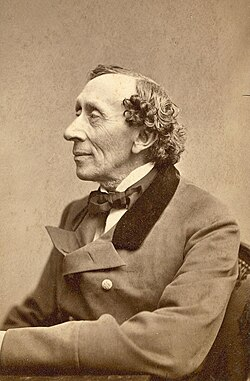
.caption[Source: Wikipedia]
]

---
# C.F. Tietgen (1829–1901)

.pull-left[
- Banker and industrialist
- Modest origins in Odense
- Director of *Privatbanken* from 1857

**Founded or financed:**
.small123[Sporvei-Selskab (1866) · Store Nordiske Telegraf (1869) · Burmeister & Wain (1871) · Sukkerfabrikker (1872) · Tuborg (1873)]

.small123["New money" — banking and industry, not estates]

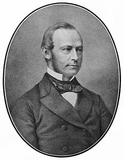
.caption[Source: Wikipedia]
]

.pull-right[
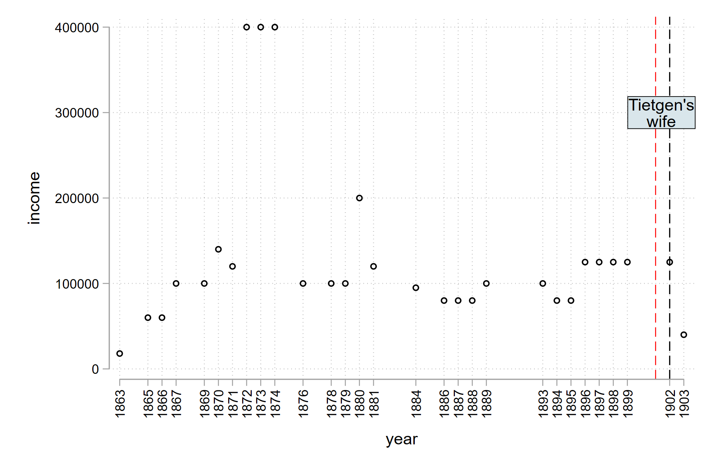
.caption[Annual reported income, Danish Kroner]
]

---
class: inverse, middle, center

# Digitising with Google Gemini

---
# The Challenge

.pull-left[
**The data**
- 40 books, each 300–1,500 pages
- Machine-written tabular format
- Five distinct layouts over time
- Addresses printed once per block

**Why standard OCR fails**
- Column alignment varies
- No clean row delimiters
]

.pull-right[
**Solution: vision LLM reads each page**

<div class="step-box"><strong>1.</strong> Split PDF → one PNG per page</div>
<div class="step-box"><strong>2.</strong> Image + prompt + schema → <strong>Gemini 2.5 Flash</strong></div>
<div class="step-box"><strong>3.</strong> Receive structured JSON per row</div>
<div class="step-box"><strong>4.</strong> Assemble → one CSV per book</div>
<div class="step-box"><strong>5.</strong> Occupations → HISCO via <em>OccCANINE</em></div>

Total: **40 books · ~2.1 million records**
]

---
# Gemini — How Each Page Is Processed

.pull-left[
**The API call**

```python
image = load_page_as_image(pdf, page_n)

response = gemini_client.generate_content([
    system_prompt,   # column layout
    image,           # page PNG
    output_schema,   # Pydantic model
])

rows = response.parsed  # list of TaxRow objects
```

**The prompt tells Gemini:**
- Column order and meaning
- Forward-fill blank addresses
- Currency conventions
- How to flag illegible entries
]

.pull-right[
**Parsed row example**

```json
{
  "surname": "Andersen",
  "initials": "H.C.",
  "street": "Nyhavn",
  "house_number": "67",
  "occupation": "Professor",
  "income_reported_100_kroner": 36,
  "rode": "2"
}
```

**Scale and speed**
- 400–1,500 pages per book
- ~3–5 seconds per page
- Full book under 2 hours
]

---
# The Prompt (1889–1903 era)

.scroll-box[
```
You are extracting rows from a historical Danish printed table from 1889-90.

COLUMNS:
- rode: the district/route name from the page header to the left
  (e.g., "Nyhavns Rode"). Copy exactly as printed.
- qvarter: the neighborhood name from the page header to the right
  (e.g., "St. Anne Øster Kvarter"). Copy exactly as printed.
- gade: CRITICAL - the street name embedded as headers within the table.
  * When a street name appears, use it for all subsequent rows until
    a new street name appears.
  * If NO street name appears (table continues from previous page),
    use "FROM PREVIOUS PAGE" for all rows.
- gadenr: the number from the leftmost "Gade" column.
- name: person's full name only from "Navn og Stand" column.
- stand: occupation/status only from "Navn og Stand" column.
- income_reported_100_kroner: number from "Den antagne Indtægt" column.
- income_reported_tax_100_kroner: number from "Skatteindtægt" column.
- reduction_par4_100_kroner: number under "Nedsættelse efter §4".
- tax_quarter_kroner and tax_quarter_ore: numbers under
  "Indkomstskat for hvert af Aarets 4 Kvartaler".

RULES:
- Parse numbers as numbers. Convert fractions like '1/2' to 0.5.
- Income columns are in hundreds of Kroner — do NOT multiply.
- If a cell is blank or a ditto mark, leave it null.
- Ignore dotted leader lines and page ornaments.
- Keep Danish diacritics exactly as printed.
- If print is unreadable, leave null and add a reason in 'notes'.
- STREET NAME LOGIC: street names appear as centered headers between
  data rows. Once found, apply to all rows below until a new one appears.

Return only JSON that matches the schema.
```
]

.note[Five prompt variants cover layout changes across 1862–1919. Switching is a one-line change in `run.py`.]

---
# Occupation Coding: OccCANINE

.pull-left[
**The solution**
- HISCO-code all 2.1 million occupations
- *OccCANINE* (Dahl, Johansen & Vedel, 2024)
- Trained on historical occupations
- >90% accuracy in Danish
]

.pull-right[
| HISCO | Sector |
|-------|--------|
| 0/1 | Professional & technical |
| 2 | Administrative |
| 3 | Clerical |
| 4 | Sales |
| 5 | Service |
| 6 | Agriculture |
| 7/8/9 | Production & transport |
]

---
class: inverse, middle, center

# Key Findings

---
# Income Distribution Across Decades

<div style="text-align:center;">
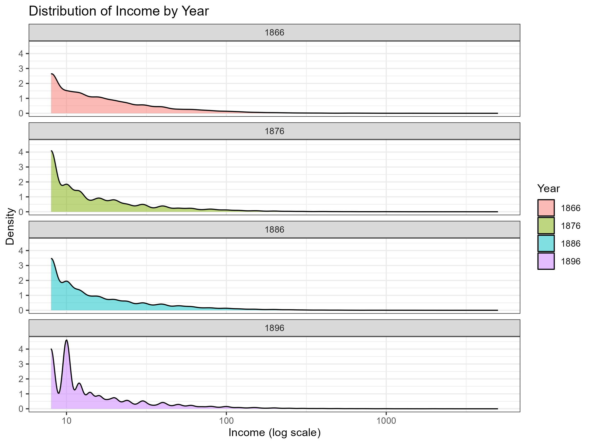
</div>

.note[Note: 800 kr deduction truncates the left tail — all inequality measures are lower bounds]

---
# Lorenz Curves & Gini over Time

.pull-left[
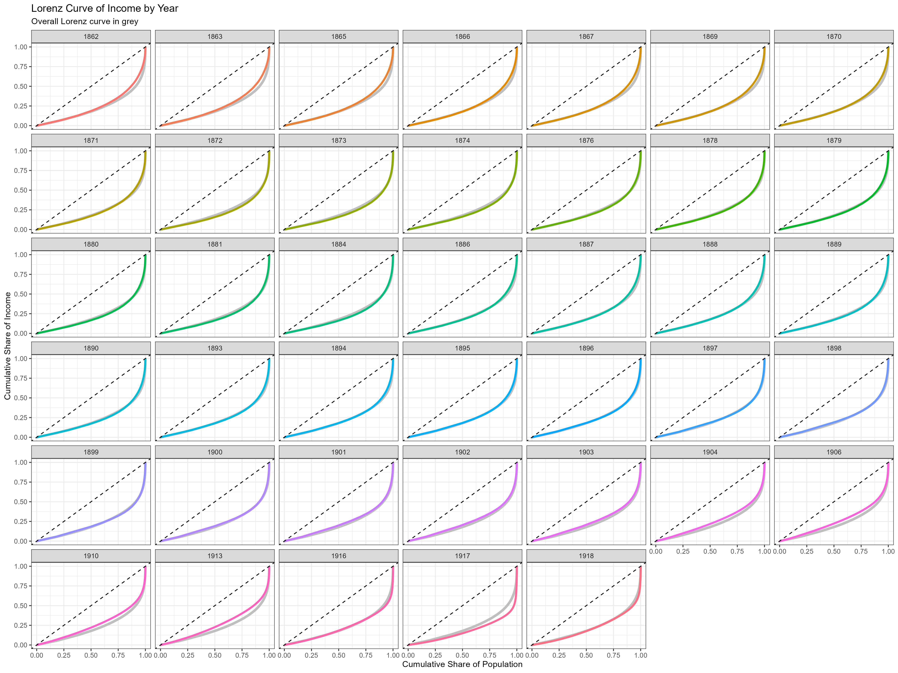
.caption[Individual-level Lorenz curves — no functional-form assumptions]
]

.pull-right[
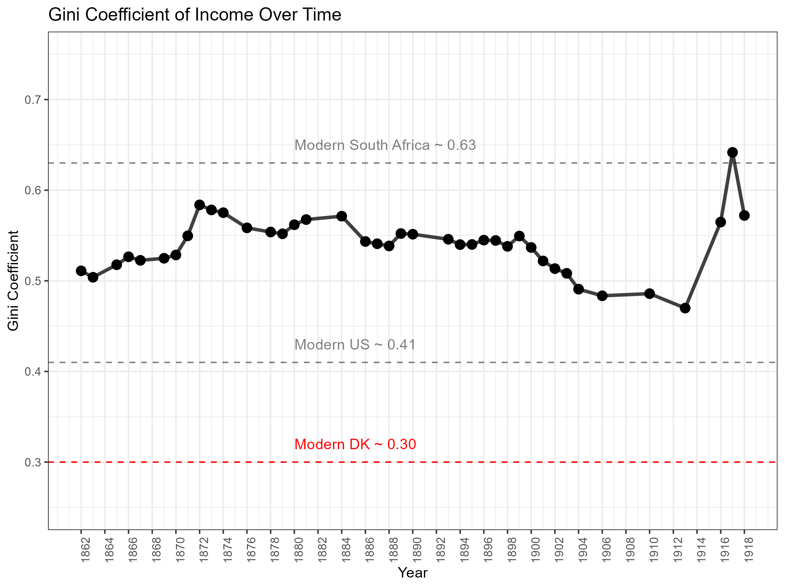
.caption[Gini over time. Today: Denmark ≈ 0.30; US ≈ 0.41]
]

---
# Top Income Shares

.panelset[
.panel[.panel-name[Top 10 %]
<div style="text-align:center;">
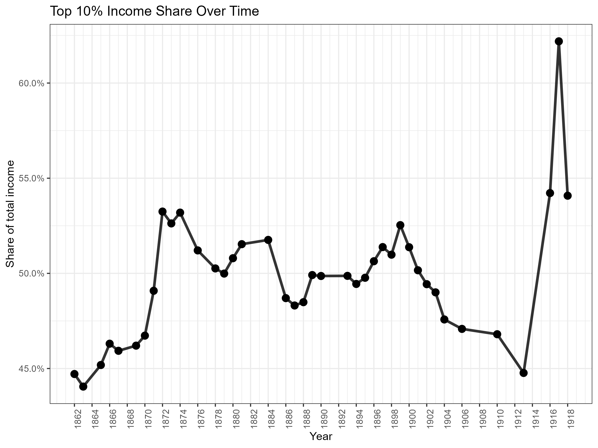
</div>
]
.panel[.panel-name[Top 1 %]
<div style="text-align:center;">
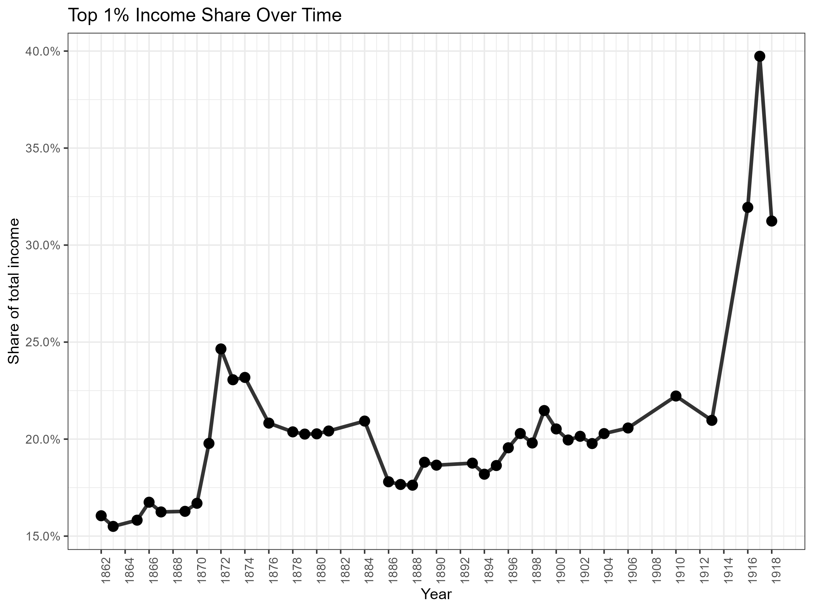
</div>
]
.panel[.panel-name[Top 0.1 %]
<div style="text-align:center;">
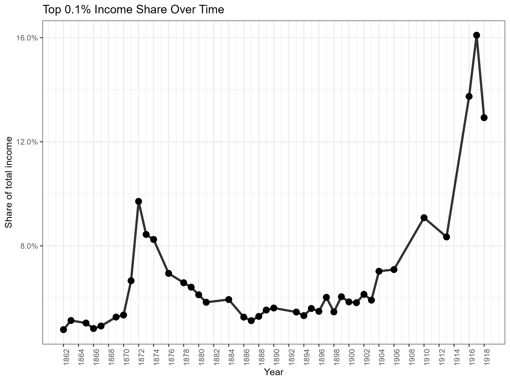
</div>
]
]

---
# Occupational Structure

.pull-left[
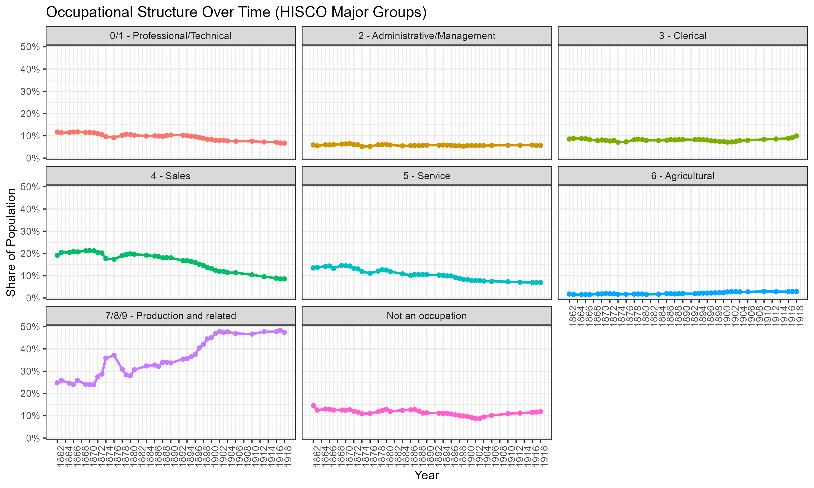
.caption[Employment shares by HISCO group]
]

.pull-right[
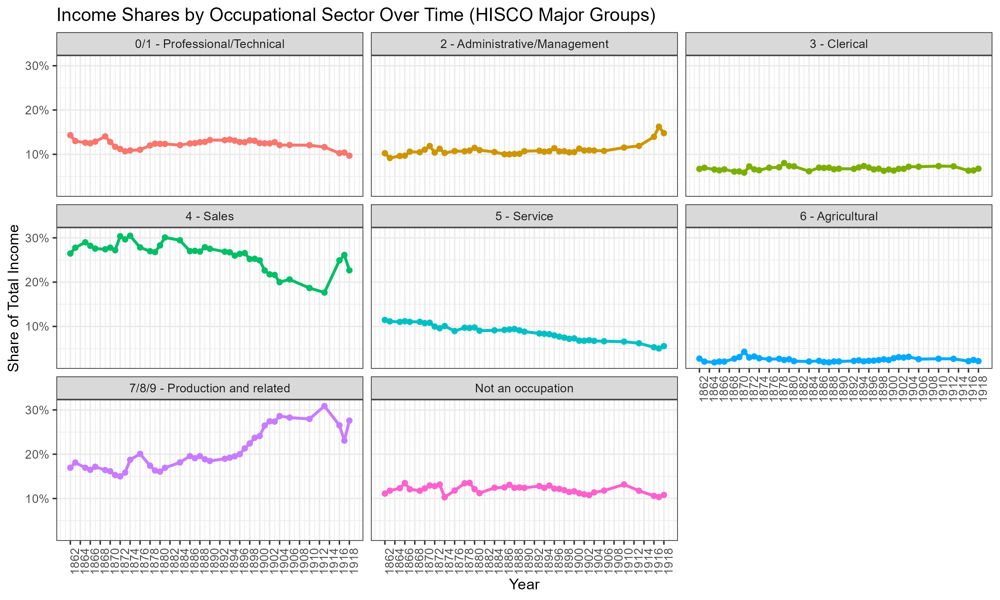
.caption[Income shares by sector]
]

---
# Occupational Structure across the Income Distribution

<div style="text-align:center;">
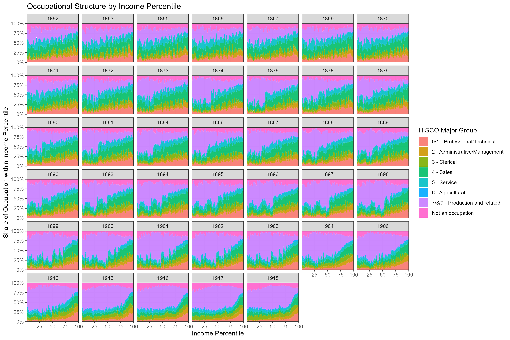
</div>
.caption[Occupation mix at each income percentile]

---
# Wealth

.pull-left[
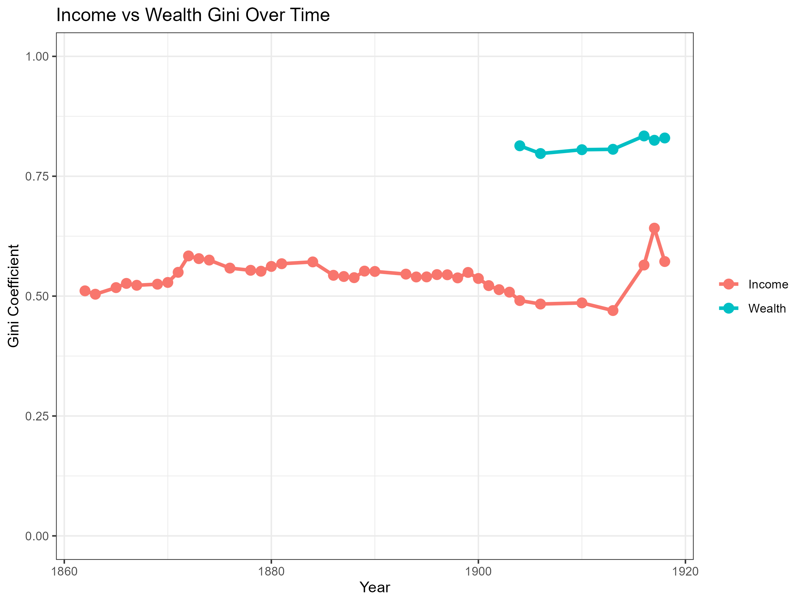
.caption[Gini: income vs. wealth]
]

.pull-right[
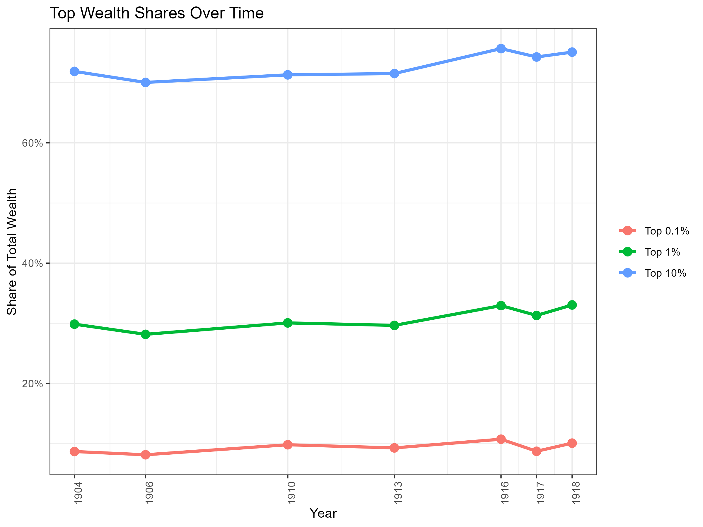
.caption[Top wealth shares over time]
]

---
class: inverse, middle, center

# Future Work

---
# What Else Can Be Done?

.pull-left[
**Linking to other sources**
- Across tax years (unique ID from 1890)
- Census records through 1901
  - Migrant assimilation
  - Returns to experience
- Burial records — Preston curve
- Street register with GIS data
]

.pull-right[
**Research questions**
- Electricity, germ theory, shipping
- Union formation (1899)
- Depressions of 1876 and 1908
- Old vs. new money
- Books available through 1970
]

---
# Cost of Digitisation

.pull-left[
**Digitisation cost only (DKK, excl. VAT)**

| Item | Total | Per book |
|------|-------|----------|
| Gemini API | ~8,400 kr* | ~210 kr |

.small123[*Sept 2025–Apr 2026, excl. Jan & May]

**RA counterfactual (transcription only)**
- ~28,000 pages (75 rows/page)
- 5 min/page × 200 kr/hr = **~468,000 kr**
- That is ~**56× the API cost**
]

.pull-right[
<br><br>
.large123[~468,000 kr]
.caption[RA transcription counterfactual]

<br>

.large123[~8,400 kr]
.caption[Actual API cost]

<br>

**The LLM approach cost roughly 2 % of manual transcription**
]

---
name: conclusion

# Conclusion

.pull-left[
### Contributions
- New dataset: 2.1 million named taxpayer records, 1862–1919
- LLM-based digitisation at ~2% of RA cost
- Individual-level inequality series, pre-WWI Copenhagen

### What remains
- Linking to census, burial, and street records
- Full inequality and occupational earnings analysis

**Email:** [christian-vs@sam.sdu.dk](mailto:christian-vs@sam.sdu.dk)
]

--

.pull-right[

]
