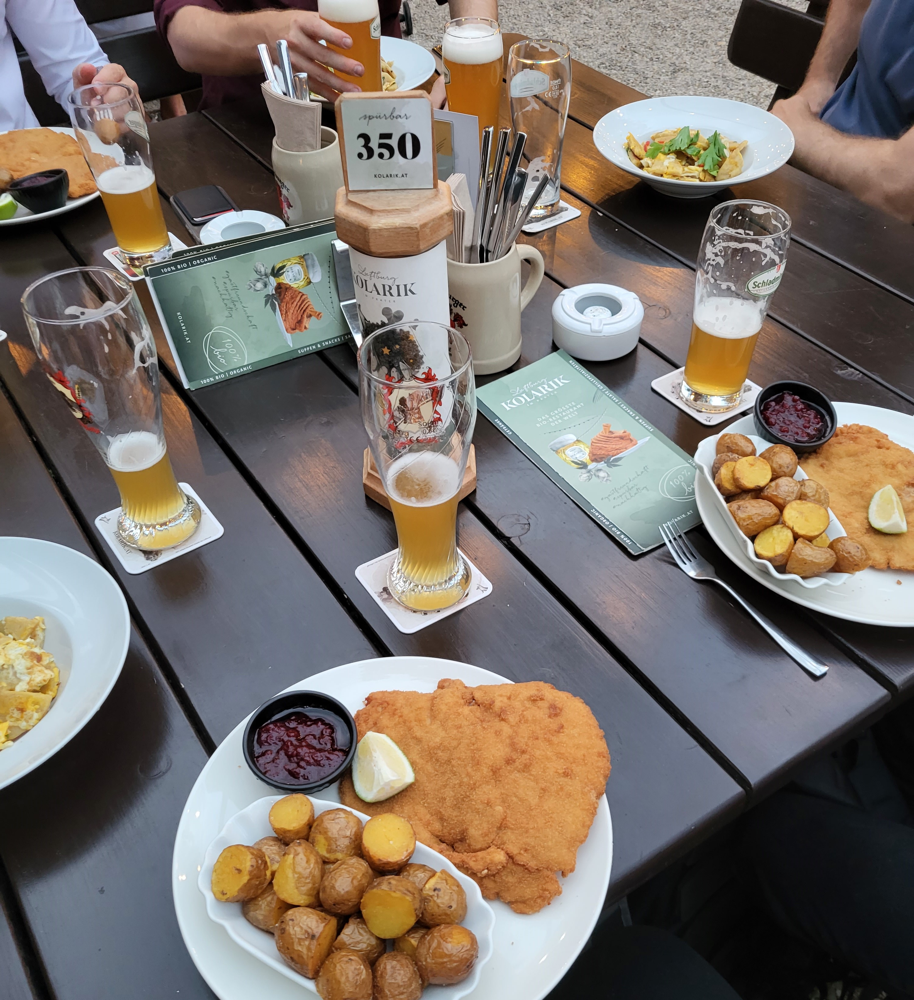

```{r setup, include=FALSE}
knitr::opts_chunk$set(eval=TRUE, include=TRUE, cache=TRUE, warnings = FALSE, message = FALSE, echo = FALSE)
library(tidyverse)
```

```{css echo=FALSE}
.pull-left {
  float: left;
  width: 48%;
}
.pull-right {
  float: right;
  width: 48%;
}
.pull-right ~ p {
  clear: both;
}


.pull-left-wide {
  float: left;
  width: 66%;
}
.pull-right-wide {
  float: right;
  width: 66%;
}
.pull-right-wide ~ p {
  clear: both;
}

.pull-left-narrow {
  float: left;
  width: 30%;
}
.pull-right-narrow {
  float: right;
  width: 30%;
}

.small123 {
  font-size: 0.80em;
}

.large123 {
  font-size: 2em;
}

.huge123 {
  font-size: 4em;
}

.highlight {
  background-color: yellow;
}

```

# Conferences
.pull-left[
.small123[
### 2021
- DFØSH (Aarhus)
- SEHS (Gothenburg)
- Agricliometrics IV (Madrid)

### 2022
- EHES (Gronningen)
- World Econ (Paris)
- PSE Summer school (Paris)
- PhD seminar, LSE (London)
- DFØSH + SEHS (Odense)

]

]

.pull-right[
.small123[
### 2023
- EHS (Warwick)
- Seminar (Lund)
- End of semester workshop (Copenhagen)
- World Clio (Dublin)
- HNCN (Oslo)
- EHES (Vienna) 
- ENCHOS (Linz)
- SEHS (Lund)

*In total: 90.523 DKK*
]
]

--
.pull-right[
**What does the department get for that?**
]

--
.pull-right[
Advertisement and networking
]

---
# What is this based on?
.pull-left[
- Aforementioned conferences - it works 
- ~ 10 years of experience in politics
- ...Where you also go to a lot of conferences
- And you want people to get to know you 
- And you want to get to know people 
]

.pull-right[

]

---
# Rethinking the purpose 
.pull-left[
- The superficial purpose of the conference is given by the programme 
- But the real purpose is everything in between the programme 
  + Getting to know people
  + Brainstorming of research ideas
  + New data sources 
  + New methods

]
--
.pull-left[
#### Implications (1/2)
- Slides are advertisement of you and your research 
  + Do not explain everything
  + Leave things open 
  + Have contact information and a twitter handle on slides
- Never miss a break - do miss a sessions
  + People are there to network like you 
  + Say hi
  + Junior vs senior - what are you comfortable with?
- About SoMe: 'Troels' knows very little about academic SoMe... Get a twitter (or Blue Sky) account. Forget LinkedIn

]

---

.pull-left[
#### Implications (2/2)

- **The most important thing on the programme:** Conference dinner
  + And whatever happens afterwards
  + Always join whatever happens afterwards 
  
- Network theory:
  + Who are the the central nodes?
  + **Answer**: The most social people (e.g. smokers)
- Check the programme and who you want to speak with 
- Write them an email before and after the conference 
  + No reason to do so? Invent one
  
- Alcohol: A problem
]

.pull-right[

**Vieaneese beer garten**

]
