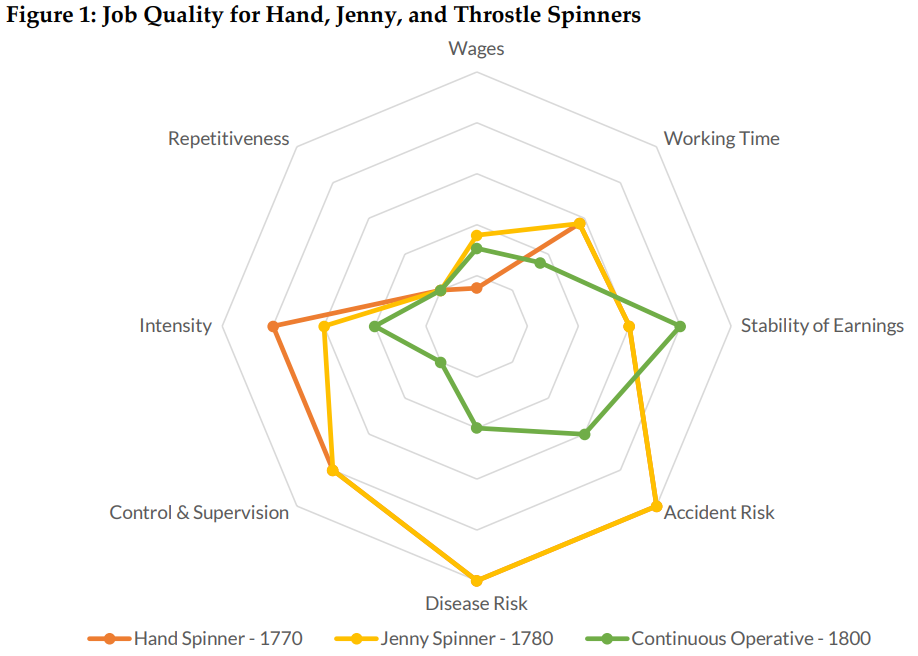
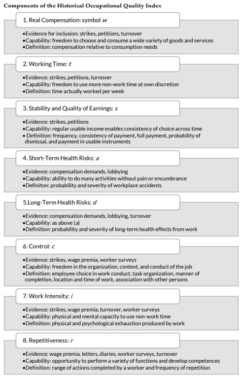
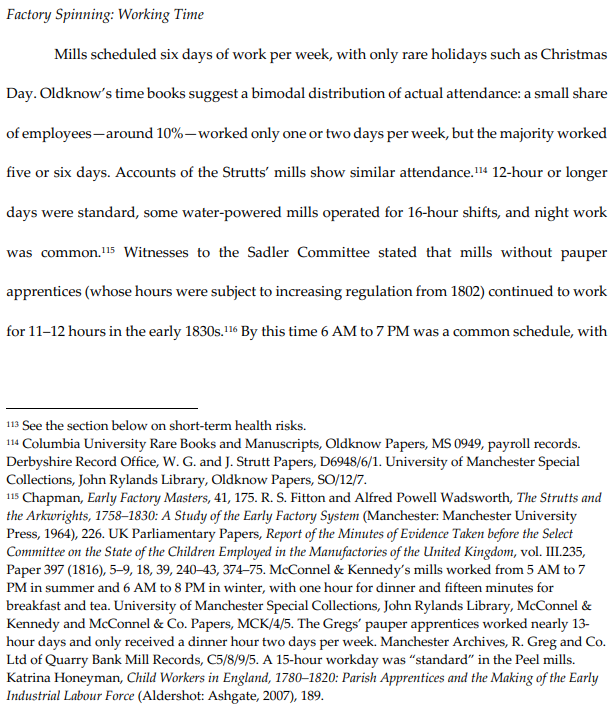
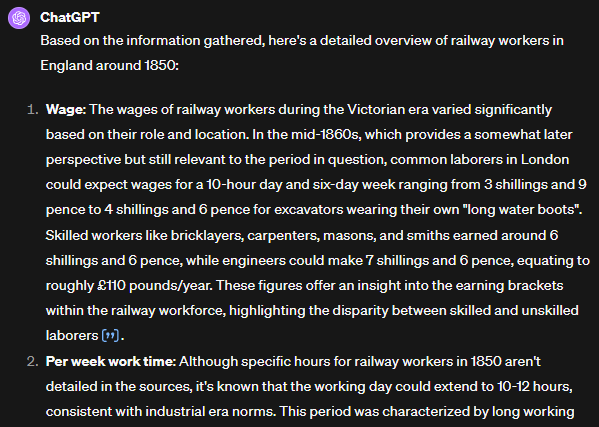

---
output:
  xaringan::moon_reader:
    includes:
      after_body: insert-logo.html
    self_contained: false
    lib_dir: libs
    nature:
      highlightStyle: github
      highlightLines: true
      countIncrementalSlides: false
editor_options: 
  chunk_output_type: console
---
class: center, inverse

```{r xaringan-panelset, echo=FALSE}
xaringanExtra::use_panelset()
```

```{r xaringan-tile-view, echo=FALSE}
xaringanExtra::use_tile_view()
```

```{r xaringanExtra, echo = FALSE}
xaringanExtra::use_progress_bar(color = "#808080", location = "top")
```

```{css echo=FALSE}
.pull-left {
  float: left;
  width: 48%;
}
.pull-right {
  float: right;
  width: 48%;
}
.pull-right ~ p {
  clear: both;
}

.pull-left-wide {
  float: left;
  width: 66%;
}
.pull-right-wide {
  float: right;
  width: 66%;
}
.pull-right-wide ~ p {
  clear: both;
}

.pull-left-narrow {
  float: left;
  width: 30%;
}
.pull-right-narrow {
  float: right;
  width: 30%;
}

.tiny123 {
  font-size: 0.40em;
}

.small123 {
  font-size: 0.80em;
}

.large123 {
  font-size: 2em;
}

.huge123 {
  font-size: 4em;
}

.red {
  color: red;
}

.highlight {
  background-color: yellow;
}
```


# From RAG to riches: 
## *Measuring the historical development of job quality using language models*
### Christian Vedel
### University of Southern Denmark, HEDG

#### Email: christian-vs@sam.sdu.dk
#### Updated `r Sys.Date()` 

---
# Content
- Motivation
- Landscape
- HOQI: A multidimensional measure of work quality 
- Feasibility
- An application
- Practicalities

### Key points
- We replace/substitute not only the RA but also the historical researcher and exploit otherwise inherently qualitative data at a large scale
- RAG can potentially solve many things. This is a pilot on qualitative occupational data. 

---
# Open questions:
- The role of change of technology
- The dynamics of income inequality 
- Social mobility
- Returns to education

--

- .red[Occupational data is key for all of this]

--
### Barriers:

--
.pull-left[
**Type A problems:**
```{r echo=FALSE, message=FALSE, warning=FALSE, out.height="250px", out.width="250px"}
knitr::include_graphics("Figures/TypeA.png")
```

]

--

.pull-right[
.red[**Type B problems:**]
```{r echo=FALSE, message=FALSE, warning=FALSE, out.height="250px", out.width="250px"}
knitr::include_graphics("Figures/TypeB.png")
```
]

---
# The landscape of occupational measures

.pull-left[
### The classical ones
- HISCAM, SOCPO, HISCLASS

#### Augmentations
- Clark, Cummins, Curtis (2022): Three new measures calibrated in English data

### Not occupations
- PLS: Sectors of the economy 
]

.pull-right[
### New approaches 
- **Task based approaches:**
  + Gray (2023): Task content from *Dictionary of Occupational Titles*
  + Vispond (2023): Task content from census data
  
.red[
- **Occupational Quality**
  + Schneider (2023): A Multidimensional measure of job quality
]  

]

---
# HOQI: Historical Occupational Quality Index
.pull-left-wide[
- Turn qualitative job information into systematic measures across several dimensions
- Requires active research time for each occupation (until now)

]

.pull-right-narrow[

]

---
# HOQI: How it is done now
.pull-left[

]

.pull-right[
- Each occupation is metricously analysed 
- Information is drawn from various sources
- **Result:** A high quality multidimensional measure
- **Drawback:** This is *very* time consuming and requires a skilled researcher.
]

---
# Feasibility: ChatGPT
.pull-left[
- We can try out the idea with ChatGPT by instructing it to do the job

]

.pull-right[

]

https://chat.openai.com/share/e2b99e23-503a-42fe-8076-f61e917c972b

---
# A systematic framework


**Intuition:**
**RAG** is generalised, optimised, systematic prompt engineering with automatic context retrieval

???
- We can utilize OccCANINE to retrieve similar occupations 
- If very similar occupations has already been encoded, then we can use the values of that instead. 

---
# Applicaiton
.pull-left[
- A widely held believe is that unions promote job quality and in turn that this is part of the explanation for the modern day success of Denmark
- Using Danish census data 1787-1901 combined with measures of union activity we can test this
- Job quality: Automatically generated HOQI
]

.pull-right[


]

---
# Process
```{r echo=FALSE, message=FALSE, warning=FALSE, fig.width=10}
library(tidyverse)

tasks = data.frame(
  Task = c("Task 1", "Task 2", "Task 3", "Task 4"),
  Start = as.Date(c("2024-09-01", "2024-09-01", "2025-06-01", "2025-09-01")),
  End = as.Date(c("2025-06-01", "2026-03-01", "2026-12-01", "2027-09-01")),
  type = c("Data", "Data", "Validation", "Application"),
  desc = c(
    "Source collection",
    "RAG construction",
    "Data validation: Paper 1",
    "Application: Paper 2"
  )
) %>% 
  mutate(
    midpoint = Start  + (End - Start)/2
  )

ggplot(tasks, aes(x = Start, y = Task)) +
  geom_segment(aes(xend = End, yend = Task, col = type), size = 20) +
  labs(title = "Gantt Chart", x = "Date", y = "") +
  theme_minimal() +
  theme(panel.grid.major.y = element_blank(),
        panel.grid.minor.y = element_blank()) + 
  geom_text(
    aes(x = midpoint, y = Task, label = desc)
  ) + 
  theme_bw() + 
  theme(legend.position = "none")


```


---
# Practicalities 
- **PI**?
- Computer resources 
- RA
- Funding people from outside. E.g. Ben Schneider
