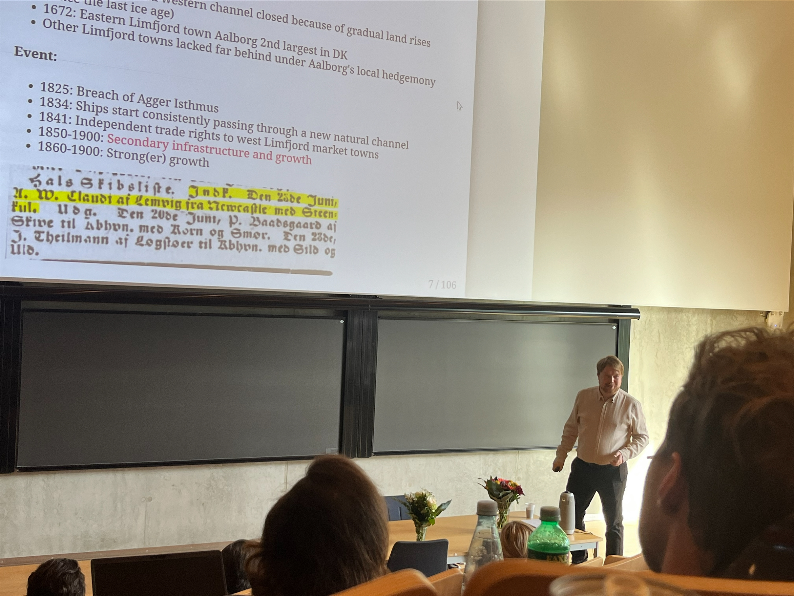
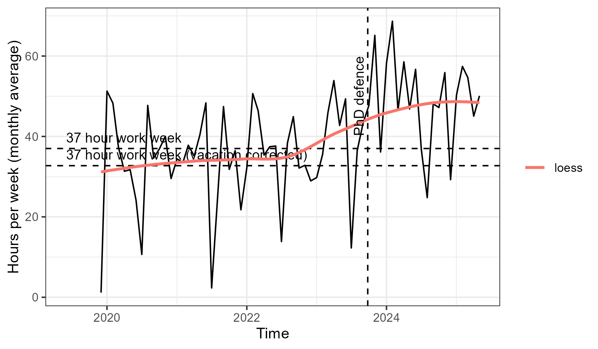

---
output:
  xaringan::moon_reader:
    seal: false
    includes:
      after_body: insert-logo.html
    self_contained: false
    lib_dir: libs
    nature:
      highlightStyle: github
      highlightLines: true
      countIncrementalSlides: false
      ratio: '16:9'
editor_options: 
  chunk_output_type: console
---
class: center, inverse, middle

```{r xaringan-panelset, echo=FALSE}
xaringanExtra::use_panelset()
```

```{r xaringan-tile-view, echo=FALSE}
xaringanExtra::use_tile_view()
```

```{r xaringanExtra, echo = FALSE}
xaringanExtra::use_progress_bar(color = "#808080", location = "top")
```

```{css echo=FALSE}
.pull-left {
  float: left;
  width: 44%;
}
.pull-right {
  float: right;
  width: 44%;
}
.pull-right ~ p {
  clear: both;
}


.pull-left-wide {
  float: left;
  width: 66%;
}
.pull-right-wide {
  float: right;
  width: 66%;
}
.pull-right-wide ~ p {
  clear: both;
}

.pull-left-narrow {
  float: left;
  width: 30%;
}
.pull-right-narrow {
  float: right;
  width: 30%;
}

.pull-right-extra-narrow {
  float: right;
  width: 20%;
}

.pull-center {
  margin-left: 28%;
  width: 44%;
}

.pull-center-wide {
  margin-left: 17%;
  width: 66%;
}

.tiny123 {
  font-size: 0.40em;
}

.small123 {
  font-size: 0.80em;
}

.large123 {
  font-size: 2em;
}

.red {
  color: red
}

.orange {
  color: orange
}

.green {
  color: green
}

.blue {
  color: blue
}
```


# From Geography to Prosperity via new methodological routes

### *Or*

## *What I am trying to achieve in my research*


### Christian Vedel,

### Email: [christian-vs@sam.sdu.dk](christian-vs@sam.sdu.dk)  

### Updated `r Sys.Date()`

---
class: middle

.pull-left-wide[
# What this is
> A reflection of what I have *(hopefully not)* wasted my time with in the past ~6 years

]

---
class: middle

## Why This Journey & Where It's heading

1. **Motivation**  
   - Can we improve life quality substantially? How?  
   – What Denmark’s micro-experiments teach about economic development

2. **Five grand puzzles**  
   *Geography • Institutions • Culture • Persistence • Welfare*

3. **Evidence toolbox**  
   Causal inference | GIS & archival data | Machine-learning tools

4. **Case studies**  
   - Limfjord storm & market access  
   - Railways $\rightarrow$ civic movements  
   - Energy shocks & adaptability  
   - Cooperatives, conflict & productivity  

5. **Looking ahead**  
   New datasets (CHAOS, Occunyms) & unanswered questions
   
---
class: middle

.pull-left-wide[
### From Rome to Economic History  

- **Spark moment – Rome, study trip, 2012**  
  *Realised a city can outlive generations; wanted to know the forces behind such endurance.*

- **Dual fascination**  
  *Blend of "hard" (quantitative) and "soft" (historical-institutional) sciences.*

- **Research lens**  
  *Causal inference × Geography × Institutions & Culture*  
  - How shocks (natural, social, technological) redirect long-run development.
]

.pull-right-narrow[

.small123[
*A much too flattering version of how I learned to love econ*  
*Generated by ChatGPT*
]
]
---
class: middle

.pull-left-wide[
.pull-right-wide[
## How to improve the world?

### 'Easy' answer
- Go into politics

### 'Hard' answer
- Do research and learn something about it
- (And learn that you cannot generally improve things) 
]
]

.pull-right-narrow[
.pull-left[
  
  .small123[
  **Current identity**
  ]
]

.pull-right[
  

  .small123[
  **BTDT**
  ]

]

]

---


.pull-left[
# Projects overview
.small123[
#### Published
- .orange[Sharp et al (2023): A database of 1419 Danish cooperative creameries 1898-1945]
- .orange[McLaughlin et al (2023): A database of 531 Irish cooperative creameries 1897-1921]
- .green[Henriques et el (2024): Peat availability and energy shocks (in creameries)]
- .blue[McLaughlin et al (2025): Denmark vs Ireland: Producitvity (of creameries)]

#### Working papers
- .red[Religious identity in the US (Boberg et al, 2024), Denmark (Bentzen et al, 2023) and Ireland (McLaughlin et al, 2024)]
- .orange[Automatic Occupational Standardization with OccCANINE (Dahl et al, 2024)]
- .green[A perfect storm (Vedel, 2024)]
- .green[Track to Modernity (Görges et al, 2025)]
- .red[Milk and conflict in Ireland (McLaughlin et al, 2024)]
]

]

.pull-right[
.pull-righ-wide[
**.red[Culture];  
.green[Geography];  
.blue[Institutions];  
.orange[Data / methods]**

]


.small123[
#### Works in progress (too much)
- .green[Railways and the Happy Danes]
  + .blue[Tracks to Modernity (submitted)]
  + .orange[Railways and things to find in many historical pictures]
- .red[Facing success: Pictures and student biographies]
- .orange[CHAOS: Converting Historical Accounts Into Occupational Scores]
- .blue[Vikings and Nazis]
- *Probbably a few things I forgot*
]

]

.footnote[
.tiny123[
*If anyone wonders where my name is in many of these - then don't get a last name starting with 'V' yourself.*
]

]


---
class: inverse, middle, center

## Some projects, published, working paper, early stage

---
class: middle
# Peat and coal
.small123[
*Published in Energy Economics in 2024*
]


.pull-left[
.small123[
"Adaptability, diversification, and energy shocks: A firm level productivity analysis"  
w. Sofie Henriques, Paul Sharp and Xanthi Tsoukli  
[doi.org/10.1016/j.eneco.2024.107887](https://doi.org/10.1016/j.eneco.2024.107887)
]

- Because of WWI and the Spanish Flu, Coal imports from England were strained
- Some creameries were located closer to an (inferior but available) alternative: Peat
- Short run and long run benefits

### Process reflection
- Started off in another PhD students project - needed help with the econometrics
- Working paper out in 2021
- Was rejected approx 4-5 different journals
- Finally decided to fix up weird econometrics

]


.pull-right[

.small123[*Figure 6:* Descriptive plot of efficiency and peat avilability]


]

---
class: middle
## A perfect storm: First-Nature Geography and Economic Development


.pull-left[
.small123[
Submitted to the AER `r as.numeric(Sys.Date() - as.Date("2025-05-20"))` days ago (fingers cross for reports with the rejection)  
https://arxiv.org/abs/2408.00885
]

- How much of the location of prosperity is determined by first-nature geography?
- In 1825 an unexpected storm completely altered the first-nature characteristics of North Western Denmark
- 25% population growth within a generation + fertility + manufacturing

### Process reflection
- Stumbled on the idea on vacation
- The struggle was with framing it in the literature
- When should you prioritize your own stuff?

]


.pull-right[

*Figure 1: A map of how the West Limfjord region changed in 1825*
]

---
class: middle
# OccCANINE

.pull-left[
.small123[
w. Christian Møller Dahl & Torben Johansen   
Final review of new version TBD before submitting to JEH
https://arxiv.org/abs/2408.00885
]

- An important economic activity is work
- Historical sources are ripe with information of peoples' occupation but it needs to be standardized
- We train a language model on ~20 million observations spanning 13 different language from 29 different sources
- Open source, user friendly, fast and highly accurate


### Process reflection
- Was an appendix
- Networking effort to get data
- Last mile problem

]

.pull-right[
 
*Figure 1: Conceptual architecture*

.small123[
#### Some numbers:
- 10k occupational descriptions: 27 seconds
- 100k occupational descriptions: 5 min.
- 1 million occupational descriptions: 45 min.
$\rightarrow$  .red[*Compared to 3.5, 35 and 350 RA working days*]
]


]


---
## CHAOS: Converting Historical Accounts into Occupational Scores
.small123[
w. Matt Curtis, Torben Johansen, Julius Koschnick
]

.pull-left[
.small123[
- Your job is a useful proxy of your (expected) income
- Common setup in history: 
  + Source: Some agency noted average wages for certain occupations
  + In the censuses we now what job people had
- Can we infer their level of income (already done) flexibly and automatically using the most relevant *local* sources + skill, education, etc. (contribution)
- Trick: It's all based on probabilities of *OccCANINE*

### Process reflection
- Presented this summer 
- Let's see how it goes
- 'Residual' time project

]
]

.pull-right[
 
]

---
# How I spend my time


```{r eval=FALSE, include=FALSE}
library(tidyverse)
load("Time tracking data.Rdata")

clean_data %>% 
  distinct(Category) %>% 
  write_csv2("Categories.csv")

meta_categories = read_csv2("Categories_manual.csv")

ready_data = clean_data %>% 
  filter(
    Category == "Fri" | (Time_spend < 12)
  ) %>% 
  filter(
    Timestamp < as.Date("2025-06-01")
  ) %>% 
  mutate(
    days_in_month = days_in_month(Timestamp)
  ) %>% 
  mutate(
    Year = format(Timestamp, "%Y")
  ) %>%
  group_by(Month, Category) %>% 
  summarise(
    median_time = median(Time_spend),
    trim_mean = mean(Time_spend, 0.05),
    n = n(),
    days_in_month = days_in_month[1]
  ) %>% 
  mutate(
    outlier_robust_time_estimate = trim_mean*n
  ) %>% 
  left_join(
    meta_categories, by = "Category"
  ) %>% 
  rowwise() %>% 
  mutate(
    Metacategory = ifelse(grepl("Research", Metacategory), "Research", Metacategory)
  ) %>% 
  group_by(Month, Metacategory) %>% 
  summarise(
    outlier_robust_time_estimate = sum(outlier_robust_time_estimate),
    days_in_month = days_in_month[1]
  )

woork_week_w_vacation = 37*(52-6)/52


p1 = ready_data %>% 
  group_by(Month) %>% 
  filter(
    Metacategory != "Time off"
  ) %>% 
  summarise(
    hours_worked_per_day = sum(outlier_robust_time_estimate/days_in_month)
  ) %>% 
  mutate(
    hours_worked_per_week = hours_worked_per_day*7
  ) %>% 
  mutate(
    Month_date = as.Date(paste0(Month, " 01"), format = "%Y %m %d")
  ) %>% 
  ggplot(aes(Month_date, hours_worked_per_week)) + 
  geom_line() + 
  geom_hline(yintercept = 37, lty = 2) + 
  annotate(
    "text",
    x      = as.Date("2019-06-01"),   # move left/right to taste
    y      = 37,
    label  = "37 hour work week",
    vjust  = -0.6,                    # just above the line
    hjust  = 0,
    size   = 3.5
  ) + 
  geom_hline(yintercept = woork_week_w_vacation, lty = 2) + 
  annotate(
    "text",
    x      = as.Date("2019-06-01"),   # move left/right to taste
    y      = woork_week_w_vacation,
    label  = "37 hour work week (vacation corrected)",
    vjust  = -0.6,                    # just above the line
    hjust  = 0,
    size   = 3.5
  ) + 
  theme_bw() + 
  geom_smooth(se = FALSE, aes(col = "loess")) + 
  geom_vline(xintercept = as.Date("2023-09-25"), lty = 2) +
  annotate(
    "text",
    x      = as.Date("2023-09-25"),
    y      = 60,                      # set near top of your y-range
    label  = "PhD defence",
    angle  = 90,
    vjust  = -0.4,
    hjust  = 1,
    size   = 3.5
  ) + 
  labs(
    y = "Hours per week (monthly average)",
    color = ""
  )

ggsave("Figures/Time_worked.png", plot = p1, width = 6, height = 3.5)

p1 = ready_data %>% 
  filter(!Metacategory %in% c("Time off", "Lunch")) %>% 
  mutate(
    Metacategory = factor(
      Metacategory, levels = c(
        'Public dissemination',
        'Learning',
        'Dissemination',
        'Admin',
        'Research',
        'Teaching'
      )
    )
  ) %>% 
  mutate(Month_date = as.Date(paste0(Month, " 01"), "%Y %m %d")) %>% 
  ggplot(aes(Month_date, outlier_robust_time_estimate,
             fill = Metacategory)) +
  geom_area(position = "fill") +      # <─ this does the normalisation
  scale_y_continuous(labels = scales::percent) + 
  geom_vline(xintercept = as.Date("2023-09-25"), lty = 2) +
  annotate(
    "text",
    x      = as.Date("2023-09-25"),
    y      = 0.3,                      # set near top of your y-range
    label  = "PhD defence",
    angle  = 90,
    vjust  = -0.4,
    hjust  = 1,
    size   = 3.5
  ) + 
  theme_bw() + 
  labs(
    "Share of time spend"
  )

ggsave("Figures/Timeshare_spend.png", plot = p1, width = 6, height = 3.5)
  
```

.pull-left-wide[
.panelset[
.panel[.panel-name[Weekly work time]

]
.panel[.panel-name[Share spend]

]
]


]


---
class: middle
# An agenda
.pull-left-wide[
#### Two legs: Doing applied work in EH and developing the methods for it
  1. The mystery of prosperity and how to create it
  2. How to get reliable data and inference
]


